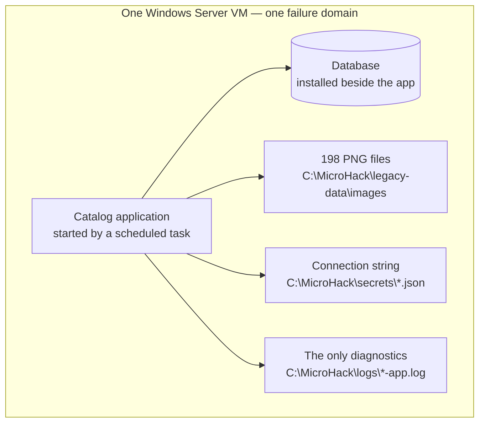

# Challenge 0: meet the application you are about to move

**By the end of this chapter you will have opened both legacy catalogs, measured how the
one you keep behaves today, and committed to a single stack for the rest of the
workshop.**

## Why this matters

You are about to spend two days arguing that this application should not live on a
virtual machine. That argument needs a *before*. Today the catalog, its database, its 198
photographs, its connection string and its only log file all sit on one Windows Server
box — so a slow query, a full disk, a failed patch, and a bad release are all the same
outage.

This chapter is where you see that for yourself and write down the numbers you will use
on day 2 to prove the move was worth it. It is also where you choose which of the two
legacy stacks you will carry forward.

**Estimated time:** 50–60 minutes, including hands-on time in both VMs.

## Before you start

- Your facilitator has given you a participant resource group (`rg-userNNN`), both VM
  names, and the public IP address and RDP credentials for both VMs.
- Your facilitator has given you the **full 40-character lowercase commit** the VMs were
  provisioned from. You will need it three times; keep it on the clipboard.
- Both VMs report a successful provisioning state.
- You know whether you are authorized to change VM power state yourself, or whether the
  facilitator will do it for you.

Stop and ask if either VM is unavailable, or if you can see another participant's
resource group. Do not repair provisioning during this challenge — that is facilitator
work, and a repaired VM is no longer the frozen baseline everyone else is comparing
against.

New vocabulary in this chapter — *baseline*, *evidence*, *handoff*, *stack* — is defined
in the [glossary](../../docs/Glossary.md).

## The concept

Two applications. Same catalog, same 198 figures, same 20 categories, same routes,
same behavior. One is .NET 8 on SQL Server 2022 Express; the other is Java 17 on
PostgreSQL 18. They exist so that you can practise on the stack your own estate actually
runs.

What they also share is a shape, and the shape is the problem:



Every arrow in that diagram is something you will move somewhere else over the next two
days. Nothing here scales independently, nothing here fails independently, and nothing
here can be observed from outside the box.


## Your goal

Experience both applications, capture a legacy baseline you can defend, verify that both
match the frozen provisioning contract, record one selection, and shut down the machine
you are not keeping.

You are done when `evidence/ch00-selection.json` names exactly one stack, both baseline
markers check out, and the unselected VM is deallocated with approval.

## 1. Open RDP for your own address

The environment is created with **no inbound RDP rule**. This is not an oversight and it
is not a security exercise: the tenant's governance automation deletes any 3389 rule that
allows the whole internet, roughly twenty minutes after it appears. A rule scoped to *your*
address is left alone, so the one that works is the one you create.

You hold **Owner** on your own resource group, so you can do this yourself. Run it once,
from your own machine:

```bash
# Your current public address, then a rule that admits only it
MYIP=$(curl -s https://api.ipify.org)
az network nsg rule create \
  -g rg-userNNN --nsg-name nsg-userNNN -n allow-my-rdp \
  --priority 300 --protocol Tcp --access Allow --direction Inbound \
  --source-address-prefixes "$MYIP/32" --destination-port-ranges 3389
```

In PowerShell, replace the first line with `$MYIP = Invoke-RestMethod https://api.ipify.org`
and use `$MYIP/32`.

> [!NOTE]
> If RDP stops responding later in the day, your public address has probably changed —
> switching networks or a VPN reconnect is enough. Re-run the same command; the rule is
> replaced in place, not duplicated. If you had to open the whole internet to get moving,
> expect to lose it again within twenty minutes.

## 2. Open both catalogs

Each VM has its own public IP address for RDP. Connect to each one with the administrator
credentials your facilitator provided, then open the catalog in the browser **inside** the
VM. Get the addresses from the deployment output, or with:

```bash
az vm list-ip-addresses -g rg-userNNN -o table
```

| Stack ID | VM | Runtime and database | URL inside the VM |
| --- | --- | --- | --- |
| `dotnet-sqlserver` | `vm-dotnet-userNNN` | .NET 8 and SQL Server 2022 Express | `http://localhost:5000` |
| `java-postgresql` | `vm-java-userNNN` | Microsoft OpenJDK 17 and PostgreSQL 18 | `http://localhost:8080` |

That the application is only reachable from the machine it runs on is itself part of the
"before" picture: it is bound to one box, and being on that box is the only way in.

Spend five minutes per application actually using it. Search for a figure. Filter by a
category. Open a detail page and load its photograph. The two applications should look
and behave identically — that is deliberate, and it is what makes the comparison in
Challenge 1 fair.

While you are there, notice what you *cannot* do: there is no second instance to fail
over to, no dashboard telling you how many requests just arrived, and no way to release a
new version without touching this one machine. This one VM is the whole service — if it
stops, the catalog is gone.

## 3. Take the baseline day 2 will argue with

This is the "before" column of your final scorecard. Run it on **both** VMs — it takes
about three minutes each — changing only the two values at the top.

```powershell
$stack = 'dotnet'                     # 'java' on the other VM
$baseUrl = 'http://localhost:5000'    # 'http://localhost:8080' on the Java VM

Invoke-WebRequest "$baseUrl/" -UseBasicParsing | Out-Null
$samples = 1..20 | ForEach-Object {
  (Measure-Command {
    Invoke-WebRequest "$baseUrl/" -UseBasicParsing | Out-Null
  }).TotalMilliseconds
}
$sorted = @($samples | Sort-Object)
$mid = [int][math]::Floor($sorted.Count / 2)
$os = Get-CimInstance Win32_OperatingSystem

$pain = [ordered]@{
  stack             = $stack
  measuredAtUtc     = (Get-Date).ToUniversalTime().ToString('o')
  catalogMedianMs   = [math]::Round($sorted[$mid], 1)
  catalogSlowestMs  = [math]::Round($sorted[-1], 1)
  hostCpuCount      = [int]$env:NUMBER_OF_PROCESSORS
  hostMemoryGb      = [math]::Round($os.TotalVisibleMemorySize / 1MB, 1)
  applicationHosts  = @(Get-Process dotnet, java -ErrorAction SilentlyContinue |
    ForEach-Object { $_.ProcessName } | Sort-Object -Unique)
  databaseServices  = @(Get-Service |
    Where-Object { $_.Name -match '^(MSSQL|postgresql)' } |
    ForEach-Object { "$($_.Name)=$($_.Status)" })
  startupTasks      = @(Get-ScheduledTask -TaskName 'MicroHack-*' -ErrorAction SilentlyContinue |
    ForEach-Object { "$($_.TaskName)=$($_.State)" })
  imageFilesOnDisk  = @(Get-ChildItem 'C:\MicroHack\legacy-data\images' -Filter *.png).Count
  configurationFile = "C:\MicroHack\secrets\$stack.json"
  onlyDiagnostics   = "C:\MicroHack\logs\$stack-app.log"
  runningInstances  = 1
  autoscale         = $false
  distributedTraces = $false
}

New-Item evidence -ItemType Directory -Force | Out-Null
$pain | ConvertTo-Json -Depth 10 |
  Set-Content "evidence/ch00-pain-$stack.json" -Encoding utf8
$pain | Format-List
```

**Write down `catalogMedianMs` for the stack you keep.** In Challenge 2 you will put it
next to the median response time the load engine reports while the modernized catalog is
under load, and it is the first row of the
[wrap-up scorecard](../wrapup/README.md).

Now read the rest of the output, because it is the actual lesson:

- `applicationHosts` and `databaseServices` are on the **same machine**. One noisy query
  and the web tier starves.
- `hostCpuCount` and `hostMemoryGb` are your entire capacity plan. `runningInstances` is
  `1` and `autoscale` is `false` — a traffic spike is survived by hoping.
- `imageFilesOnDisk` is 198 photographs living on a C: drive. Rebuild the VM and they are
  gone.
- `configurationFile` holds a database credential in a file on the server.
- `onlyDiagnostics` is a text file. `distributedTraces` is `false`. That is your entire
  answer to "why was it slow at 02:00 last Tuesday?".

Finally, work out how you would ship a one-line fix to this application right now. Look
at `C:\MicroHack\app\$stack` and the `MicroHack-*` scheduled task, then count the steps:
build somewhere, copy files onto this box, stop the task, swap the files, start the task,
check the site by hand. **There is no step in that list that undoes it.**

That count is the "before" for three rows of the wrap-up scorecard, so record it in the
same file as everything else rather than on a sticky note. Set `$stack`, fill in the three
values, and run this on the VM you just measured:

```powershell
$stack = 'dotnet'            # 'java' on the other VM

$counted = [ordered]@{
  manualDeploySteps   = 0    # every step in the list you just made
  manualRollbackSteps = 0    # how many of those steps undo the release
  manualDeployWindow  = ''   # when you would have been allowed to run them
}

if ($counted.manualDeploySteps -lt 1 -or -not $counted.manualDeployWindow) {
  throw 'Count the steps and name the release window before running this.'
}

$painPath = "evidence/ch00-pain-$stack.json"
$pain = Get-Content $painPath -Raw | ConvertFrom-Json
foreach ($field in $counted.Keys) {
  $pain | Add-Member -NotePropertyName $field -NotePropertyValue $counted[$field] -Force
}
$pain | ConvertTo-Json -Depth 10 | Set-Content $painPath -Encoding utf8
$pain | Select-Object manualDeploySteps, manualRollbackSteps, manualDeployWindow
```

The guard is the point: a blank count would put an empty cell on the scorecard, and an
empty cell is the one thing a before/after table cannot survive. `manualRollbackSteps` is
almost certainly `0`, and that zero is the most quotable number Challenge 0 produces —
Challenge 3 replaces it with a timed traffic weight change.

## 4. Verify the .NET baseline

Both VMs were provisioned from one immutable commit and carry a signed marker proving
what was installed. Confirming it now means that any difference you see later is
something *you* changed.

Connect to the .NET VM over RDP, open PowerShell at the source tree
(`cd C:\MicroHack\source`), and run:

```powershell
$stack = 'dotnet'
$baseUrl = 'http://localhost:5000'
$expectedSourceCommit = '<facilitator-provided-40-character-lowercase-commit>'
$markerPath = "C:\MicroHack\status\$stack-smoke.json"
$marker = Get-Content $markerPath -Raw | ConvertFrom-Json

if (
  $expectedSourceCommit -cnotmatch '^[0-9a-f]{40}$' -or
  $marker.stack -ne $stack -or
  $marker.sourceCommit -cne $expectedSourceCommit -or
  $marker.healthRoute -ne '/healthz' -or
  $marker.readinessRoute -ne '/readyz' -or
  $marker.canonicalImage -notmatch '^/images/[0-9a-f-]{36}\.png$' -or
  $marker.figures -ne 198 -or
  $marker.categories -ne 20 -or
  $marker.images -ne 198
) {
  throw "The $stack provisioning marker does not match the frozen baseline."
}

$health = Invoke-WebRequest "$baseUrl/healthz" -UseBasicParsing
$ready = Invoke-WebRequest "$baseUrl/readyz" -UseBasicParsing
$catalog = Invoke-WebRequest "$baseUrl/" -UseBasicParsing
$image = Invoke-WebRequest "$baseUrl$($marker.canonicalImage)" -UseBasicParsing

if (
  $health.StatusCode -ne 200 -or
  $ready.StatusCode -ne 200 -or
  $catalog.StatusCode -ne 200 -or
  $image.StatusCode -ne 200 -or
  $image.Headers.'Content-Type' -notlike 'image/png*'
) {
  throw "The $stack baseline HTTP checks failed."
}

New-Item evidence -ItemType Directory -Force | Out-Null
$marker | ConvertTo-Json -Depth 10 |
  Set-Content "evidence/ch00-$stack-baseline.json" -Encoding utf8
```

Record the full `sourceCommit` and `verifiedAtUtc` values. Do not edit the copied marker.
The source marker is `C:\MicroHack\status\dotnet-smoke.json`.

Notice that the application answers on two separate routes: `/healthz` says the process
is alive, `/readyz` says it can actually reach its data. On this VM both are always true
together, because the database is the same machine. Keep that distinction — it becomes
load-bearing the moment the database moves away.

## 5. Verify the Java baseline

Connect to the Java VM and repeat the same check with only these two values changed:

```powershell
$stack = 'java'
$baseUrl = 'http://localhost:8080'
```

Write the copied marker to `evidence/ch00-java-baseline.json` — the block above derives that
filename from `$stack`, so changing the two values is genuinely all you need. The expected
corpus and routes are identical to the .NET check. The source marker is
`C:\MicroHack\status\java-smoke.json`. Use the same facilitator-provided
`$expectedSourceCommit`; do not substitute the current branch or a short SHA.

Both applications must report the same `198` figures, `20` categories, and 198 images.
If they do not, stop — the comparison is no longer fair and the facilitator needs to
reprovision.

## 6. Choose the stack you will carry forward

You have now used both applications and measured both. Choose on that basis, not on the
version numbers.

| Decision area | .NET/SQL Server | Java/PostgreSQL |
| --- | --- | --- |
| Legacy runtime | .NET 8 | Microsoft OpenJDK 17 |
| Legacy database | SQL Server 2022 Express | PostgreSQL 18 |
| Modernized runtime | .NET 10 | Microsoft OpenJDK 21 |
| Azure database | Azure SQL Database | Azure Database for PostgreSQL Flexible Server |
| Application directory | `dotnet/` | `java/` |
| Target stack ID | `dotnet-sqlserver` | `java-postgresql` |
| Database cutover you will run | `.bacpac` export and import | `pg_dump` export and restore |
| Migration feels like | Schema-and-data package handed to Azure SQL | Logical dump replayed into a managed server |

Both stacks converge on identical target behavior, the same canonical data, the same
acceptance harness, the same Azure Container Apps runtime, and the same Challenges 2
through 6. Neither is the easy option.

Pick the one closest to what you support at home — or, if your table can split, pick
different ones deliberately so you have someone to compare notes with at the wrap-up.

## 7. Record the selection

On the selected VM, replace the placeholders and create the selection record. Every later
chapter reads this file to know which stack you are on, so it has to be exact:

```powershell
$selectedStack = '<dotnet-sqlserver|java-postgresql>'
$selectedVm = '<your-selected-vm-name>'
$unselectedVm = '<your-unselected-vm-name>'
$resourceGroup = '<your-rg-userNNN>'
$expectedSourceCommit = '<facilitator-provided-commit-same-as-above>'

$selection = [ordered]@{
  schemaVersion = '1.0.0'
  selectedStack = $selectedStack
  selectedVm = $selectedVm
  unselectedVm = $unselectedVm
  resourceGroup = $resourceGroup
  sourceCommit = $expectedSourceCommit
  baselineContract = 'workshop/contracts/behavior-contract.json@1.1.0'
  checkedStacks = @('dotnet-sqlserver', 'java-postgresql')
  selectedAtUtc = (Get-Date).ToUniversalTime().ToString('o')
}

$selection | ConvertTo-Json -Depth 10 |
  Set-Content evidence/ch00-selection.json -Encoding utf8
```

Then check your own work before anyone else does:

```powershell
$selection = Get-Content evidence/ch00-selection.json -Raw | ConvertFrom-Json
$allowed = @('dotnet-sqlserver', 'java-postgresql')
$expectedSourceCommit = '<facilitator-provided-commit-same-as-above>'

if ($selection.resourceGroup -notmatch '^rg-(user[0-9]{3})$') {
  throw 'Challenge 0 resource group must identify one participant.'
}
$participant = $Matches[1]
$expectedSelectedVm = if ($selection.selectedStack -eq 'dotnet-sqlserver') {
  "vm-dotnet-$participant"
} else {
  "vm-java-$participant"
}
$expectedUnselectedVm = if ($selection.selectedStack -eq 'dotnet-sqlserver') {
  "vm-java-$participant"
} else {
  "vm-dotnet-$participant"
}

if (
  $selection.schemaVersion -ne '1.0.0' -or
  $selection.selectedStack -notin $allowed -or
  $selection.selectedVm -ne $expectedSelectedVm -or
  $selection.unselectedVm -ne $expectedUnselectedVm -or
  $expectedSourceCommit -cnotmatch '^[0-9a-f]{40}$' -or
  $selection.sourceCommit -cne $expectedSourceCommit -or
  $selection.baselineContract -ne
    'workshop/contracts/behavior-contract.json@1.1.0' -or
  @($selection.checkedStacks).Count -ne 2 -or
  @($selection.checkedStacks | Sort-Object) -join ',' -ne
    'dotnet-sqlserver,java-postgresql'
) {
  throw 'Challenge 0 selection evidence is invalid.'
}
```

Silence means it passed.

## 8. Deallocate the unselected VM

You only need one legacy machine from here on, and the other one costs money for two
days. Deallocating it takes $4.42 a day off your environment — $16.14 becomes $11.72,
roughly 27% — for a machine you will not open again; the
[cost estimate](../../docs/CostEstimate.md) shows the arithmetic. Deallocating is not
deleting: the compute stops and the disk keeps billing, which is exactly why the VM can
be started again. This is a live Azure mutation. Run it only after the
facilitator authorizes your exact resource group and VM name:

```powershell
az vm deallocate `
  --resource-group $selection.resourceGroup `
  --name $selection.unselectedVm
```

Confirm the VM reports `PowerState/deallocated`. Do not delete the VM, disk, NIC,
database, resource group, or shared network. The facilitator can restore it with
`az vm start` if a golden-stack rejoin is needed.

## Success criteria

- You have used both catalogs in a browser and can describe what the application does
  without reading this page.
- `evidence/ch00-pain-dotnet.json` and `evidence/ch00-pain-java.json` exist, and you can
  state your selected stack's `catalogMedianMs` from memory.
- Your selected stack's pain file carries a non-zero `manualDeploySteps` and a
  `manualDeployWindow` you can defend, because the wrap-up reads both as the "before" for
  pipeline lead time and rollback.
- Both provisioning markers report their correct stack and the same `198`/`20`/198
  corpus, and each marker's `sourceCommit` equals the same facilitator-provided full
  commit.
- Both applications return HTTP 200 for catalog, liveness, readiness, and one canonical
  PNG image.
- `evidence/ch00-selection.json` passes the validation block and names exactly one stack.
- The selected VM remains running.
- The unselected VM reports `PowerState/deallocated` with approval, or the facilitator
  records that deallocation is deferred.
- No application, database, role assignment, provider, or resource is modified beyond the
  approved VM power-state change.

## Hints

<details>
<summary>Hint 1 — a nudge</summary>

The measurement block is ordinary PowerShell: it makes 20 requests, sorts the timings,
and asks Windows what else is running on this machine. If it throws, read which line
threw — a missing path or an unexpected service name is a fact about the VM worth
knowing, not a bug to work around.

For the selection record, everything in it is either something the facilitator told you
or something you can read off the VM. Nothing is invented.

</details>

<details>
<summary>Hint 2 — the approach</summary>

Work VM by VM rather than step by step: connect to the .NET VM, browse it, run the
measurement block, run the marker check, disconnect. Then do the same on the Java VM.
Only then choose, record the selection on the machine you keep, and deallocate the other.

The resource group is always `rg-userNNN`, and the VM names are always
`vm-dotnet-<userNNN>` and `vm-java-<userNNN>`. If the validation block complains about
the VM mapping, you have almost certainly swapped `selectedVm` and `unselectedVm`.

</details>

<details>
<summary>Hint 3 — nearly the answer</summary>

The commit is the usual failure. `$expectedSourceCommit` must be the full 40-character
lowercase SHA the facilitator provisioned from, pasted identically into all three blocks
— the .NET check, the Java check, and the selection record. `git rev-parse HEAD` on the
VM is *not* a substitute, and neither is a short SHA or a branch name.

The facilitator-side expectations for every field, the exact VM-to-stack mapping, and the
power-state verification are written out in
[the Challenge 0 solution](../../solutions/ch00/README.md).

</details>

## If it goes wrong

| Symptom | Cause | Fix |
| --- | --- | --- |
| RDP times out, on a VM that reports *running* | Either you have not run step 1 yet, or your public address changed — a VPN reconnect or moving between networks is enough. | Re-run the step 1 command; it replaces the rule rather than adding a second one. If it still times out, confirm Azure agrees the flow is allowed: `az network watcher test-ip-flow --vm <vm> -g rg-userNNN --direction Inbound --protocol TCP --local <private-ip>:3389 --remote <your-ip>:56789`. `Allow` means the block is on your own network, not in Azure. |
| RDP worked, then stopped about twenty minutes later | An inbound rule that allowed the whole internet was used instead of an address-scoped one. Tenant governance deletes those automatically. | Run the step 1 command as written, with `$MYIP/32`. Do not widen the source to get moving; it will fail again at the next sweep, usually mid-task. |
| `The .NET provisioning marker does not match the frozen baseline.` | `$expectedSourceCommit` is a short SHA, a branch, uppercase, or from the wrong provisioning run. | Paste the full 40-character lowercase commit the facilitator gave you. If it still fails, the VM was provisioned from a different commit — that is a facilitator repair, not yours. |
| `The .NET baseline HTTP checks failed.` | The `MicroHack-*` scheduled task or the local database service is not running yet. | Check `Get-ScheduledTask -TaskName 'MicroHack-*'` and the database service state, wait for startup to finish, and retry. Do not reseed the database. |
| `Challenge 0 selection evidence is invalid.` | Selected and unselected VM names are swapped, or the resource group is not `rg-userNNN`. | Re-read the mapping in step 7: the selected stack determines both names. |
| The deallocation command in step 8 returns an authorization error | You are Owner on your resource group only, and the facilitator retains power-state rights. | Ask the facilitator to run it and record the outcome. Deferred deallocation is an acceptable outcome for this chapter. |

Everything else: [troubleshooting](../../docs/Troubleshooting.md).

## What you just proved

You now have a defensible *before*. Not "the legacy app was slow" — but a median page
response in milliseconds, on a named machine, with a named CPU and memory budget, one
instance, no autoscale, 198 photographs on a local disk, a credential in a config file,
and a text file as the only diagnostic surface.

| | What you measured today |
| --- | --- |
| Catalog page, median | your `catalogMedianMs`, from one instance |
| Instances available | 1 |
| Autoscale | none |
| Recovery from a bad release | restore from backup |
| Answer to "why was it slow?" | one text file on the server |

Keep that. In Challenge 2 you will put a real load through the modernized application and
watch replicas appear; in Challenge 3 you will time a deployment and a rollback; in
Challenge 6 an agent will recover an incident while you watch. Every one of those numbers
is meaningless without the column you just filled in.

You have also committed to one stack. That decision is now in
`evidence/ch00-selection.json`, and every remaining chapter reads it rather than asking
you again.

---

**Previous:** [Workshop overview](../../README.md) ·
**Next:** [Challenge 1: choose how you modernize](../ch01/README.md)
