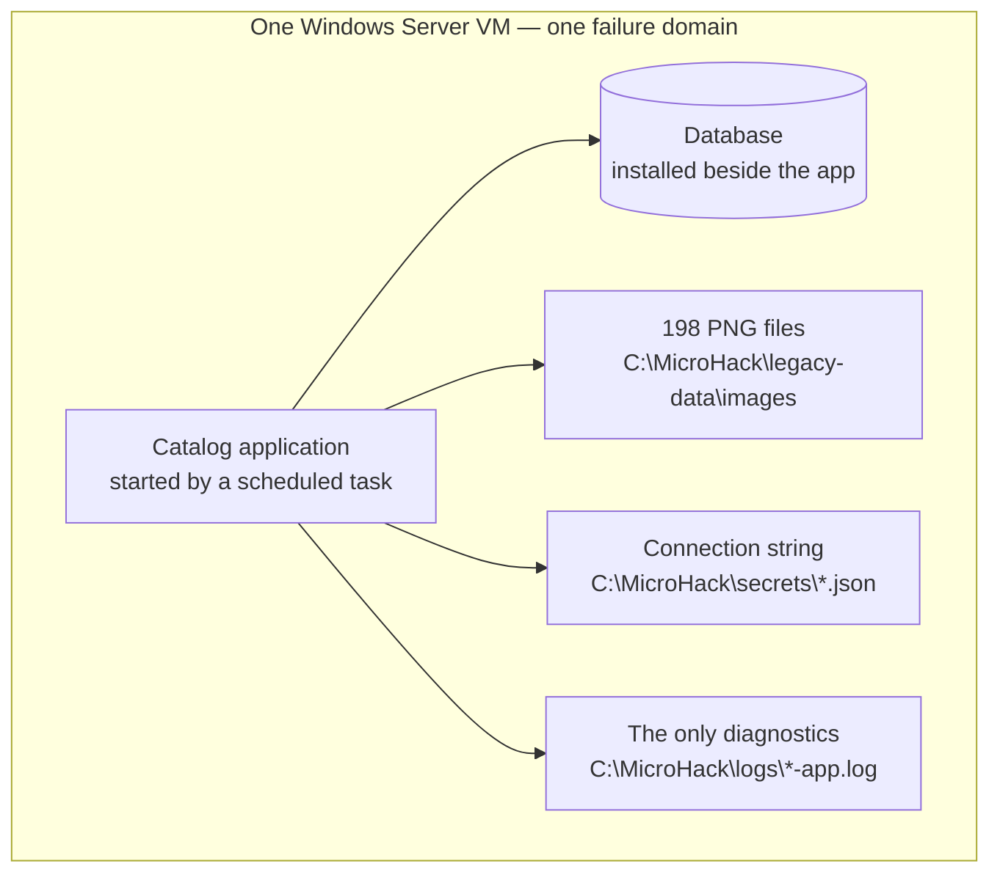

# Challenge 0: meet the application you are about to move

**By the end of this chapter you will have chosen one of the two legacy stacks, connected
to its virtual machine, and measured how that application behaves today.**

## Why this matters

You are about to spend two days arguing that this application should not live on a
virtual machine. That argument needs a *before*. Today the catalog, its database, its 198
photographs, its connection string and its only log file all sit on one Windows Server
box — so a slow query, a full disk, a failed patch, and a bad release are all the same
outage.

This chapter is where you choose your stack and write down the numbers you will use on
day 2 to prove the move was worth it.

**Estimated time:** 15 minutes.

## Before you start

- Your facilitator has given you a participant resource group (`rg-userNNN`), both VM
  names, and the RDP credentials.
- Your facilitator has given you the **full 40-character lowercase commit** the VMs were
  provisioned from. You will need it twice; keep it on the clipboard.
- Both VMs report a successful provisioning state.
- You have a clone of this workshop repository **on your own machine**. That clone is
  where every `evidence/` file you produce over the next two days lives.

Stop and ask if your VMs are unavailable, or if you can see another participant's
resource group. Do not repair provisioning during this challenge — that is facilitator
work, and a repaired VM is no longer the frozen baseline everyone else is comparing
against.

> [!IMPORTANT]
> The VM is scenery, not scaffolding. It exists to show you what the legacy world looks
> and feels like. Everything you build from Challenge 1 onwards is driven from the
> application **source code** in your own clone, not from anything on the VM. The only
> things that ever leave the VM are the handful of numbers you write down here.

New vocabulary in this chapter — *baseline*, *evidence*, *handoff*, *stack* — is defined
in the [glossary](../../docs/Glossary.md).

## The concept

Two applications. Same catalog, same 198 figures, same 20 categories, same routes,
same behavior. One is .NET 8 on SQL Server 2022 Express; the other is Java 17 on
PostgreSQL 18. They exist so that you can practise on the stack your own estate actually
runs.

What they also share is a shape, and the shape is the problem:



Every arrow in that diagram is something you will move somewhere else over the next two
days. Nothing here scales independently, nothing here fails independently, and nothing
here can be observed from outside the box.


## Your goal

Choose one stack, connect to that stack's VM, capture a legacy baseline you can defend,
and record the selection in your own repository clone.

You are done when `evidence/ch00-selection.json` in your clone names exactly one stack and
that stack's baseline marker checks out.

## 1. Choose your stack

Do this **first**. Everything else in this challenge — and every challenge after it — is
measured against one stack only, so there is nothing to gain by testing both.

| | `dotnet-sqlserver` | `java-postgresql` |
| --- | --- | --- |
| VM | `vm-dotnet-userNNN` | `vm-java-userNNN` |
| Runtime today | .NET 8 | Microsoft OpenJDK 17 |
| Database today | SQL Server 2022 Express | PostgreSQL 18 |
| URL inside the VM | `http://localhost:5000` | `http://localhost:8080` |
| Application directory | `dotnet/` | `java/` |
| Target database | Azure SQL Database | Azure Database for PostgreSQL Flexible Server |
| Database cutover you will run | `.bacpac` export and import | `pg_dump` export and restore |
| Choose it if | your estate is .NET, or you want the shortest path | your estate is JVM, or you want the more explicit configuration story |

Both stacks converge on the same Azure Container Apps runtime and the same Challenges 2
through 6, so neither is the easy option. Pick the one that resembles what you actually
maintain; if your table can split, pick different ones deliberately so you have someone to
compare notes with at the wrap-up. No preference? Take `dotnet-sqlserver`.

Write the choice down now; you will need the stack ID verbatim in step 5.

> [!NOTE]
> Leave the other VM running. It costs little over a two-day workshop, and it is there if
> you want to glance at the other stack later.

## 2. Connect to your VM

Your VM has **no standing inbound RDP rule**, and you should not create one — the tenant's
governance automation removes standing rules that open management ports. The supported way
in is **Just-in-Time (JIT) VM access**, which opens 3389 to your address for a few hours
and then closes it again. You hold **Owner** on your own resource group, so you can do all
of this yourself from the Azure Portal.

### 2a. Enable JIT on your VM

1. In the [Azure Portal](https://portal.azure.com), open your resource group `rg-userNNN`
   and select the VM for the stack you chose in step 1.
2. In the left-hand menu choose **Connect**.
3. If the portal offers to enable **Just-in-time access** for this VM, accept it. Otherwise
   search the portal for **Microsoft Defender for Cloud**, open **Just-in-time VM access**,
   find your VM on the **Not Configured** tab and choose **Enable JIT on 1 VM**.
4. Leave the default rule for port **3389** as it is and select **Save**.

<!-- SCREENSHOT PLACEHOLDER: Azure Portal, Defender for Cloud > Just-in-time VM access, "Not Configured" tab with the participant VM selected -->
_(Screenshot to follow.)_

You only do this once per VM.

### 2b. Request access

1. On the **Configured** tab of **Just-in-time VM access**, tick your VM and choose
   **Request access**.
2. For port **3389**, set the source to **My IP** and leave the default time range.
3. Select **Open ports**.

<!-- SCREENSHOT PLACEHOLDER: The "Request access" blade, port 3389 toggled on with "My IP" selected -->
_(Screenshot to follow.)_

Access lasts for the requested window. When it expires, come back and request it again —
that is normal, and it is the whole point of JIT.

### 2c. Connect

Back on the VM's **Connect** page, choose **RDP**, download the `.rdp` file, and open it
with the administrator credentials your facilitator gave you.

Once you are on the desktop, open the browser **inside** the VM and go to your stack's
URL from the table in step 1. You should see the catalog.

That the application is only reachable from the machine it runs on is itself part of the
"before" picture: it is bound to one box, and being on that box is the only way in.

> [!TIP]
> If RDP stops responding later in the day, your public address has probably changed —
> switching networks or a VPN reconnect is enough. Request JIT access again and it will
> pick up your new address.

## 3. Look around (optional)

If you have time, use the application before you measure it. Search for a figure. Filter
by a category. Open a detail page and load its photograph.

Notice what you *cannot* do: there is no second instance to fail over to, no dashboard
telling you how many requests just arrived, and no way to release a new version without
touching this one machine. This VM is the whole service — if it stops, the catalog is gone.

## 4. Measure the legacy baseline

This is the "before" column of the scorecard you fill in at the end of the workshop — the
before/after table in [the wrap-up](../wrapup/README.md). Every row of it needs a number
from this step.

### First, how a one-line fix reaches this application today

Almost every number below comes from the machine. Two do not, so here they are, spelled
out — you do not have to work them out yourself.

Say a label on the catalog page is wrong and you have to fix that one line. On this VM,
that is:

1. Change the line on your laptop.
2. Build and publish the application.
3. Get the output onto the VM — zip it, upload it, drag it over RDP.
4. Raise a change ticket.
5. Wait for it to be approved.
6. Wait for the change window to open.
7. Connect to the VM over RDP.
8. Copy the current `C:\MicroHack\app\<stack>` folder somewhere safe, in case.
9. Back up the database, in case.
10. Stop the `MicroHack-*` scheduled task.
11. Wait for the process to actually exit.
12. Swap in the new files.
13. Start the task again.
14. Open the browser on the VM and click round the catalog to see whether it worked.

**Fourteen steps, and every one of them is a person.** Undoing it is six steps of the same
kind — reconnect, stop the task, put the old folder back, restore the database, start the
task, check by hand — and that only works at all if you remembered steps 8 and 9.

That is where the three values at the top of the block below come from. **They are already
filled in.** If your own organization is slower (a change freeze, a two-week queue) or
faster, edit them so the wrap-up compares against your reality rather than ours.

### Then, the numbers the machine gives you

The same block also checks the VM against the frozen baseline it was provisioned from, so
anything that differs later is something *you* changed. Paste the whole thing into
PowerShell **inside the VM**, after setting the three values at the top:

```powershell
$stack   = 'dotnet'                   # 'java' if you chose java-postgresql
$baseUrl = 'http://localhost:5000'    # 'http://localhost:8080' for java
$expectedSourceCommit = '<facilitator-provided-40-character-lowercase-commit>'

# How a one-line fix ships today — the list above. Edit only if yours differs.
$manualDeploySteps   = 14
$manualRollbackSteps = 6
$manualDeployWindow  = 'Saturday 22:00-02:00, change board approval required'

$marker = Get-Content "C:\MicroHack\status\$stack-smoke.json" -Raw | ConvertFrom-Json

if (
  $expectedSourceCommit -cnotmatch '^[0-9a-f]{40}$' -or
  $marker.stack -ne $stack -or
  $marker.sourceCommit -cne $expectedSourceCommit -or
  $marker.healthRoute -ne '/healthz' -or
  $marker.readinessRoute -ne '/readyz' -or
  $marker.canonicalImage -notmatch '^/images/[0-9a-f-]{36}\.png$' -or
  $marker.figures -ne 198 -or
  $marker.categories -ne 20 -or
  $marker.images -ne 198
) {
  throw "The $stack provisioning marker does not match the frozen baseline."
}

$health  = Invoke-WebRequest "$baseUrl/healthz" -UseBasicParsing
$ready   = Invoke-WebRequest "$baseUrl/readyz" -UseBasicParsing
$catalog = Invoke-WebRequest "$baseUrl/" -UseBasicParsing
$image   = Invoke-WebRequest "$baseUrl$($marker.canonicalImage)" -UseBasicParsing

if (
  $health.StatusCode -ne 200 -or
  $ready.StatusCode -ne 200 -or
  $catalog.StatusCode -ne 200 -or
  $image.StatusCode -ne 200 -or
  $image.Headers.'Content-Type' -notlike 'image/png*'
) {
  throw "The $stack baseline HTTP checks failed."
}

$samples = 1..20 | ForEach-Object {
  (Measure-Command {
    Invoke-WebRequest "$baseUrl/" -UseBasicParsing | Out-Null
  }).TotalMilliseconds
}
$sorted = @($samples | Sort-Object)
$os = Get-CimInstance Win32_OperatingSystem

$pain = [ordered]@{
  stack               = $stack
  measuredAtUtc       = (Get-Date).ToUniversalTime().ToString('o')
  catalogMedianMs     = [math]::Round($sorted[[int][math]::Floor($sorted.Count / 2)], 1)
  catalogSlowestMs    = [math]::Round($sorted[-1], 1)
  hostCpuCount        = [int]$env:NUMBER_OF_PROCESSORS
  hostMemoryGb        = [math]::Round($os.TotalVisibleMemorySize / 1MB, 1)
  applicationHosts    = @(Get-Process dotnet, java -ErrorAction SilentlyContinue |
    ForEach-Object { $_.ProcessName } | Sort-Object -Unique)
  databaseServices    = @(Get-Service |
    Where-Object { $_.Name -match '^(MSSQL|postgresql)' } |
    ForEach-Object { "$($_.Name)=$($_.Status)" })
  startupTasks        = @(Get-ScheduledTask -TaskName 'MicroHack-*' -ErrorAction SilentlyContinue |
    ForEach-Object { "$($_.TaskName)=$($_.State)" })
  imageFilesOnDisk    = @(Get-ChildItem 'C:\MicroHack\legacy-data\images' -Filter *.png).Count
  configurationFile   = "C:\MicroHack\secrets\$stack.json"
  onlyDiagnostics     = "C:\MicroHack\logs\$stack-app.log"
  runningInstances    = 1
  autoscale           = $false
  distributedTraces   = $false
  manualDeploySteps   = $manualDeploySteps
  manualRollbackSteps = $manualRollbackSteps
  manualDeployWindow  = $manualDeployWindow
}

"=== save as evidence/ch00-$stack-baseline.json ==="
$marker | ConvertTo-Json -Depth 10
"=== save as evidence/ch00-pain-$stack.json ==="
$pain | ConvertTo-Json -Depth 10
```

No errors means it passed. **Copy the two JSON documents out of the RDP session and save
them in your own clone**, under the names the output gives you, unedited. Clipboard
sharing works over RDP; if yours does not, retype the values you care about. Nothing
downstream reads these off the VM — they belong to you. Keep the full `sourceCommit`
handy; you need it again in step 5.

If either check throws, stop and tell your facilitator. A baseline that does not match is
not something to fix yourself.

**`catalogMedianMs` is the one to remember.** In Challenge 2 you put it next to the median
the load engine reports against the modernized catalog.

The rest of the output is the actual lesson:

- `applicationHosts` and `databaseServices` are on the **same machine**. One noisy query
  and the web tier starves.
- `hostCpuCount` and `hostMemoryGb` are your entire capacity plan. `runningInstances` is
  `1` and `autoscale` is `false` — a traffic spike is survived by hoping.
- `imageFilesOnDisk` is 198 photographs on a C: drive. Rebuild the VM and they are gone.
- `configurationFile` holds a database credential in a file on the server.
- `onlyDiagnostics` is a text file and `distributedTraces` is `false`. That is your entire
  answer to "why was it slow at 02:00 last Tuesday?".
- The application answers on two routes: `/healthz` says the process is alive, `/readyz`
  says it can reach its data. Here they are always true together, because the database is
  the same box. That distinction becomes load-bearing the moment the database moves away.

## 5. Record your selection

This step happens **in your own clone**, not on the VM. Every later chapter reads this file
to know which stack you are on, so it has to be exact.

Create `evidence/ch00-selection.json` with a text editor and fill in the five values:

```json
{
  "schemaVersion": "1.0.0",
  "selectedStack": "dotnet-sqlserver",
  "selectedVm": "vm-dotnet-userNNN",
  "resourceGroup": "rg-userNNN",
  "sourceCommit": "<the 40-character commit from step 4>",
  "baselineContract": "workshop/contracts/behavior-contract.json@1.1.0",
  "selectedAtUtc": "2026-01-01T09:00:00Z"
}
```

Check it against this list before you move on:

- `selectedStack` is exactly `dotnet-sqlserver` or `java-postgresql` — no other spelling.
- `selectedVm` is the VM for that stack: `vm-dotnet-userNNN` for .NET, `vm-java-userNNN`
  for Java, with your own participant number.
- `resourceGroup` matches `rg-userNNN` and is *your* resource group.
- `sourceCommit` is 40 lowercase hex characters and matches the marker from step 4 exactly
  — not a short SHA, not a branch name.
- `selectedAtUtc` is an ISO-8601 UTC timestamp.

From here on, this file is the answer to "which stack am I on?" — and it, not the VM, is
what Challenge 1 starts from.

## Success criteria

- You have used your chosen catalog in a browser and can describe what the application
  does without reading this page.
- `evidence/ch00-pain-<stack>.json` exists **in your own clone**, and you can state its
  `catalogMedianMs` from memory.
- That file carries `manualDeploySteps`, `manualRollbackSteps` and a `manualDeployWindow`,
  because the wrap-up reads all three as the "before" for pipeline lead time and rollback.
  The supplied defaults are fine; edit them only if your own organization differs.
- `evidence/ch00-<stack>-baseline.json` exists in your clone, reports the correct stack and
  the `198`/`20`/198 corpus, and its `sourceCommit` is the facilitator-provided full commit.
- Your application returned HTTP 200 for catalog, liveness, readiness, and one canonical
  PNG image.
- `evidence/ch00-selection.json` names exactly one stack and passes the checklist in step 5.
- No application, database, role assignment, provider, or resource is modified.

## Hints

<details>
<summary>Hint 1 — a nudge</summary>

The block is ordinary PowerShell: it checks the provisioning marker, calls four routes,
times 20 requests and asks Windows what else is running on this machine. If it throws,
read which line threw — a missing path or an unexpected service name is a fact about the
VM worth knowing, not a bug to work around.

For the selection record, everything in it is either something the facilitator told you
or something you can read off the marker. Nothing is invented.

</details>

<details>
<summary>Hint 2 — the approach</summary>

Choose your stack first, then do everything once. Request JIT access, connect, browse the
catalog, run the one measurement block, copy both JSON documents into your clone,
disconnect. The selection record is written on your own machine afterwards and needs no
VM at all.

The resource group is always `rg-userNNN`, and the VM names are always
`vm-dotnet-<userNNN>` and `vm-java-<userNNN>`.

</details>

<details>
<summary>Hint 3 — nearly the answer</summary>

The commit is the usual failure. `$expectedSourceCommit` must be the full 40-character
lowercase SHA the facilitator provisioned from, pasted identically into the measurement
block and the selection record. `git rev-parse HEAD` on the VM is *not* a substitute, and
neither is a short SHA or a branch name.

The facilitator-side expectations for every field and the exact VM-to-stack mapping are
written out in [the Challenge 0 solution](../../solutions/ch00/README.md).

</details>

## If it goes wrong

| Symptom | Cause | Fix |
| --- | --- | --- |
| RDP times out, on a VM that reports *running* | Your JIT request has expired, or your public address changed — a VPN reconnect or moving between networks is enough. | Request JIT access again (step 2b) with **My IP**. If it still times out, confirm Azure agrees the flow is allowed: `az network watcher test-ip-flow --vm <vm> -g rg-userNNN --direction Inbound --protocol TCP --local <private-ip>:3389 --remote <your-ip>:56789`. `Allow` means the block is on your own network, not in Azure. |
| RDP worked, then stopped later in the day | Either the JIT window closed, or a standing "allow the internet" rule was added by hand — tenant governance deletes those automatically. | Use JIT rather than a standing rule. Requesting access again is the expected routine, not a failure. |
| Just-in-time VM access is not offered in the portal | Defender for Cloud is not enabled for servers on this subscription. | Ask your facilitator — this is a subscription-level setting, not something to work around. |
| `The <stack> provisioning marker does not match the frozen baseline.` | `$expectedSourceCommit` is a short SHA, a branch, uppercase, or from the wrong provisioning run. | Paste the full 40-character lowercase commit the facilitator gave you. If it still fails, the VM was provisioned from a different commit — that is a facilitator repair, not yours. |
| `The <stack> baseline HTTP checks failed.` | The `MicroHack-*` scheduled task or the local database service is not running yet. | Check `Get-ScheduledTask -TaskName 'MicroHack-*'` and the database service state, wait for startup to finish, and retry. Do not reseed the database. |
| You cannot paste JSON out of the RDP session | Clipboard redirection is disabled in your RDP client. | Enable it in the client's *Local Resources* settings, or retype the handful of values the wrap-up actually needs. |

Everything else: [troubleshooting](../../docs/Troubleshooting.md).

## What you just proved

You now have a defensible *before*. Not "the legacy app was slow" — but a median page
response in milliseconds, on a named machine, with a named CPU and memory budget, one
instance, no autoscale, 198 photographs on a local disk, a credential in a config file,
and a text file as the only diagnostic surface.

| | What you measured today |
| --- | --- |
| Catalog page, median | your `catalogMedianMs`, from one instance |
| Instances available | 1 |
| Autoscale | none |
| Recovery from a bad release | restore from backup |
| Answer to "why was it slow?" | one text file on the server |

Keep that. In Challenge 2 you will put a real load through the modernized application and
watch replicas appear; in Challenge 3 you will time a deployment and a rollback; in
Challenge 6 an agent will recover an incident while you watch. Every one of those numbers
is meaningless without the column you just filled in.

You have also committed to one stack. That decision is now in
`evidence/ch00-selection.json`, and every remaining chapter reads it rather than asking
you again.

---

**Previous:** [Workshop overview](../../README.md) ·
**Next:** [Challenge 1: choose how you modernize](../ch01/README.md)
