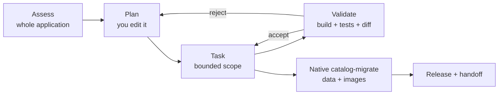

# Path 1C: GitHub Copilot modernization

**By the end of this path you will have modernized the catalog with the GitHub Copilot
modernization IDE experience — assessed, planned, executed task by task, and rejoined the
shared Azure target.**

## Why this path

Every organization with a legacy estate faces the same question before it faces any
technical one: *what would it even take to move this?* Answering that by hand is days of
an experienced engineer's time. This path produces a reviewable answer in a sitting, and
then executes against it.

Executing against it is what separates this path from the other two. 1A and 1B rebuild the
catalog on the framework version it already runs; this is the only path that moves the
version itself — .NET 8 to 10, or Spring Boot 3 to 4 on Java 21 — with the existing tests
as the referee. That is the shape of most real modernization backlogs, and it is the one
claim here you will not have to take on trust: the
[debrief](../ch01/README.md#debrief-compare-the-three-paths) puts your own wall-clock next
to the two paths that reached the same destination without the tooling.

**What the modernization experience does for you:**

- **Assesses the whole application at once.** Runtime and framework compatibility, cloud
  readiness, process model, health endpoints, container suitability, configuration and
  secret handling, dependency CVEs, database connectivity and transaction use, local-file
  access. You get a written inventory of every place this application touches the machine
  it lives on.
- **Produces a task plan you can argue with.** Not a wall of generated code — a sequence
  of bounded tasks, each with a file scope, that you review and edit before anything runs.
  Reviewing a plan is much cheaper than reviewing a diff.
- **Executes supported transformations.** The framework major-version move itself, plus
  managed-identity code preparation, containerization, and infrastructure scaffolding,
  each within the scope you approved.
- **Surfaces the security work you would otherwise miss.** Dependency CVEs and hardcoded
  credentials come out of the assessment, not out of a penetration test six months later.
- **Turns unknown scope into known scope.** That is the real deliverable. Even when a
  task fails preflight, you have learned something specific about the application.

This is why it is the fastest of the three paths — you spend your time deciding rather
than discovering.

**Estimated time:** 5–7 hours. Tighter than the alternatives, but still more than the
time available. The facilitator can supply a golden handoff so you rejoin at Challenge 2
with the rest of the room.

## Before you start

**Where you work.** Everything below runs on the selected VM from Challenge 0, reached
over Azure Bastion. The source tree is at `C:\MicroHack\source` — **that directory is
what "the repository root" means throughout this workshop.** Open that folder in VS Code
and start each terminal with `cd C:\MicroHack\source`.

**What the VM has, and does not.** The image is fully pinned. Git is pinned with it, so
`C:\MicroHack\source` is a repository holding one baseline commit of the extracted
archive. There is no Docker daemon.

| You need | On the VM |
| --- | --- |
| the exact 40-character source commit of the archive | `(Get-Content 'C:\MicroHack\source\.source-commit' -Raw).Trim()` — the provisioner writes this marker when it extracts the archive |
| the commit that identifies your modernized source | `git rev-parse HEAD` on a clean tree, taken in §3 once the branch is pushed. It binds every build, tag, migration, acceptance, telemetry, and handoff artifact, and it is the only commit Challenge 3 can check out |
| a container image build | `az acr build` uploads the build context and builds inside Azure Container Registry, so no local daemon is needed |
| to commit accepted modernization tasks | `git add` and `git commit` in `C:\MicroHack\source`. Working rule 1 and the review loop in §2 stage and commit reviewed diffs; §3 then publishes them and recaptures the commit. |

- You completed [Challenge 0](../ch00/README.md) and read [Challenge 1](../ch01/README.md).
- You are on the selected legacy VM, with VS Code and the pinned extensions available.
- Your facilitator has approved the target deployment and supplied protected parameter
  files. Those files also carry `resourceGroupName`: the resource group the facilitator
  created for you before the workshop, the one your two legacy VMs already live in, and
  the only group this path deploys into.
- **Two parameters are missing from those files on purpose:** `sourceCommit` and
  `imageDigest`. Neither value existed when provisioning wrote the files — you produce one
  in §3 and the other in §5 — and a placeholder that satisfied `infra/main.bicep`'s format
  assert would deploy the wrong source without ever saying so. Supply them on the command
  line instead, *after* the file —
  `--parameters '@C:\protected\<file>.json' --parameters sourceCommit=$SourceCommit` —
  because a later `--parameters` overrides an earlier one. A deployment that fails because
  you forgot one is that guard working, not a broken file.
- You have the HTTPS URL of your own GitHub repository, from the facilitator.

Choose exactly one stack. The version on the left is what is on your VM today; the version
on the right is where this path takes it, and that move is the point of this path:

- [**.NET 8.0.30 → .NET 10.0.11**, SQL Server 2022 → Azure SQL Database](../../solutions/ch01-copilot-modernization/dotnet/README.md)
- [**Spring Boot 3.5.16 → Spring Boot 4.0.7**, Java 17.0.20+8 → Java 21.0.12+8, PostgreSQL 18 → Flexible Server 18](../../solutions/ch01-copilot-modernization/java/README.md)

The destination is the frozen shared design: one non-root Azure Container Apps
application, the matching managed database, immutable ACR image identity, managed
identity, direct Azure Monitor OpenTelemetry export, and 198 images in Azure Blob
Storage. Use `infra/main.bicep`, the selected stack's `Dockerfile` at the repository root,
`catalog-migrate`, and the shared acceptance harness. Do not replace or reinterpret those
interfaces.

The legacy baseline ships without a Dockerfile on purpose — producing one is part of this
work, and the containerization capability is one of the tasks the extension can perform
for you. Once it is accepted and its base images are digest-pinned, treat it as frozen.

## Required IDE product

Both legacy VMs expose these exact signed Visual Studio Marketplace packages from
`C:\ProgramData\MicroHack\vscode-extensions`:

| Extension | Locked version |
| --- | --- |
| `github.copilot` | `1.388.0` |
| `github.copilot-chat` | `0.48.1` |
| `vscjava.migrate-java-to-azure` | `1.23.26081703` |

`vscjava.migrate-java-to-azure` is the unified GitHub Copilot modernization
extension for this workshop and is required on both the .NET and Java VMs.
Historical Java or .NET upgrade extensions might also be installed on a
stack-specific VM, but they are not the required Path 1C modernization product.

From `C:\MicroHack\source` on the selected source VM, capture the exact inventory:

```powershell
New-Item -ItemType Directory -Force evidence | Out-Null
$ExtensionRoot = 'C:\ProgramData\MicroHack\vscode-extensions'
code --list-extensions --show-versions --extensions-dir $ExtensionRoot |
  Sort-Object |
  Tee-Object evidence\ide-extensions.txt
```

Stop if any required ID or version differs. Do not install a newer package,
switch to a mutable source ref, or continue with an unsigned VSIX.

## The concept



Notice where the branch is. On the rewrite path you review generated code; here you
review a *plan*, and code follows from an approved plan. That is a different — and for
large estates, more scalable — control point.

Notice also that data leaves the diagram. Application transformation and database cutover
are separate concerns on this path, deliberately.

## Your goal

Assess the legacy application, execute a reviewed modernization plan, migrate data and
images with the native CLI, and finish with a validated handoff plus a written assessment
your organization could act on.

## Working rules

1. Record the starting revision for traceability, work on a branch, and keep
   secrets outside Git. After all accepted modernization tasks, commit the
   reviewed changes, require a clean worktree, push the branch to your own
   GitHub repository, and recalculate the exact lowercase full 40-hex source
   commit. That final pushed commit, not the pre-modernization revision, binds
   build, tag, migration, acceptance, telemetry, and handoff evidence.
2. Use the IDE experience in guided mode. Assessment, plan, and task output is
   evidence, never proof that runtime behavior, deployment, or cutover works.
3. Review and edit every generated plan before execution. A human owns the
   target runtime, database family, image provider, authentication, and rollback
   decisions.
4. Preflight each proposed task against the installed product. Run only a
   supported task with a bounded file scope and explicit validation command.
5. After every task, review `git diff`, reject unrelated edits, and run the
   stack build and tests. Commit or revert the bounded task before proceeding.
6. Stop and replan if a task changes a frozen contract, changes database
   family, selects Azure Files, weakens managed identity, introduces a mutable
   image or dependency, commits a secret, deletes source data, or cannot name
   its validation.
7. Azure execution requires the facilitator-approved bootstrap output from the shared
   target. Path 1C does not authorize creation, deletion, or mutation outside that
   target.

## Steps

### 1. Assessment and reviewed plan

Open `C:\MicroHack\source` in VS Code and use the unified modernization
experience to assess all of these areas:

- source and target runtime/framework compatibility;
- cloud readiness, process model, health endpoints, and container suitability;
- configuration externalization and secret handling;
- dependency security and CVE findings;
- database connectivity, authentication, schema ownership, and transaction use;
- local-file reads/writes, especially `data/images`, seed data, and file logs.

Save the reviewed result as `evidence/assessment.md`. The document must separate
observed facts from recommendations and identify unsupported or irrelevant
findings.

Generate a task plan, review it line by line, and save the approved version as
`evidence/modernization-plan.md`. It must preserve the selected database family
and require `azure-blob` with managed identity. For each proposed task, record:

- supported IDE capability and exact files in scope;
- prerequisites and a clean-diff preflight;
- expected generated or modified artifacts;
- build, test, and security validation;
- stop/replan triggers and rollback of that task.

Use supported runtime/framework, managed-identity code preparation,
containerization, IaC, and deployment capabilities only where their preflight
matches this repository. The final container and IaC are still the repository-relative
`dotnet/Dockerfile` or `java/Dockerfile` and `infra/main.bicep`; generated alternatives
must not silently replace them.

### 2. Execute the plan task by task

Run one bounded task, review its diff, run the stack build and tests, then commit or
revert. Repeat. Record every task outcome in `evidence/task-results.json` and the
build/test/CVE picture in `evidence/build-test-cve-summary.md`.

The containerization task belongs in this section, not later: the `Dockerfile` it produces
has to exist in the commit you publish next, because that is the commit Challenge 3 checks
out and builds. If the extension cannot produce one for your repository, write it yourself
before §3.

### 3. Publish the modernized source

With every accepted task committed and the worktree clean, push your work before you touch
data. Add your own GitHub repository as `origin` and
`git push --set-upstream origin workshop`, signing in through the browser when Git
Credential Manager asks. Then recapture `$SourceCommit` from `git rev-parse HEAD`.

This is the first section that produces a usable source identity, and it comes before §4
deliberately: every `catalog-migrate` mutation binds to `--source-commit`, and a commit
that exists only on this VM is one Challenge 3 cannot check out. If a later fix changes a
tracked file, commit, push, and recapture `$SourceCommit` before the next command that
consumes it.

### 4. Migrate data and images natively

See the boundary below. Export, import, verify, and copy images with `catalog-migrate`
from the selected source VM, each command bound to the published `$SourceCommit`.

### 5. Build, release, and hand off

Build the image with `az acr build` — the VM has no Docker daemon, and `az acr build`
needs none — resolve its digest, then deploy baseline and release by that same digest.
`infra/main.bicep` is resource-group scoped and creates no resource group: deploy it with
`az deployment group create --resource-group <your resource group>`, and its
`resourceGroupName` parameter must name that same group, or an assert refuses the
deployment. Take both values from the protected parameter file under `C:\protected\`.
Then run full acceptance and telemetry collection, write the rollback runbook, and render
the handoff. Finish by committing and pushing `evidence/modernization-contract.json`:
Challenge 3 reads the handoff from the commit it dispatches, and that commit has to be
later than the source commit it builds.

## Required boundary

The extension can assess code, prepare supported application transformations,
and produce reviewed modernization artifacts. It does **not** prove behavior
and it does **not** perform the database schema/data cutover for this workshop.

Database export, import, principal creation, corpus verification, and image copy
are always explicit native `catalog-migrate` commands run from the selected legacy
source VM. Mutating commands require a bootstrap-stage target output, the exact
target resource ID repeated in `--confirm-target-resource-id`, and `--execute`.
They reject nonempty targets. Images must be copied to the `azure-blob`
resource declared by the bootstrap output.

This boundary is not a shortcoming to work around — it is the correct division. Data
cutover needs guards an IDE cannot enforce: repeated confirmation of the target resource,
refusal to write into a non-empty database, and binding to an immutable source commit.

## Success criteria

Path-specific evidence is exact:

- `evidence/assessment.md`
- `evidence/modernization-plan.md`
- `evidence/task-results.json`
- `evidence/build-test-cve-summary.md`

The shared handoff bundle is also required:

- `evidence/azure-target-output.json`
- `evidence/migration-report.json`
- `evidence/acceptance-report.json`
- `evidence/runtime-test-report.json` — start from your stack's entry in
  `workshop/contracts/runtime-test-evidence.template.json` and replace only
  `sourceCommit`, `artifact`, and `command`. The fourteen `tests` entries are fixed by
  the contract and checked for exact equality; the handoff also parses the native
  artifact and fails unless all fourteen are present and passing.
- `evidence/telemetry-report.json`
- `evidence/modernization-contract.json`
- `evidence/rollback-runbook.md`

> **Telemetry evidence has a renderer — do not hand-author it.** Record your Azure
> Monitor observations into a capture manifest, then run
> `uv run python -m catalog_acceptance.telemetry_evidence_cli --capture
> evidence/telemetry-capture.json`. It normalizes all four `evidence/telemetry/*.json`
> files and the report, supplies each metric `unit` from the behavior contract, stamps
> `workspaceId`/`capturedAt`/`queryText` provenance, and lists **every** unmet
> requirement in one run rather than one per handoff attempt. The manifest's shape is
> `workshop/contracts/telemetry-evidence-capture.schema.json`, with a complete worked
> manifest in `telemetry-evidence-capture.example.json` — copy that and replace the
> observations with your own. Do not invent a signal you did not observe: the renderer
> refuses a missing signal rather than defaulting it.

Finish only when:

1. every approved task has a reviewed diff and passing stack validation, all
   accepted changes are committed, and the clean final commit is pushed and
   recaptured;
2. native runtime evidence contains all fourteen frozen tests;
3. the image commit tag resolves to the exact deployed digest and the retained
   baseline revision is healthy, inactive, distinct, and uses that same digest;
4. full acceptance passes against the managed database and all 198 Blob images,
   with its subject bound to the final source commit, immutable image digest,
   and release revision; `PERFTEST_API_KEY` is supplied only through the
   environment and cleared afterward;
5. telemetry evidence has nonempty resources, traces, metrics, and logs;
6. the rollback runbook is executable and repository-contained; and
7. native `catalog-migrate render-handoff --path copilot-modernization
   --rollback-runbook evidence/rollback-runbook.md ...` creates handoff `1.4.0`,
   which passes `python -m catalog_acceptance.handoff_cli`.

## Hints

<details>
<summary>Hint 1 — a nudge</summary>

Spend real time on the assessment before you generate a plan. The assessment is the
deliverable your organization would pay for; the plan is downstream of it. If the
assessment misses that images are read from a local directory, every task after it
inherits that miss.

Edit the generated plan. A plan you accepted without changing is a plan you did not
review.

</details>

<details>
<summary>Hint 2 — the approach</summary>

Order the tasks so the cheapest validation comes first: configuration externalization and
health endpoints before containerization, containerization before deployment. Each task
should end with a green build and green tests, which means each task is independently
revertible.

When a task fails preflight, record *why* in `task-results.json`. That refusal is a real
finding about your application, not a tooling defect.

</details>

<details>
<summary>Hint 3 — nearly the answer</summary>

The stack runbook has the complete executable form of every command and the exact
ordering of commit, clean-tree check, and source-commit recapture:
[.NET](../../solutions/ch01-copilot-modernization/dotnet/README.md) or
[Java](../../solutions/ch01-copilot-modernization/java/README.md).

[The reference implementation](../../solutions/reference/README.md) is the modernized
target for both stacks.

</details>

## If it goes wrong

| Symptom | Cause | Fix |
| --- | --- | --- |
| `git rev-parse HEAD` does not match `.source-commit` | Expected. `C:\MicroHack\source` is initialized on the VM with one baseline commit of the extracted archive, so its history is unrelated to the upstream archive commit | Read `.source-commit` where a step wants archive provenance. For everything that identifies your modernized source, use `git rev-parse HEAD` taken after the accepted tasks are committed, the tree is clean, and the branch is pushed. Both satisfy the same 40-hex guard, but only the pushed one exists on GitHub. |
| `docker` is not recognized, or a generated task proposes `docker build` | The provisioned VM has no Docker daemon | Build with `az acr build`. If a *generated* task proposes a local Docker build, reject it and replan — that is exactly the preflight mismatch the working rules ask you to record. |
| The extension version does not match the locked table | A newer package was installed | Stop. Do not proceed on an unpinned version — the whole evidence chain assumes these versions. |
| A proposed task fails its preflight | The capability does not match this repository | Record it in `task-results.json` and replan around it. This is information, not an error. |
| A task's diff touches files outside its scope | Scope was too broad or the plan was vague | Revert the task, tighten the file scope in the plan, re-run. |
| Source commit derivation refuses | The worktree is dirty | Commit the accepted changes first. The clean final commit binds every downstream artifact. |
| A deployment is rejected before a single resource is created, naming a required parameter it was not given | `sourceCommit` — and, at the two application deployments in §5, `imageDigest` — are deliberately absent from the protected files | Append `--parameters sourceCommit=$SourceCommit` (and `imageDigest=$ImageDigest`) after the `@file` argument. Absent by design, not a broken file — see the bullet in [Before you start](#before-you-start). |
| A `catalog-migrate` command rejects the target | The target is non-empty, or the resource ID confirmation does not match | That guard is doing its job. Fix the prerequisite; do not bypass it. |

Everything else: [troubleshooting](../../docs/Troubleshooting.md).

## Optional appendix: preview orchestration

The Modernize CLI is public preview and optional. A facilitator may demonstrate
its portfolio assessment and planning flow separately, but it is not a
prerequisite, required task, evidence producer, deployment tool, or replacement
for the signed IDE extension in this challenge.

## What you just proved

You produced, in an afternoon, the artifact that normally blocks legacy modernization
programs for months: a specific, evidenced answer to "what would it take to move this
application?" — with the tasks that succeeded, the tasks that were refused, and the
security findings that came out along the way.

You also drew the line in the right place. Application transformation was assisted; data
cutover was explicit, guarded, and native. Anyone who tells you a tool can do both without
that separation has not migrated a production database.

Bring `evidence/assessment.md` and your task-refusal list to the
[debrief](../ch01/README.md#debrief-compare-the-three-paths) — the refusals are the most
interesting thing any of the three paths produced.

---

**Previous:** [Challenge 1: get the catalog off the virtual machine](../ch01/README.md) ·
**Next:** [Challenge 2: load and autoscaling](../ch02/README.md) ·
**Other paths:** [Manual](../ch01-manual/README.md) ·
[Copilot rewrite](../ch01-copilot-rewrite/README.md)
