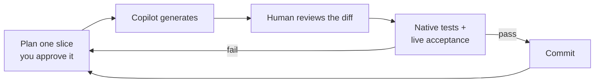

# Path 1B: bounded rewrite with GitHub Copilot

**By the end of this path you will have modernized the catalog slice by slice with
GitHub Copilot, with the existing test suite acting as referee on every diff.**

## Why this path

The hard part of a rewrite is never typing the code. It is knowing what the old code
actually did — which routes exist, what the schema really enforces, which errors are
swallowed, what configuration is read at startup. That knowledge is spread across a
codebase nobody has read end to end in years.

That is what Copilot is genuinely good at here.

**What GitHub Copilot does for you on this path:**

- **Reads the legacy code faster than you can.** Ask it to explain the existing schema,
  security, configuration, error, and dependency behavior for one area, and you get a
  written characterization in minutes instead of an afternoon of grep.
- **Proposes the smallest diff that preserves that behavior.** You approve a plan before
  any code is generated, so you are reviewing intent, not archaeology.
- **Writes the mechanical parts.** Provider wiring, configuration binding, health
  endpoints, OpenTelemetry instrumentation, the container definition — the parts that are
  tedious rather than interesting.
- **Reviews its own output when you ask it to.** "Find any behavior change, secret
  exposure, mutable image reference, or swallowed error in this diff" is a genuinely
  useful prompt, and it catches things.
- **Keeps momentum when you are stuck.** On a legacy codebase, the expensive minutes are
  the ones where you do not know what to do next. There are fewer of those here.

**What it does not do:** Copilot has no opinion about whether your migration was correct.
It cannot tell you that your row counts match, that TLS is enforced, or that the image
corpus is complete. So this path uses the existing characterization and acceptance tests
as the behavioral oracle, and a human reviews every generated diff before it is accepted.
Copilot output, a successful compile, screenshots, and prompt transcripts are not proof.

This is a bounded rewrite, not an open-ended redesign, and it does not use a
modernization or migration extension. The assisted-development tools are `github.copilot`
and `github.copilot-chat`, at the versions pinned by `workshop/toolchain.lock.json`.

**Estimated time:** 8–12 hours — the longest of the three paths, because every slice is
reviewed and tested before the next one starts. That is well beyond the time you have.
Complete as many slices as you can; the facilitator can hand you a golden handoff so you
rejoin at Challenge 2 with everyone else.

## Before you start

**Where you work.** Azure and migration commands run on the selected VM from Challenge 0,
reached over RDP at its public IP address. The source tree is at `C:\MicroHack\source` — **that
directory is what "the repository root" means throughout this workshop.** Start each
terminal with `cd C:\MicroHack\source`.

**Read this before you commit to this path.** This path's entire method is *one reviewed
commit per accepted slice*, so what the repository on the VM looks like matters more here
than on the other two paths. The image is fully pinned, Git included: the provisioner
initializes `C:\MicroHack\source` and puts the extracted archive into a single baseline
commit, so every commit after that one is yours. There is no Docker daemon.

| You need | On the VM |
| --- | --- |
| the exact 40-character source commit of the archive | `(Get-Content 'C:\MicroHack\source\.source-commit' -Raw).Trim()` — the provisioner writes this marker when it extracts the archive |
| the commit that identifies your rewrite | `git rev-parse HEAD` on a clean tree, taken at the publish checkpoint once the branch is pushed. Every `--source-commit` argument, image tag, and revision suffix carries it, and it is the only commit Challenge 3 can check out |
| a container image build | `az acr build` uploads the build context and builds inside Azure Container Registry, so no local daemon is needed |
| a per-slice commit | `git add` and `git commit` in `C:\MicroHack\source`, once the slice's diff is reviewed and its tests pass |

- You completed [Challenge 0](../ch00/README.md) and read [Challenge 1](../ch01/README.md).
- You have `github.copilot` and `github.copilot-chat` at the pinned versions, and you are
  signed in.
- Your facilitator has approved the target deployment and supplied protected parameter
  files. Those files also carry `resourceGroupName`: the resource group the facilitator
  created for you before the workshop, the one your two legacy VMs already live in, and
  the only group this path deploys into.
- **Two parameters are missing from those files on purpose:** `sourceCommit` and
  `imageDigest`. Neither value existed when provisioning wrote the files — you produce one
  at checkpoint 5 and the other at checkpoint 7 — and a placeholder that satisfied
  `infra/main.bicep`'s format assert would deploy the wrong source without ever saying so.
  Supply them on the command line instead, *after* the file —
  `--parameters '@C:\protected\<file>.json' --parameters sourceCommit=$SourceCommit` —
  because a later `--parameters` overrides an earlier one. A deployment that fails because
  you forgot one is that guard working, not a broken file.
- You have the HTTPS URL of your own GitHub repository, from the facilitator.

Choose exactly one registered slice in
[`workshop/contracts/challenge-paths.json`](../../workshop/contracts/challenge-paths.json):

| Slice | Source | Database family | Image provider | Runbook |
| --- | --- | --- | --- | --- |
| `copilot-rewrite-dotnet` | `dotnet/` | `azure-sql` | `azure-blob` | [.NET](../../solutions/ch01-copilot-rewrite/dotnet/README.md) |
| `copilot-rewrite-java` | `java/` | `postgresql-flexible` | `azure-blob` | [Java](../../solutions/ch01-copilot-rewrite/java/README.md) |

Treat the registry, its schema, modernization handoff 1.4.0, migration CLI 1.4.0,
`infra/main.bicep`, and `tests/acceptance` as read-only interfaces. You do author the
selected stack's `Dockerfile` — the legacy baseline deliberately ships without one — but
once it is accepted and its digests are locked, treat it as frozen too.

## The concept

Every slice runs the same loop, and the loop is the lesson:

The tests are what make assistance safe. Without them, "Copilot wrote it and it compiled"
is the only evidence you have, and that is not evidence. With them, you can accept
generated code quickly *because* something independent is checking it.

## Your goal

Rewrite the catalog onto Azure Container Apps one reviewed slice at a time, preserving
every frozen boundary, and finish with a validated handoff and a written architecture
delta.

## Required target

The completed rewrite must preserve all of these boundaries:

- one application container and no extra application services;
- the selected database family, hosted as a separate managed database;
- the `azure-blob` image provider with workload-identity access;
- Container Apps liveness and readiness behavior;
- externalized runtime configuration and secrets supplied outside source control;
- the frozen routes, data identity, import transaction, error behavior, security
  behavior, and OpenTelemetry signals.

## Steps

Create `evidence/` at the repository root. The shared evidence required by the
registry is:

- `evidence/azure-target-output.json`
- `evidence/migration-report.json`
- `evidence/acceptance-report.json`
- `evidence/runtime-test-report.json` — start from your stack's entry in
  `workshop/contracts/runtime-test-evidence.template.json` and replace only
  `sourceCommit`, `artifact`, and `command`. The fourteen `tests` entries are fixed by
  the contract and checked for exact equality; the handoff also parses the native
  artifact and fails unless all fourteen are present and passing. A bounded rewrite
  that preserves test display names and class or method identities satisfies the
  mapping unchanged, so this file needs no Azure resources and can be produced and
  validated before you deploy.
- `evidence/telemetry-report.json`
- `evidence/rollback-runbook.md`

> **Telemetry evidence has a renderer — do not hand-author it.** Record your Azure
> Monitor observations into a capture manifest, then run
> `uv run python -m catalog_acceptance.telemetry_evidence_cli --capture
> evidence/telemetry-capture.json`. It normalizes all four `evidence/telemetry/*.json`
> files and the report, supplies each metric `unit` from the behavior contract, stamps
> `workspaceId`/`capturedAt`/`queryText` provenance, and lists **every** unmet
> requirement in one run rather than one per handoff attempt. The manifest's shape is
> `workshop/contracts/telemetry-evidence-capture.schema.json`, with a complete worked
> manifest in `telemetry-evidence-capture.example.json` — copy that and replace the
> observations with your own. Do not invent a signal you did not observe: the renderer
> refuses a missing signal rather than defaulting it.

Preserve all of those plus `evidence/characterization.md`, `evidence/bounded-plan.md`,
`evidence/review-checklist.md`, and `evidence/decision-log.md`.

Use these checkpoints in order:

1. **Characterization checkpoint.** You cannot preserve behavior you never wrote down.
   Run the native suite and shared acceptance against the unchanged source. Record
   commands, results, known failures, routes, schema, configuration, and dependency
   behavior in `characterization.md`. This is the highest-leverage use of Copilot in the
   whole path — ask it to explain each area, then verify what it tells you against the
   tests.
2. **Bounded-plan checkpoint.** Write a human-reviewed plan in `bounded-plan.md`. Every
   slice must name its files, behavior, tests, exclusions, and rollback. The plan must
   explicitly preserve the database family, single-container boundary, Blob provider, and
   frozen infrastructure and migration contracts.
3. **Diff-review checkpoints.** Ask Copilot for one slice only. A human reviews the
   schema, security, dependencies, configuration, error handling, and every generated
   diff before accepting it. Record the review in `review-checklist.md`, then run the
   relevant native tests, static contract tests, and a shared live acceptance profile
   against the running application. Commit every accepted slice.
4. **Container checkpoint.** Author the selected stack's `Dockerfile` in that stack's
   directory — `java/Dockerfile` or `dotnet/Dockerfile`, the paths
   `workshop/contracts/challenge-paths.json` pins and the contract tests read — and prove
   it on paper before any registry exists: non-root execution, port `8080`,
   `/healthz`, `/readyz`, external configuration, digest-pinned base images, and exactly
   one application container. The image itself is built in checkpoint 7 with
   `az acr build` — it builds inside Azure Container Registry, so the VM's missing Docker
   daemon is not a blocker, but the registry only exists once the shared target is
   bootstrapped. Authoring it here is what lets the next checkpoint publish a commit that
   already contains it.
5. **Publish checkpoint.** With every accepted slice committed and the implementation tree
   clean, add your own GitHub repository as `origin` and
   `git push --set-upstream origin workshop`. Git Credential Manager opens a browser
   sign-in on the first push. Take `$SourceCommit` from `git rev-parse HEAD` afterwards:
   that pushed commit is the source identity everything downstream uses, the only commit
   Challenge 3 can check out, and the commit whose `Dockerfile` Challenge 3 builds. It has
   to happen here, before checkpoint 6, because `--source-commit` binds every migration
   command. If a later fix changes a tracked file, commit, push, and re-take
   `$SourceCommit` before the next command that consumes it.
6. **Migration checkpoint.** Use only native `catalog-migrate` export, import,
   image-copy, and verify commands, each bound to the published `$SourceCommit`. Retain
   the source and migration artifact. Do not add application-managed data transfer, and do
   not let Copilot generate one.
7. **Release checkpoint.** Deploy only through the frozen stages of the shared Azure
   target in `infra/main.bicep`. That template is resource-group scoped and creates no
   resource group: deploy it with `az deployment group create --resource-group <your
   resource group>`, and its `resourceGroupName` parameter must name that same group —
   an assert refuses the deployment otherwise. Take both values from the protected
   parameter file under `C:\protected\`. Build the image you authored with `az acr build`
   once bootstrap has created the registry, resolve the source-commit tag through the
   registry evidence command, and deploy `<loginServer>/<repository>@<digest>`, never a
   tag.
8. **Handoff checkpoint.** Complete native runtime evidence, full acceptance, telemetry
   evidence, `decision-log.md`, and `rollback-runbook.md`. The decision log must contain
   an explicit **Architecture delta** section listing every changed boundary and
   confirming the preserved database, one-container, Blob, readiness, configuration,
   migration, and shared-target infrastructure boundaries. Render and validate
   modernization handoff 1.4.0, then commit and push
   `evidence/modernization-contract.json`. Challenge 3 reads the handoff from the commit
   it dispatches, and that commit has to be later than the source commit it builds.

Run tests after every accepted slice. Static vocabulary or contract-asset tests do not
substitute for live behavioral acceptance. A failing or skipped required test, an
uncommitted accepted slice, or a dirty implementation tree is not a checkpoint. Before
deriving the lowercase full 40-hex source commit used by the image tag, revision,
migration report, and handoff, fail unless the implementation tree is clean; derive it
only from `git rev-parse HEAD` in `C:\MicroHack\source`, taken at checkpoint 5 after the
branch is pushed. That value identifies your own work and is the only commit Challenge 3
can check out. `C:\MicroHack\source\.source-commit` records the provenance of the archive
you started from, GitHub has never seen it, and the two are deliberately unrelated, so
never substitute one for the other.

## Suggested prompts

Prompts guide the assistant; they are not executable proof and are never graded for
wording.

> Read the frozen contracts and current tests. Propose one bounded slice only. List
> exact files, behavior preserved, tests to run, and explicit exclusions. Do not
> edit infrastructure, migration tooling, contracts, or unrelated architecture.

> For this slice, first explain the existing schema, security, configuration, error,
> and dependency behavior. Then propose the smallest diff that preserves it. Do not
> generate code until I approve the plan.

> Review this generated diff against characterization and acceptance. Identify any
> behavior change, secret exposure, mutable image reference, new service boundary,
> database-family change, or swallowed error. Recommend rejection if uncertain.

## Success criteria

- The catalog is served over HTTPS by a Container Apps revision built from a digest, and
  the VM is out of the request path.
- All 198 figures, 20 categories, and 198 images are reachable from managed services.
- Every accepted slice is committed, and the implementation tree is clean at handoff.
- `characterization.md`, `bounded-plan.md`, `review-checklist.md`, and `decision-log.md`
  exist and are non-empty, and the decision log has an Architecture delta section.
- The shared registry evidence is complete, and
  `python -m catalog_acceptance.handoff_cli` accepts your rendered contract.

## Hints

Hint 1 — a nudge

Make your first slice small enough to feel trivial. The point of slice one is not
progress, it is calibrating how much you trust the output and how long a review takes.
People who start with a big slice spend the rest of the day untangling it.

Ask Copilot to explain before it writes. Its explanations are cheap and its code is
expensive to review.

Hint 2 — the approach

Good slice boundaries for this codebase: configuration binding; the image provider; the
data-access layer; health and readiness endpoints; OpenTelemetry wiring; the container
definition. Each one is independently testable, which is exactly what makes it a slice.

Keep `characterization.md` open while you review. Most rejected diffs are rejected
because they quietly changed something you had written down an hour earlier.

Hint 3 — nearly the answer

The stack runbook has the complete executable form of every command, plus worked prompts
for each slice: [.NET](../../solutions/ch01-copilot-rewrite/dotnet/README.md) or
[Java](../../solutions/ch01-copilot-rewrite/java/README.md).

[The reference implementation](../../solutions/reference/README.md) shows the finished
shape of both stacks — useful as a target, not as something to copy wholesale, since
copying it skips the review loop that this path is teaching.

## If it goes wrong

| Symptom | Cause | Fix |
| --- | --- | --- |
| `git rev-parse HEAD` does not match `.source-commit` | Expected. `C:\MicroHack\source` is initialized on the VM with one baseline commit of the extracted archive, so its history is unrelated to the upstream archive commit | `.source-commit` is archive provenance and GitHub has never seen it. The identity of your work is `git rev-parse HEAD`, taken at checkpoint 5 with a clean tree after the branch is pushed — that is the value everything downstream in this path expects. |
| `docker` is not recognized | The provisioned VM has no Docker daemon | Build with `az acr build`, which builds inside Azure Container Registry. Resolve the digest afterwards with `az acr manifest show-metadata`. |
| A deployment is rejected before a single resource is created, naming a required parameter it was not given | `sourceCommit` — and, at the two application deployments in checkpoint 7, `imageDigest` — are deliberately absent from the protected files | Append `--parameters sourceCommit=$SourceCommit` (and `imageDigest=$ImageDigest`) after the `@file` argument. Absent by design, not a broken file — see the bullet in [Before you start](#before-you-start). |
| A generated diff is large and touches unrelated files | The slice was too broadly scoped | Discard the unaccepted diff, re-scope the slice in `bounded-plan.md`, ask again. |
| Copilot proposes a new service, a different database, or an application-managed copy loop | It optimized for what looks idiomatic, not for your frozen boundaries | Reject it. State the boundary in the prompt and re-ask. This is a normal outcome, not a failure. |
| Tests pass but acceptance fails | You verified vocabulary, not behavior | Run the shared live acceptance profile against the running application, not the static contract tests alone. |
| Source identity derivation fails | The implementation tree is dirty | Commit or discard. The commit is the identity of everything downstream. |

**Stop and replan** — discard only the current slice's unaccepted diff and return to the
last passing checkpoint — when any of these occurs:

- a frozen contract, shared test, shared-target Bicep file, or migration command would
  need to change;
- the proposed design adds a service, container, database technology, or
  application-managed transfer path;
- a diff introduces a secret, mutable deployment reference, broad exception handling,
  undocumented configuration, or an unreviewed dependency;
- native or shared acceptance behavior changes, required telemetry is absent, or the
  test failure cannot be explained within the approved slice;
- the accepted implementation is uncommitted or the tree is dirty when source identity
  would be derived.

Update `bounded-plan.md` and obtain human approval before continuing.

Everything else: [troubleshooting](../../docs/Troubleshooting.md).

## Cleanup and rejoin

Remove only local transient build, test, and prompt-scratch artifacts after their
accepted results have been copied into `evidence/`. Keep migration artifacts, required
evidence, and the retained rollback revision. Confirm the repository diff contains only
the approved rewrite slices before rejoining.

Rejoin the shared path only after both the native suite and full acceptance pass and all
required evidence is present. The final command protocol is
`catalog-migrate render-handoff --path copilot-rewrite --rollback-runbook <path>`; use
the stack guide for its complete executable form. Validate
`evidence/modernization-contract.json` with `python -m catalog_acceptance.handoff_cli`
before handing it to the next challenge.

## What you just proved

You showed that AI assistance and rigor are not opposites. Every diff on this path was
generated quickly and accepted slowly, and the thing that made the second part possible
was a test suite that existed before the assistant did.

The number worth carrying into the [debrief](../ch01/README.md#debrief-compare-the-three-paths)
is your review-to-generation ratio — how much of each slice was Copilot writing, and how
much was you checking. Compare it against the manual table, which had no generation step,
and the modernization table, which reviewed a plan instead of a diff.

Your `decision-log.md` Architecture delta is the artifact your own organization would
actually want. It is the answer to "what changed and what did we deliberately keep."

---

**Previous:** [Challenge 1: get the catalog off the virtual machine](../ch01/README.md) ·
**Next:** [Challenge 2: load and autoscaling](../ch02/README.md) ·
**Other paths:** [Manual](../ch01-manual/README.md) ·
[Copilot modernization](../ch01-copilot-modernization/README.md)
