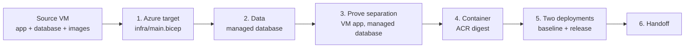

# Path 1A: modernize it by hand

**By the end of this path you will have moved the catalog to Azure Container Apps
yourself — every boundary crossed deliberately, with nothing generated for you.**

## Why this path

The catalog runs on one VM because someone, years ago, installed it there and it worked.
Nobody since has had to understand where the data lives, how the images are served, or
what a release actually consists of. On this path you find out, one boundary at a time,
because you cross each one by hand.

That is slower than the other two paths. It is also the version of this skill you keep:
when you go home to a codebase no assistant has ever seen, this is the sequence you will
follow.

**Estimated time:** 5–8 hours for an engineer comfortable with Azure CLI and Bicep. That
is longer than the time you have. Get as far as you can — the facilitator can hand you a
golden handoff to rejoin at Challenge 2.

## Before you start

**Where you work.** Everything below runs on the selected VM from Challenge 0, reached
over Azure Bastion. The source tree is at `C:\MicroHack\source` — **that directory is
what "the repository root" means throughout this workshop.** Start each terminal with
`cd C:\MicroHack\source`.

**What the VM has, and does not.** The image is fully pinned, Git included:
`C:\MicroHack\source` is a working tree whose single baseline commit is the extracted
archive. There is no Docker daemon — image builds run in the registry instead. This path
is already built for that:

| You need | Use this |
| --- | --- |
| the commit that identifies your work | `git rev-parse HEAD`, taken after [Publish your work to GitHub](#publish-your-work-to-github) below. Every `--source-commit` argument on this path carries this value, and Challenge 3 checks your source out of GitHub at exactly this SHA |
| the upstream archive this VM was built from | the marker file `C:\MicroHack\source\.source-commit`. It is provenance only: GitHub has never seen that commit, so nothing here builds, deploys, or reports with it |
| a container image build | `az acr build` — uploads the build context and builds inside Azure Container Registry |

- You completed [Challenge 0](../ch00/README.md), and `evidence/ch00-selection.json`
  names your stack.
- You read [Challenge 1](../ch01/README.md) and chose this path deliberately.
- You are working on the selected VM. The migration tooling verifies that VM's resource
  identity, source VNet, peering, and private DNS links before it moves anything, so it
  will not run from your laptop.
- Your facilitator has approved the target deployment and given you protected parameter
  files that hold secrets. Those files also carry `resourceGroupName`: the name of the
  resource group the facilitator created for you before the workshop, the one your two
  legacy VMs already live in, and the only group this path deploys into.
- **Two parameters are missing from those files on purpose:** `sourceCommit` and
  `imageDigest`. Neither value existed when provisioning wrote the files — you produce one
  at the [publish gate](#publish-your-work-to-github) below and the other in step 6 — and a
  placeholder that satisfied `infra/main.bicep`'s format assert would deploy the wrong
  source without ever saying so. Supply them on the command line instead, *after* the file
  — `--parameters '@C:\protected\<file>.json' --parameters sourceCommit=$SourceCommit` —
  because a later `--parameters` overrides an earlier one. A deployment that fails
  because you forgot one is that guard working, not a broken file.
- You have the HTTPS URL of your own GitHub repository, from the facilitator.

| Slice | Source | Managed database | Reference solution |
| --- | --- | --- | --- |
| `manual-dotnet` | `dotnet/` | Azure SQL Database | [Runbook](../../solutions/ch01-manual/dotnet/README.md) |
| `manual-java` | `java/` | Azure Database for PostgreSQL Flexible Server | [Runbook](../../solutions/ch01-manual/java/README.md) |

### Publish your work to GitHub

**Do this before step 1.** Challenge 3 checks the application source
out of **your own** GitHub repository at the commit the handoff records, and builds your
`Dockerfile` from that checkout. Step 3 is already the first command that wants that
commit, so a SHA you only produce at the end of the day is a SHA you have to redo the day
around.

Two consequences, and they are the whole reason this sits here:

- **Author your stack's `Dockerfile` first.** Step 6 states exactly what it must contain —
  read it now and write `dotnet/Dockerfile` or `java/Dockerfile` before you commit. You
  build it in step 6, when ACR exists; you publish it here, because the commit Challenge 3
  checks out has to already contain it.
- **Publish, then take the SHA.** A commit that exists only on this VM is not a commit
  Challenge 3 can reach.

```powershell
git add --all
git commit -m 'Modernize the catalog for Azure'
$ParticipantRepositoryUrl = '<facilitator-provided-https-url-of-your-repository>'
if ((git remote) -contains 'origin') {
  git remote set-url origin $ParticipantRepositoryUrl
}
else {
  git remote add origin $ParticipantRepositoryUrl
}
git push --set-upstream origin workshop
$SourceCommit = (git rev-parse HEAD).Trim()
```

The first push opens a browser sign-in through Git Credential Manager; sign in as the
account that owns the repository, and the credential is reused by every later push.
Re-running the block is safe — `git remote set-url` replaces an existing `origin` rather
than failing.

`$SourceCommit` is now a lowercase 40-character SHA that exists on GitHub. It is what
every `--source-commit` argument, image tag, and revision suffix below carries, and it is
also the `sourceCommit` you hand each deployment on the command line. **If you change a
tracked file after this — including the `Dockerfile` — re-run the block and take
`$SourceCommit` again before the next command that consumes it.**

Your rendered handoff is published separately, in step 11. That second commit is required,
not an accident: Challenge 3 reads the handoff from the commit it dispatches and refuses a
run where that commit is the same as the source commit it builds.

## The concept

You are separating one machine into four Azure services, and the order matters because
each stage proves something the next one assumes:



Stage 3 is the one people skip and regret. Pointing the *still-running VM application* at
the managed database, with the local one untouched, isolates a single variable: can this
application talk to Azure SQL or Flexible Server at all? If you find out after
containerizing, you are debugging two changes at once.

The frozen source of truth for what your slice must produce is
[`workshop/contracts/challenge-paths.json`](../../workshop/contracts/challenge-paths.json).
Use the shared target implementation in `infra/`, the container image you author for your
stack, and `tests/acceptance`. Do not create another application, migration tool, or
infrastructure-as-code path.

## Your goal

Move data, images, and compute off the VM without generating any of it, and finish with a
Container Apps revision serving the catalog, a retained rollback revision, and a
validated handoff.

## Ground rules

- Work from one immutable, lowercase 40-character source commit — the one you published
  above. Not a branch, not `latest`, not another mutable reference.
- Use only the checked-in lock files, wrapper, contracts, Bicep, and acceptance package.
  Keep Azure CLI isolated with `AZURE_CONFIG_DIR="$HOME/.azure-365"`.
- Run `catalog-migrate` on the selected source VM.
- Supply database passwords, tokens, and the performance key only through the documented
  environment variables or protected parameter files outside the repository. Never put a
  secret in an argument, evidence document, terminal transcript, or commit.
- Get facilitator approval before every deployment, target mutation, identity assignment,
  traffic change, or cleanup action.

Stop if the registry, migration CLI contract `1.4.0`, modernization handoff schema
`1.4.0`, target output, or `infra/main.bicep` would need to change. This path consumes
those interfaces; it does not reinterpret them.

## Steps

1. **Characterize and protect the source.** You cannot prove you preserved behavior if
   you never recorded it. Record the exact commit, source VM and VNet resource IDs,
   application configuration names without values, native test results, local
   full-acceptance result, corpus counts, and a restorable database export. Keep the
   source database and `data/images/` intact. Write the checkpoint to
   `evidence/baseline-backup.md`.
2. **Review and bootstrap the shared target.** Read the infrastructure before you deploy
   it — this is the only chapter where you see the whole target in one file. Build
   `infra/main.bicep`, run a resource-group what-if
   (`az deployment group what-if --resource-group <your resource group> ...`), and review
   private networking, the managed database, `imageProvider=azure-files`, ACR,
   observability, and the absence of a bootstrap Container App. The template is
   resource-group scoped and creates no resource group: it deploys into the group the
   facilitator already created for you, the one holding your two legacy VMs, and its
   `resourceGroupName` parameter must name that same group — an assert refuses the
   deployment before a single resource is touched otherwise. Take both the group name and
   `resourceGroupName` from the protected parameter file under `C:\protected\` rather than
   typing them. Record the review in `evidence/iac-review.md`, then deploy only with an
   approved protected parameter file. Save the emitted bootstrap output as
   `evidence/azure-target-output.json`.
3. **Migrate the data with the native CLI.** Use the selected
   `catalog-migrate sql export` / `catalog-migrate sql import` or
   `catalog-migrate postgresql export` / `catalog-migrate postgresql import` commands,
   followed by `catalog-migrate images copy` and `catalog-migrate verify`. Imports and
   image copy repeat the exact target resource ID in both confirmation arguments, bind
   every transfer to the protected target with `--source-commit` carrying the
   `$SourceCommit` you published, and require `--execute`. They refuse a non-empty target
   — that guard is what makes a re-run safe.
4. **Verify the migration properly.** Row counts are not proof.
   `evidence/migration-report.json` must show the schema, migration history, constraints,
   indexes, the complete figure and category corpus, image count, image bytes, image-set
   hash, TLS, a least-privilege application principal, and the source-VM execution
   topology.
5. **Prove application/database separation on the VM.** Reconfigure the still-running
   source-VM application to the managed database, disable startup import, and run full
   acceptance while compute is still the VM. Record application resource, managed
   database resource, identity, commit, acceptance result, and timestamps in
   `evidence/managed-database-separation.json`. Do not build or deploy to Container Apps
   until this passes.
6. **Build the container image from the Dockerfile you authored.** The legacy baseline has
   no Dockerfile — writing one is part of the work, and you wrote it at the
   [publish gate](#publish-your-work-to-github) because the commit Challenge 3 checks out
   has to contain it. `dotnet/Dockerfile` or `java/Dockerfile` sits at the repository root
   and needs a numeric non-root user, a read-only seed, port `8080`, a health check,
   pinned base-image digests, and an external `/app/images` path. Build it with
   `az acr build`, which uploads the context and builds inside Azure Container Registry —
   the VM has no Docker daemon and does not need one, and the registry only exists from
   step 2 onwards, which is why the build waits until here. If fixing the build changes
   the Dockerfile, re-publish and re-take `$SourceCommit` before you build again. Save the
   build result and manifest digest in `evidence/container-build.json`.
7. **Use Azure Files compatibility mode.** Copy the canonical source images with
   `catalog-migrate images copy`. The unchanged local image provider reads the Container
   Apps Azure Files mount; do not add an adapter or an alternate provider.
8. **Deploy one immutable digest twice.** Resolve the commit tag to an ACR `sha256:`
   digest, then deploy the shared Bicep application stage first as `baseline` and then as
   `release`, using the same digest both times. Retain the healthy baseline revision
   inactive so you have something to roll back to. Never deploy by tag — a tag can move,
   and a rollback target that can move is not a rollback target.
9. **Run complete release verification.** Produce the native TRX or Surefire JUnit
   artifact and `evidence/runtime-test-report.json`, run
   `python -m catalog_acceptance --profile full` to `evidence/acceptance-report.json`,
   and collect normalized Azure Monitor resource, trace, metric, and log results
   referenced by `evidence/telemetry-report.json`. A healthy response or a successful
   deployment does not prove behavior.

   Start `evidence/runtime-test-report.json` from your stack's entry in
   `workshop/contracts/runtime-test-evidence.template.json` — copy that object and
   replace only `sourceCommit`, `artifact`, and `command`. The fourteen `tests` entries
   are fixed by the contract and are checked for exact equality, so do not retype them.
   The report describes results the native artifact must already contain: the handoff
   parses that artifact and fails unless all fourteen are present and passing. Writing a
   report the artifact does not support is caught, and is the one thing here that would
   be worth catching.
10. **Write and validate rollback.** `evidence/rollback-runbook.md` must name the
    retained baseline revision and immutable digest, the approval gate, the Container
    Apps single-revision activation command, health/readiness and full-acceptance checks,
    abort conditions, and the forward-recovery procedure. Do not use weighted traffic:
    `activeRevisionsMode` is `Single`, so activating the retained prior revision
    deactivates the current one. Preserve both databases, exports, images, and evidence.
11. **Render the handoff.** Run
    `catalog-migrate render-handoff --path manual --rollback-runbook evidence/rollback-runbook.md`
    with every required argument, write `evidence/modernization-contract.json`, then
    validate it with `python -m catalog_acceptance.handoff_cli`, then commit and push
    `evidence/modernization-contract.json`. Challenge 3 reads the handoff from the commit
    it dispatches, and that commit has to be later than the source commit it builds.

## Success criteria

- The catalog is served over HTTPS by a Container Apps revision, and the VM is out of the
  request path.
- The managed database holds all 198 figures and 20 categories, reached over TLS by a
  least-privilege principal.
- All 198 images are served from Azure storage.
- The deployed image is referenced by `sha256:` digest and runs as a non-root user.
- A healthy baseline revision is retained, inactive, and distinct from the release.
- These files exist, are non-empty, and pass validation:
  - shared — `evidence/azure-target-output.json`, `evidence/migration-report.json`,
    `evidence/acceptance-report.json`, `evidence/runtime-test-report.json`,
    `evidence/telemetry-report.json`, `evidence/modernization-contract.json`, and
    `evidence/rollback-runbook.md`;
  - this path — `evidence/baseline-backup.md`,
    `evidence/managed-database-separation.json`, `evidence/container-build.json`, and
    `evidence/iac-review.md`.

Keep raw native tests and normalized telemetry query results at the repository-relative
paths named by their evidence documents. Generated migration archives and deployment
parameter files are transient protected artifacts, not repository evidence.

## Hints

<details>
<summary>Hint 1 — a nudge</summary>

Start with `catalog-migrate --help`, then `catalog-migrate <subcommand> --help`. The CLI
tells you exactly which arguments it wants, and its refusals are informative: it will not
write into a non-empty target, and it will not run from a host it cannot verify.

For the Dockerfile, you already have a working example of the shape you need — look at
how the application reads its image directory and its configuration, and make the
container match.

</details>

<details>
<summary>Hint 2 — the approach</summary>

Deploy the infrastructure in stages rather than all at once, and read the what-if output
before you approve it. Bootstrap first — that gives you the database, registry, storage,
and observability but no application. Migrate into that. Prove the VM application can
reach the new database. Only then build a container.

For the two deployments, the same digest goes out twice with a different
`applicationRevisionRole`. Resolve the digest once, save it in a variable, and reuse it.

</details>

<details>
<summary>Hint 3 — nearly the answer</summary>

The complete executable form of every command in this path — including the secret
prompts, the failure guards, and the exact parameter shapes — is in the stack runbook:
[.NET](../../solutions/ch01-manual/dotnet/README.md) or
[Java](../../solutions/ch01-manual/java/README.md).

If you want to see what a finished container image and modernized application look like,
[the reference implementation](../../solutions/reference/README.md) has both stacks.

</details>

## If it goes wrong

| Symptom | Cause | Fix |
| --- | --- | --- |
| `docker` is not recognized | The provisioned VM has no Docker daemon, deliberately — image builds happen in the registry | Build with `az acr build`. That is what the runbook already uses. |
| `git rev-parse HEAD` does not match `.source-commit` | It never will. The repository in `C:\MicroHack\source` is initialized on the VM with one baseline commit of the extracted archive, so its history is unrelated to the upstream archive commit | Use `git rev-parse HEAD` taken at the [publish gate](#publish-your-work-to-github), before step 1. That is the commit your repository holds and the only one Challenge 3 can check out. The marker is archive provenance and nothing else. |
| A deployment is rejected before a single resource is created, naming a required parameter it was not given | `sourceCommit` — and, at the two application deployments in step 8, `imageDigest` — are deliberately absent from the protected files | Append `--parameters sourceCommit=$SourceCommit` (and `imageDigest=$ImageDigest`) after the `@file` argument. Absent by design, not a broken file — see the bullet in [Before you start](#before-you-start). |
| A migration command exits non-zero and writes a JSON failure document | Something in the guard chain did not hold — wrong host, non-empty target, mismatched commit | Read the failure document. It names the check. Fix the prerequisite; do not delete source data and do not skip the guard. |
| Step 5 acceptance fails against the managed database | Firewall, TLS, or the application principal's grants | This is exactly why step 5 exists, and it is much cheaper to fix here than after containerizing. |
| The release deployment succeeds but the revision is unhealthy | The container cannot reach its images mount or its database | Check the revision's provisioning state and logs before redeploying. Never delete the baseline revision to make room. |
| The handoff validator rejects your rendered document | A referenced resource, digest, or evidence file cannot be reached | Re-run the failing stage and re-render. Never hand-edit a rendered handoff. |

On any non-zero command, failed schema validation, topology mismatch, non-empty target,
digest mismatch, skipped full-acceptance check, missing telemetry signal, or unhealthy
rollback revision: stop before the next mutation. Preserve the failure document and your
current evidence, correct the prerequisite without deleting source data, and re-run that
checkpoint.

Everything else: [troubleshooting](../../docs/Troubleshooting.md).

## What you just proved

You took an application apart along four boundaries — data, images, configuration, and
compute — and put it back together on managed services, without any of it being generated
for you. You now know precisely where each one lives, because you moved each one.

The number to remember from this path is not a duration. It is that stage 3 exists: the
moment the application was still on the VM but its data was already in Azure, and
acceptance still passed. That is what a safe migration looks like — one variable at a
time, with a test as the referee.

When you compare notes in the [Challenge 1 debrief](../ch01/README.md#debrief-compare-the-three-paths),
you are the control group. The other two paths are measured against what you just did.

---

**Previous:** [Challenge 1: get the catalog off the virtual machine](../ch01/README.md) ·
**Next:** [Challenge 2: load and autoscaling](../ch02/README.md) ·
**Other paths:** [Copilot rewrite](../ch01-copilot-rewrite/README.md) ·
[Copilot modernization](../ch01-copilot-modernization/README.md)
