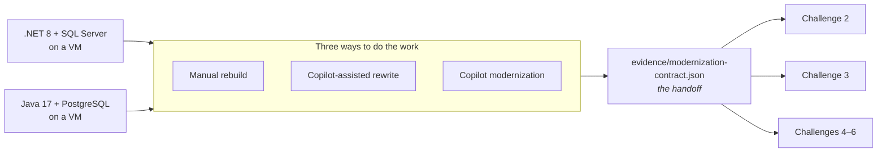

# Challenge 1: get the catalog off the virtual machine

**By the end of this chapter your catalog will run as a container on Azure Container
Apps, against a managed database, with its images in Azure storage and no password
anywhere in the application — and you will have a validated document that proves it.**

## Why this matters

Everything you measured in Challenge 0 comes from one machine: one instance, one disk
holding 198 photographs, one credential in a config file, one text log. This is the
chapter that takes those apart. The database moves to a managed service, the images move
to Azure storage, the application becomes an immutable image identified by a digest, and
the credential disappears behind a managed identity.

It is also the longest chapter in the workshop and the one people most often run out of
time on. Read the whole of this page before you pick a path — the choice you make in the
next ten minutes decides how the rest of your day goes.

**Estimated time:** 5–12 hours depending on the path you choose. That is longer than the
time available, deliberately: you are meant to get far enough to understand the work, not
necessarily to finish it. See "If you run out of time" below.

## Before you start

**Where you work.** Everything in this chapter runs on your selected VM from Challenge 0,
reached over RDP at its public IP address. The source tree is at `C:\MicroHack\source`, extracted there
from a verified archive by the provisioner. **That directory is what "the repository
root" means in this and every other workshop document** — start each terminal with
`cd C:\MicroHack\source`.

> **This chapter can end the legacy application, and that is one-way.** The legacy catalog
> boots from the same tree you are about to modernize. If you repoint its configuration in
> place — editing `application.properties` or `appsettings.json` inside `C:\MicroHack\source`
> — it stops running on the VM and nothing later restarts it. If instead you supply the new
> connection details from outside the tree, the legacy app keeps working. **The material does
> not tell you which to do, and no step re-checks the baseline afterwards, so if it stops you
> will not be told.** Both outcomes happened during this workshop's own trial run.
>
> **Everything you will ever be able to say about "before" is the evidence you captured in
> Challenge 0.** If you have not written `evidence/ch00-<stack>-baseline.json` and
> `evidence/ch00-pain-<stack>.json`, go back and do it now — the wrap-up in Challenge 7 asks
> you to compare against numbers you may no longer be able to re-measure.
>
> If you want the old application available for a side-by-side demonstration later, copy the
> tree **before** you change anything:
> ```powershell
> Copy-Item C:\MicroHack\source C:\MicroHack\legacy-source -Recurse
> ```

**What the VM has, and deliberately does not.** The image is fully pinned, and Git is part
of that pin: the provisioner initializes `C:\MicroHack\source` as a repository holding one
baseline commit of the extracted archive, so `git status`, `git add`, `git commit`, and
`git rev-parse HEAD` all behave normally. There is no Docker daemon, and none is needed.
Three things carry the whole chapter:

| You need | Use this |
| --- | --- |
| the commit that identifies your work | `git rev-parse HEAD`, taken once you have published your branch — see [Publishing: the gate every path passes through](#publishing-the-gate-every-path-passes-through) below |
| the exact 40-character source commit of the archive | `(Get-Content 'C:\MicroHack\source\.source-commit' -Raw).Trim()` — the provisioner writes this marker when it extracts the archive |
| a container image build | `az acr build`, which uploads the build context and builds inside Azure Container Registry |

Both Copilot paths commit their accepted work as they go, which is what that baseline
commit is for: your first commit is your own modernization. It also means the local
history is unrelated to the published commit the archive came from. Read `.source-commit`
when you need the provenance of the source you were handed, and `git rev-parse HEAD` when
you need the identity of the work you did — your path guide says which one each command
takes, and confusing the two is the single most common way to lose an hour in this
chapter.

Beyond that:

- You completed [Challenge 0](../ch00/README.md) and have
  `evidence/ch00-selection.json` naming exactly one stack.
- Your selected VM is running and still passes its baseline check. Everything in this
  chapter is executed from that VM, because the migration tooling verifies the host's
  network identity before it moves any data.
- You can produce an immutable source commit — a full 40-character lowercase SHA, not a
  branch, not `HEAD`, not a short SHA. You do not have one yet: it is the commit you
  publish at the gate below, and your path guide says exactly where that gate sits.
- Your facilitator has approved the Azure target deployment, and has given you the
  protected parameter files that hold secrets. Those files live outside the repository
  and never get committed. They also name your `resourceGroupName` — the resource group
  the facilitator created for you before the workshop, the one holding your two legacy
  VMs, and the only group `infra/main.bicep` will deploy into.
- **Two parameters are missing from those files on purpose:** `sourceCommit` and
  `imageDigest`. Neither value existed when provisioning wrote the files — one comes from
  the publish gate below, the other from your container build — and a placeholder that
  satisfied `infra/main.bicep`'s format assert would deploy the wrong source without ever
  saying so. Supply them on the command line instead, *after* the file —
  `--parameters '@C:\protected\<file>.json' --parameters sourceCommit=$SourceCommit` —
  because a later `--parameters` overrides an earlier one. A deployment that fails because
  you forgot one is that guard working, not a broken file; your path guide says which
  deployment needs which.
- You have the HTTPS URL of your own GitHub repository, from the facilitator.
- For either GitHub Copilot path: an active GitHub Copilot entitlement, signed in on the
  VM.

Unfamiliar terms — *handoff*, *evidence*, *digest*, *revision*, *managed identity* — are
in the [glossary](../../docs/Glossary.md).

## The concept

Six routes, one destination. Two legacy stacks × three ways of doing the work, all
finishing at the same Azure architecture and the same validated document:



That middle document is the point. Challenges 2 through 6 never rediscover your
resources from the portal — they read the handoff. So the handoff must be true: it names
the container image by digest, the database by resource ID, the revision that is
serving, and the rollback revision held in reserve. A validator refuses it if any of
those cannot be reached.

This is worth stealing for your own estate. The handoff is the boundary between "we
migrated it" and "we can prove we migrated it".

A contract only earns its name if something reads it. An audit of this repository found
that our own acceptance harness declared its destructive-delete boundary twice, under two
different names, and then deleted rows using a string literal that matched neither
declaration. Nothing was wrong at runtime — and nothing would have told us if it had become
wrong. A guard now fails if the literal and either declaration disagree. Ask that of every
contract you write: what breaks if the declaration and the code drift apart?

## Your goal

Take the stack you selected in Challenge 0 and produce a running Azure Container Apps
deployment with a managed database, external image storage, managed identity, immutable
image digest, and telemetry — then render and validate
`evidence/modernization-contract.json`.

**How** you do that is your choice, and it is a real one.

## Choose your path

All three paths end at the same place. They differ in what they teach and what they
cost.

| | [Manual rebuild](../ch01-manual/README.md) | [Copilot-assisted rewrite](../ch01-copilot-rewrite/README.md) | [Copilot modernization](../ch01-copilot-modernization/README.md) |
| --- | --- | --- | --- |
| **Realistic time** | 5–8 hours | 8–12 hours | 5–7 hours |
| **You will spend it on** | Reading Bicep, running migrations, fixing your own container | Reviewing generated diffs, one slice at a time | Reviewing a generated plan, then reviewing generated diffs |
| **Teaches you** | Every boundary, in detail, because you cross each one by hand | How far an AI pair goes when *you* own the target architecture | What guided modernization tooling does and does not do for a real upgrade backlog |
| **Assumes you know** | Azure CLI, Bicep, your stack's build tooling | Your stack well enough to reject a bad diff quickly | Your IDE and how to read a plan critically |
| **Pick it if** | You want to be able to do this again without any tooling | You want to judge AI-assisted development honestly, with tests as the referee | Your real backlog is framework upgrades, and you want to see the tooling on a codebase you understand |
| **Avoid it if** | You already know this shape and want a bigger lesson | You are short on time — this is the longest path | You want to learn what the tooling is doing underneath |
| **The honest catch** | You will type a lot and learn a lot | The assistant is fast at code and indifferent to your contracts; the reviewing is the work | The tooling upgrades and prepares code; it does not move your data, and it does not prove behavior |

**If your table has three or more people, split.** The single most valuable thing to come
out of this chapter is the comparison, and you can only make it if somebody in the room
took each route. The debrief at the end of this page assumes you did.

**If you can only pick one and want a recommendation:** take *Copilot modernization*. It
is the closest thing to the work most teams actually have queued, and it is the only path
that shows you tooling you cannot get anywhere else. Take *manual* if you have never
migrated an application to containers before — the slow way is the one that sticks.

Whichever you choose, the reference solutions are here when you need them:

| Path | Participant guide | Reference solutions |
| --- | --- | --- |
| Manual rebuild | [Manual modernization](../ch01-manual/README.md) | [.NET](../../solutions/ch01-manual/dotnet/README.md) · [Java](../../solutions/ch01-manual/java/README.md) |
| Copilot-assisted rewrite | [Copilot rewrite](../ch01-copilot-rewrite/README.md) | [.NET](../../solutions/ch01-copilot-rewrite/dotnet/README.md) · [Java](../../solutions/ch01-copilot-rewrite/java/README.md) |
| Copilot modernization | [Copilot modernization](../ch01-copilot-modernization/README.md) | [.NET](../../solutions/ch01-copilot-modernization/dotnet/README.md) · [Java](../../solutions/ch01-copilot-modernization/java/README.md) |

The [finished target for both stacks](../../solutions/reference/README.md) is checked in
as well. Read it if you are stuck on one specific thing; copying it wholesale skips the
only chapter that teaches modernization.

## Before you open your path

Record your selected stack, confirm the selected VM's baseline is still healthy, and read
these three:

- [`workshop/contracts/challenge-paths.json`](../../workshop/contracts/challenge-paths.json)
  — the exact path/stack target and the evidence set your path must produce.
- [`infra/README.md`](../../infra/README.md) — the shared Azure target and the order its
  stages deploy in.
- [`tests/acceptance/README.md`](../../tests/acceptance/README.md) — how behavior,
  database, image, runtime-test, telemetry, and handoff verification actually work.

If the selected stack, database family, image provider, source identity, or required
tooling differs from what the registry says, stop and ask. A workaround here invalidates
every chapter downstream.

## Publishing: the gate every path passes through

Whichever path you took, your work has to leave the VM before it can identify anything.
Challenge 3 checks the application source out of **your own** GitHub repository at the
commit the handoff names, and builds the `Dockerfile` you authored from that checkout, so
a commit that exists only on the VM disk is not enough.

**This gate comes before the first command that takes `--source-commit`, not at the end of
the day.** Every migration command binds to that SHA, so publishing late means redoing
everything that consumed it. Two things follow, and your path guide places both:

- **The `Dockerfile` has to be in the commit you publish.** Author it before you push. On
  the manual path that means writing it at the publish gate and building it later, when
  the registry exists; on both Copilot paths the container work already comes first.
- **Take the SHA after the push, never before.** `git rev-parse HEAD` on a clean tree is
  the identity of your own work. `C:\MicroHack\source\.source-commit` is the provenance of
  the archive you were handed, GitHub has never seen it, and the two are never
  interchangeable.

Commit everything, point `C:\MicroHack\source` at your repository, and publish the branch:

```powershell
git add --all
git commit -m 'Modernize the catalog for Azure'
$ParticipantRepositoryUrl = '<facilitator-provided-https-url-of-your-repository>'
if ((git remote) -contains 'origin') {
  git remote set-url origin $ParticipantRepositoryUrl
}
else {
  git remote add origin $ParticipantRepositoryUrl
}
git push --set-upstream origin workshop
$SourceCommit = (git rev-parse HEAD).Trim()
if ($SourceCommit -eq (Get-Content C:\MicroHack\source\.source-commit -Raw).Trim()) {
  throw "sourceCommit equals the archive provenance SHA. You captured the baseline you were handed instead of the work you just pushed; nothing downstream can detect this."
}
```

The first push opens a browser sign-in through Git Credential Manager; sign in as the
account that owns the repository. `$SourceCommit` is what the handoff records as
`source.commitSha`, and re-running the block is safe if a later fix changes a tracked
file — just recapture `$SourceCommit` before the next command that consumes it.

That guard exists because nothing downstream can catch the mistake it prevents. Both
values are forty hexadecimal characters, both live under `C:\MicroHack\source`, and the
deployment only checks the *shape* of `sourceCommit` — so the archive SHA deploys
successfully, tags an image, and produces a handoff that passes schema validation. The
failure surfaces a chapter later in Challenge 3, which builds your `Dockerfile` from a
checkout at that SHA and finds no `Dockerfile`, because writing it was this challenge.

Every path produces the same seven shared evidence artifacts plus the four specific to
your path. The final handoff must name the path you took, reference a real rollback
runbook in the repository, and validate before you start Challenge 2:

```powershell
cd tests\acceptance
uv --no-config run python -m catalog_acceptance.handoff_cli ..\..\evidence\modernization-contract.json --contracts ..\..\workshop\contracts --repository-root ..\..
```

That command is one line on purpose. Wrapping it would need PowerShell's backtick
continuation, and a single trailing space after a backtick silently turns one command into
several — paste it whole.

Once it validates, commit and push `evidence/modernization-contract.json` too. That second
push is deliberate, not tidiness: Challenge 3 reads the handoff from the commit it
dispatches, and that commit has to be a later commit than the source commit it builds.

## Success criteria

- The catalog is served by an Azure Container Apps revision, over HTTPS, from a public
  URL — and the VM is no longer in the request path.
- The database is a managed Azure service, holding all 198 figures and 20 categories,
  reached over TLS by a least-privilege application principal.
- All 198 images are served from Azure storage, not from a container's local disk.
- The application container runs as a non-root user and is deployed by immutable
  `sha256:` digest, never by tag.
- A healthy previous revision is retained, inactive, ready to roll back to.
- No application password exists anywhere in source, evidence, or shell history.
- Your modernized source and `evidence/modernization-contract.json` are pushed to your own
  GitHub repository on the `workshop` branch.
- `evidence/modernization-contract.json` passes the command above with no findings.

## Hints

<details>
<summary>Hint 1 — a nudge</summary>

Do the work in the order the target is built, not the order that feels natural. Publish
your branch first so you have a real source commit, then infrastructure, then data, then
images, then the container build, then the deployment. Each stage proves something the
next one assumes.

The single most common way to lose an afternoon is to build and deploy a container
before proving the application can talk to the managed database at all. There is a
checkpoint for exactly that reason — take it seriously.

</details>

<details>
<summary>Hint 2 — the approach</summary>

Sequence: characterize the source and back it up → author your `Dockerfile` and publish
the branch, which is where your source commit comes from → review and deploy the shared
Bicep target → export, import, and verify the database → copy the images → point the
still-on-the-VM application at the managed database and re-run acceptance → build the
container → deploy the same digest twice, as a baseline and as a release → collect
runtime, acceptance, and telemetry evidence → write the rollback runbook → render and
validate the handoff.

Telemetry evidence has a step in it that is easy to miss: four of the eight required log
signals only appear when the application fails, so you have to induce those failures on
purpose and put things back afterwards. See
[inducing the telemetry failure signals](../../docs/TelemetryFaultInjection.md).

Every migration command wants the same three things: the exact target resource ID
repeated as a confirmation argument, `--source-commit` bound to your published commit,
and `--execute`. They refuse to overwrite a non-empty target, which is a feature.

</details>

<details>
<summary>Hint 3 — nearly the answer</summary>

Your path's guide lists the required progression step by step, and the stack-specific
reference solution in `solutions/ch01-*/` contains the complete executable form of every
command including the guards around it. Use the reference solution when you are stuck on
*syntax*; use your path guide when you are stuck on *what comes next*.

If the handoff validator rejects your document, read the finding it names rather than
editing the document. The handoff is rendered by
`catalog-migrate render-handoff`, never written by hand — a hand-edited handoff is the
one failure mode this workshop treats as fatal.

</details>

## If it goes wrong

| Symptom | Cause | Fix |
| --- | --- | --- |
| A deployment is rejected before a single resource is created, naming a required parameter it was not given | `sourceCommit` — and, at the application stages, `imageDigest` — are deliberately absent from the protected parameter files | Append `--parameters sourceCommit=$SourceCommit` (and `imageDigest=$ImageDigest`) after the `@file` argument. Absent by design, not a broken file — see the bullet in [Before you start](#before-you-start). |
| A migration command refuses to run, saying the target is not empty | You already imported once, or the facilitator pre-seeded the target | Do not force it. Confirm which import succeeded, and re-run only `catalog-migrate verify`. |
| The handoff validator reports a digest mismatch | You deployed by tag, or you rebuilt the image after resolving the digest | Resolve the tag to a `sha256:` digest once, then use that digest for both deployments and for the handoff. |
| The handoff validator reports a missing telemetry signal | Four of the eight required signals are *failure* signals, emitted only from `catch` blocks. A correctly working application never produces them, so no amount of extra traffic will | Induce the failures deliberately, then restore: [inducing the telemetry failure signals](../../docs/TelemetryFaultInjection.md). Also check you are querying `AppExceptions` and not only `AppTraces` — records logged with an exception go to the former. |
| The handoff validator reports a missing telemetry signal and the application was deployed before Application Insights was wired | No traces exist for the release revision at all | Confirm the connection string reached the container, generate traffic against the release revision, and re-collect telemetry. |
| Acceptance passes locally but fails against Azure | You are testing the VM application, not the Container Apps revision | Check the base URL your acceptance run is bound to. |

Everything else: [troubleshooting](../../docs/Troubleshooting.md).

## If you run out of time

You probably will, and that is designed in. Tell your facilitator where you got to. They
can hand you a prevalidated **golden handoff** for the same stack, which lets you rejoin
at Challenge 2 with a working environment.

Two rules: it must be the golden handoff for *your* stack, and you never hand-edit or
fabricate an evidence document to fill a gap. At the wrap-up, count the numbers you
measured yourself and mark the rest *not measured*. That is an honest result. A
fabricated one is not.

## Debrief: compare the three paths

**Do this as a group before you start Challenge 2. Fifteen minutes.** This is the
comparison the workshop is built around, and it only works if people who took different
paths talk to each other.

Fill this in together, one row per person:

| | Manual | Copilot rewrite | Copilot modernization |
| --- | --- | --- | --- |
| Wall-clock to a running Container App | | | |
| Roughly how many lines did *you* type? | | | |
| What did the tests catch that review missed? | | | |
| What did the tooling get wrong? | | | |
| What would you not have let it touch? | | | |
| Would you use this on your own estate? | | | |

Then discuss:

1. **Where did the time actually go?** Almost nobody spends it where they expected. The
   manual path loses it to infrastructure and data, the rewrite path loses it to
   reviewing, and the modernization path loses it to the parts the tooling does not
   cover.
2. **Who caught the mistakes?** In all three paths the referee was the same: the
   characterization and acceptance tests. Note how much confidence that bought, and what
   you would have done without them.
3. **What did the AI paths refuse to do, and were they right to?** Neither Copilot path
   performs the database cutover. Ask whether you would have *wanted* it to.
4. **Which path fits which kind of change?** A framework upgrade, a re-platform, a
   rewrite, and a lift-and-shift are four different jobs. Map each to a path.
5. **What would you tell your own team on Monday?** One sentence. That sentence is the
   real output of this chapter.

## What you just proved

The catalog no longer runs on a machine you patch. It runs as an immutable image on a
platform that can start another copy of it, against a database with its own backups and
its own failure domain, using an identity instead of a password, with a previous version
sitting ready to take traffic back.

| | Before (Challenge 0) | Now |
| --- | --- | --- |
| Compute | One Windows VM | Container Apps revision, replaceable |
| Database | Same box as the app | Managed service, separate failure domain |
| 198 images | Local disk | Azure storage |
| Application credential | A file on the server | Managed identity — none exists |
| Undoing a bad release | Restore from backup | A retained revision, one command away |
| Proof any of this is true | A person's word | A validated handoff document |

And you have the number that matters for everything that follows: a real deployment,
addressable over the internet, that Challenges 2 through 6 can load-test, redeploy,
observe, assess, and break on purpose.

---

**Previous:** [Challenge 0: meet the application you are about to move](../ch00/README.md) ·
**Next:** [Challenge 2: load and autoscaling](../ch02/README.md) ·
**Solution:** [Challenge 1 solution](../../solutions/ch01/README.md)
