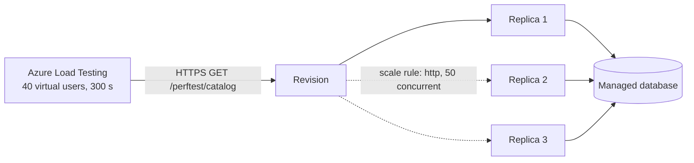

# Challenge 2: make the catalog survive a traffic spike

**By the end of this chapter you will have watched your catalog add capacity by itself
under 40 concurrent users, serve every request without a single error, and give the
capacity back when the traffic stopped — with the metrics to prove all three.**

## Why this matters

On the Windows VM there was one instance of the catalog and one way to survive a busy
day: hope, followed by a change request for a bigger machine. Nobody in the retailer
could answer "what happens at 40 concurrent shoppers?" because there was no safe way to
find out and no metric to look at afterwards.

You are about to answer that question with a number. This chapter retires the scaling
wall — and it also retires the *guess*, because from here on the catalog's behaviour
under load is something you measure rather than something you argue about.

## Estimated time

**Estimated time:** 75–110 minutes, of which **at least 35 minutes is unavoidable
waiting** while Azure does its work:

| Wait | Why it exists |
| --- | --- |
| ~10 minutes | A quiet baseline so Azure Monitor records the single-replica point *before* load |
| ~10 minutes | Provisioning, the 300-second run itself, and deprovisioning the load engine |
| up to 15 minutes | Waiting for the replica count to fall back to one after load |

Use that time — do not sit and watch a progress bar:

- Open the Container App's **Metrics** blade in the portal and pin `Replicas` split by
  revision. You will see the scale-out live rather than only in JSON afterwards.
- Read the [Challenge 3](../ch03/README.md) concept section so the CI/CD chapter starts
  faster.
- Read your own scale rule in the portal (**Container App → Scale**) and decide which
  rule you would use for *your* application at work.

## Before you start

**Where you work.** You are still on your VM from Challenge 0, in `C:\MicroHack\source` —
the evidence this chapter produces has to land in the repository you push, so it has to be
written on the machine that holds it. What changes here is the *shell*: from this chapter
on, the command blocks are bash, and you run them in **Git Bash**, not PowerShell. Start a
terminal with `"C:\Program Files\Git\bin\bash.exe" -l`, then `cd /c/MicroHack/source`.

This is not a preference. In PowerShell, `curl` is an alias for `Invoke-WebRequest`, which
takes different flags and returns an object rather than a body — so a block that ends in
`curl -s ... | jq` fails in a way that looks like a broken application rather than a
broken shell. Git Bash resolves `curl` to the real `curl.exe` that the provisioner pinned.
If you are ever unsure which shell you are in, run `echo $SHELL`: Git Bash prints a path,
PowerShell prints an empty line.

- Challenge 1 is finished and `evidence/modernization-contract.json` passes the shared
  handoff validator. Every resource ID, URL, and revision name used here comes from that
  file — see [Challenge 1](../ch01/README.md). If your modernization path ran out of
  time, ask the facilitator for the **golden handoff** for your stack and rejoin here.
- `az`, `curl`, `jq`, `sha256sum`, and `uv` are on your PATH *in Git Bash*, and `az login`
  is done against the subscription that owns the handoff resources.
- **Two performance-test resources must exist before you start**, and they are created by
  a template in this repository — `infra/perf-testing.bicep`. If the facilitator has
  already deployed it, ask for the two values below. If not, deploy it yourself against
  your resource group; it takes a couple of minutes.

  | Environment variable | Where the value comes from |
  | --- | --- |
  | `LOAD_TEST_RESOURCE_ID` | The `loadTestResourceId` output of the `infra/perf-testing.bicep` deployment — the **Azure Load Testing** resource (`Microsoft.LoadTestService/loadTests`) |
  | `PERFTEST_API_KEY_SECRET_URI` | `<keyVaultUri>secrets/PERFTEST-API-KEY` — the vault comes from the same deployment, and the facilitator sets the secret **value** once with `az keyvault secret set`. The secret name uses hyphens because Key Vault rejects underscores in object names; the environment variable it feeds is still `PERFTEST_API_KEY` |

  The template also grants the workflow identity `Load Test Contributor` on the load test
  and `Key Vault Secrets User` on the vault, and grants the load test's own managed
  identity `Key Vault Secrets User` so it can resolve the secret reference you pass to
  `az load test create`. Full deployment procedure:
  [infra/README.md → *Challenge 2 performance-test prerequisites*](../../infra/README.md).
- New to *revision*, *replica*, *scale rule*, or *handoff*? See
  [the glossary](../../docs/Glossary.md).

## The concept

A Container Apps **revision** is an immutable snapshot of your app. Each revision runs
some number of identical **replicas**, and a **scale rule** decides that number by
watching a signal. Your target uses an HTTP concurrency rule: Azure divides observed
concurrent requests by `concurrentRequests` `50` and keeps the answer between `1` and `3`.



Two consequences are worth internalising before you run anything. First, a scale rule is
only as good as its signal — an HTTP rule cannot see a slow background job, which is why
a queue-depth or CPU rule exists. Second, **scaling the web tier pushes the load
somewhere else.** More replicas means more concurrent database connections, which is why
this chapter insists you also watch the database. On the VM, the app and the database
shared a box, so this pressure had nowhere to go.

## Your goal

Drive real, bounded traffic at the Container App revision that your handoff already
describes, and come away with evidence that it scaled out, stayed correct, and recovered.

Concretely, you must show that the existing revision:

- serves one sampler: HTTPS `GET /perftest/catalog`;
- completes 40 virtual users for 300 seconds with zero errors;
- has one replica before load, two or three during the observed run timestamps,
  and one after load;
- stays inside the target's scale contract: rule `http`, type `http`, minimum `1`,
  maximum `3`, and `concurrentRequests` `50`;
- produces database load above baseline; and
- returns exact HTTP `200` responses from the handoff `/healthz` and `/readyz`
  URLs after recovery.

This is an observation exercise, not a deployment exercise. Do not deploy or update the
application, create a replacement revision, change traffic, or edit infrastructure. A
scale-out that only shows up *after* the run has finished is not the behaviour you are
trying to demonstrate — it means Azure reacted too late to have absorbed the spike.

## Steps

### 1. Bind to the handoff and to the performance-test resources

Read the stack, revision, URLs, and database resource ID out of the validated handoff —
never out of a portal search. Export `LOAD_TEST_RESOURCE_ID` and
`PERFTEST_API_KEY_SECRET_URI` from the `infra/perf-testing.bicep` deployment outputs
(`loadTestResourceId`, and `<keyVaultUri>secrets/PERFTEST-API-KEY`).

The same procedure covers all six modernization outcomes; only the database signal
differs:

| Slice IDs | Stack | Required database signal |
| --- | --- | --- |
| `manual-dotnet`, `copilot-rewrite-dotnet`, `copilot-modernization-dotnet` | `dotnet-sqlserver` | `app_cpu_billed`, `Total` |
| `manual-java`, `copilot-rewrite-java`, `copilot-modernization-java` | `java-postgresql` | `cpu_percent`, `Maximum` |

For Azure SQL, use the handoff database resource ID. For PostgreSQL, `cpu_percent` is
emitted by the **flexible-server parent** of the handoff database child, so trim the
`/databases/<name>` suffix.

### 2. Record the scale configuration and a quiet baseline

Capture the raw Container App ARM response — including its `etag`, which proves the
configuration you recorded is the configuration that was live — then leave the app alone
for ten minutes so Azure Monitor writes a one-replica data point at `PT1M` grain.

### 3. Run the bounded load test

The checked-in plan is deliberately small and deterministic: one sampler, 40 users, a
300-second scheduler, an HTTP `200` assertion, stop-on-error behaviour, and both redirect
modes disabled — a redirect stays a 3xx and therefore fails the assertion rather than
quietly passing. The hostname is injected as an environment variable; the API key reaches
JMeter only through Azure Load Testing `GetSecret`, so it never appears in the YAML, the
JMX, a command line, a raw response, or your evidence.

Poll the run until it reports `DONE`, then take the engine's own
`executionStartDateTime` and `executionEndDateTime` — not your polling clock — as the
load window.

### 4. Capture the metrics that prove it

Four raw Azure responses, unedited:

- `evidence/load/raw/test-run.json` — the completed run;
- `evidence/load/raw/container-app.json` — the scale configuration and `etag`;
- `evidence/load/raw/replicas.json` — the `Replicas` metric with `Maximum`, `PT1M`, and
  the exact handoff `revisionName` dimension, so the series belongs to your revision and
  no other;
- `evidence/load/raw/database.json` — the database metric selected in step 1.

While the run response is in front of you, read
`.testRunStatistics.Total.medianResTime` out of `evidence/load/raw/test-run.json`. That
is the engine's median response time for the sampler, in milliseconds — the same unit as
the `catalogMedianMs` you recorded on the legacy VM in
[Challenge 0](../ch00/README.md). Write the two numbers down next to each other now; you
will need both at the end of this chapter and again at the wrap-up. This is an
observation, not evidence: do not add it to `capture.json`, which is a closed schema, and
do not re-capture or edit a raw file you have already hashed.

Then poll until replicas return to one and both `/healthz` and `/readyz` answer `200`.

### 5. Hash the raw inputs into the capture manifest

Hash every raw response and both checked-in load assets into the canonical
`evidence/load/capture.json`. Include the exact Load Testing resource ID, baseline time,
metric resource IDs/windows, scale observation time, recovery time, recent Container App
ARM `etag`, and exact handoff health/readiness URLs and statuses.

The two contract examples and the raw fixtures under `workshop/contracts/` are sanitized
structure only. Their zero identities, timestamps, URLs, hashes, and observations are
not live proof.

### 6. Render, then validate

Do not manually create or edit `evidence/load-test-report.json` or any of the five
normalized observations — the point of the renderer is that your conclusion is derived
from the raw captures rather than typed by hand.

```bash
cd tests/acceptance
uv --no-config run catalog-render-load-evidence --capture evidence/load/capture.json --handoff evidence/modernization-contract.json --output evidence/load-test-report.json --repository-root ../..
```

Then run the common fail-closed validator:

```bash
cd tests/acceptance
uv --no-config run catalog-validate-challenge-evidence load evidence/load-test-report.json --handoff evidence/modernization-contract.json --contracts workshop/contracts --repository-root ../..
```

The frozen interfaces behind those two commands are
`workshop/contracts/shared-challenges.json` schema `1.2.0`, its `loadEvidenceProtocol`,
`workshop/contracts/load-evidence-capture.schema.json` version `1.0.0`,
`workshop/contracts/load-test-evidence.schema.json` version `1.1.0`,
`evidence/modernization-contract.json` version `1.4.0`, `tests/load/load-test.yaml`, and
`tests/load/catalog-load.jmx`. Consume them directly rather than reinterpreting them.

## Success criteria

You are done when all of the following are true:

- [ ] The load run finished in status `DONE` with 40 virtual users, 300 seconds, and an
      error count of exactly zero.
- [ ] `evidence/load/raw/replicas.json` shows one replica immediately before load, two or
      three inside the observed load window, and one again afterwards — every value
      within `1..3`.
- [ ] The database metric peaks above its pre-load baseline, so you can point at the
      moment the web tier's extra replicas reached the data tier.
- [ ] `/healthz` and `/readyz` both return exactly `200` after recovery, from the handoff
      URLs.
- [ ] `evidence/load-test-report.json` exists, was written by the renderer, and
      `catalog-validate-challenge-evidence load` exits `0`.
- [ ] You have your Challenge 0 `catalogMedianMs` and this run's
      `.testRunStatistics.Total.medianResTime` written down together, and you can say
      what each of the two measured.

## Hints

<details>
<summary>Hint 1 — a nudge</summary>

Everything you need to identify — the app, the revision, the database, the URLs — is
already written down in a file you produced in Challenge 1. You should not be searching
the portal for resource IDs.

Two things in this chapter are *not* in that file: the load test resource and the secret
URI. Those come from the `infra/perf-testing.bicep` deployment, not from the handoff.

</details>

<details>
<summary>Hint 2 — the approach</summary>

Work in this order, and let each step gate the next:

1. Read the handoff, pick the database metric for your stack, and confirm the Load
   Testing resource exists.
2. Capture the Container App ARM response, then wait ten minutes doing nothing. The wait
   is the evidence — without it there is no "before" data point.
3. Create the test from `tests/load/load-test.yaml`, passing the hostname as an
   environment variable and the API key as a Key Vault secret reference. Start a run and
   poll until `DONE`.
4. Pull `Replicas` with a `revisionName` filter and the database metric over the same
   window, then keep polling replicas until the last non-null value is `1`.
5. Hash everything, render, validate.

If your replica series has more than one time series in it, you forgot the filter.

</details>

<details>
<summary>Hint 3 — nearly the answer</summary>

The shape is: bind handoff → assert `LOAD_TEST_RESOURCE_ID` and
`PERFTEST_API_KEY_SECRET_URI` → `az rest` the Container App → `sleep 600` →
`az load test create` + `az load test-run create` → poll `az load test-run show` →
`az monitor metrics list` twice (database, then `Replicas` with
`--filter "revisionName eq '$APP_REVISION'"`) → `sha256sum` six files into
`evidence/load/capture.json` → render → validate.

Every command, with its fail-closed assertions, is in
[the Challenge 2 solution](../../solutions/ch02/README.md).

</details>

## If it goes wrong

| Symptom | Cause | Fix |
| --- | --- | --- |
| `az load` says the resource does not exist, or `PERFTEST_API_KEY_SECRET_URI` is unset | `infra/perf-testing.bicep` has not been deployed, or the `PERFTEST-API-KEY` secret value was never set in the vault it creates | Deploy the template and set the secret — see [infra/README.md](../../infra/README.md). Do not improvise a substitute resource |
| The run finishes with a nonzero error count | The sampler got a 3xx or a 4xx — usually a missing or wrong `x-api-key`, or a URL that redirects | Confirm the Key Vault secret holds the catalog's performance-test key and that the Load Testing resource's identity can read it. Redirects are intentionally not followed |
| Replicas never exceed one | The app absorbed 40 users below the `concurrentRequests` `50` threshold, or you filtered on the wrong revision | Check that the `revisionName` filter matches the handoff revision exactly, and confirm the run really executed against your host |
| Replicas rise only after `LOAD_END` | Metric lag, or the load window was taken from your polling clock instead of the engine timestamps | Use `executionStartDateTime`/`executionEndDateTime` from the run response and re-pull the metric |
| The validator rejects a digest | A raw file was edited, reformatted, or re-captured after hashing | Re-hash the exact bytes you captured; never hand-edit normalized evidence |
| `.testRunStatistics.Total.medianResTime` is null or absent | The field is optional in the Azure Load Testing run response | Take the median response time from the run's own dashboard in the portal instead. Do not re-capture `test-run.json` to obtain it — the digest in `capture.json` is bound to the bytes you already hashed |

More patterns are in [the troubleshooting guide](../../docs/Troubleshooting.md).

## What you just proved

Read your own numbers out of `evidence/load-test-report.json` and say them out loud:

| | Legacy VM | Your Container App |
| --- | --- | --- |
| Catalog response, median | your `catalogMedianMs` — one instance, no load, over the VM's loopback | **_your `medianResTime`_ ms** — under 40 concurrent users, over public HTTPS |
| Response to a traffic spike | One instance, forever | **1 → 2 or 3 replicas**, automatically, inside the 300-second run |
| Errors under 40 concurrent users | Unknown — never safely tested | **0** |
| Capacity after the spike | Whatever you bought stays bought | **Back to 1 replica** within 15 minutes |
| Database under the spike | Same box as the web tier | A separate managed service whose **peak rose above baseline** and stayed healthy |
| Evidence | A screenshot, maybe | A digest-bound report re-derived from raw Azure responses |

That last row is the one that matters when you go home: the scale-out is not a claim, it
is a measurement, and anyone can re-render it from the raw captures. The database signal
is the honest part of the story — it shows that scaling the web tier moved pressure to
the data tier, which is exactly the conversation the retailer could never have when both
lived on one Windows box.

The first row is the one you carried in from Challenge 0, and it is the only row where
both numbers are yours. State the caveat alongside them: Challenge 0 timed the catalog
page over the VM's own loopback with nothing else happening on that box, and this chapter
timed `GET /perftest/catalog` over public HTTPS with 40 users arriving at once. They are
not the same measurement, so the claim to make is not that the move made the catalog
faster. It is that a question the retailer used to answer with an opinion now has a
recorded before and a recorded after — and that you can say what each one measured.
Whichever direction your two numbers point, be ready to explain the direction; that
explanation is worth more than the numbers.

Your target is pinned to a maximum of three replicas so a workshop cannot run away with
the budget. In production that ceiling is a number you choose, and Container Apps can
also scale to zero when idle — which is the same mechanism pointed at your bill instead
of your latency.

---

**Previous:** [Challenge 1: Modernize the catalog](../ch01/README.md)
**Next:** [Challenge 3: Deploy without a weekend](../ch03/README.md)
