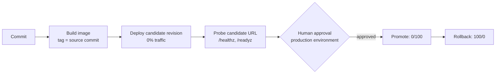

# Challenge 3: deploy without a weekend

**By the end of this chapter you will have shipped a release through an approved
pipeline, measured how long it took from the moment the pipeline was dispatched to the
moment the new revision served traffic, and undone it on purpose — with a number for that
too.**

## Why this matters

The retailer's release process is a person, a remote desktop session, and a Saturday.
Someone stops the service, copies files over the old ones, starts it again, and hopes.
There is no rollback, because the previous version was overwritten. There is no record of
who approved anything, because nobody was asked.

This chapter replaces that with a pipeline that builds one immutable image, deploys it as
a **revision** nobody is using yet, waits for a human to say yes, shifts traffic, and can
put it back. And it puts a stopwatch on the whole thing, because **pipeline lead time** —
how long the release machinery takes from the moment it is asked to the moment customers
are served — is the single number that best explains to a finance director why this
migration was worth paying for.

One honesty note up front, because you will read the `jq` later. DORA's *lead time for
changes* is measured from a code commit; this chapter cannot measure that, because the
workflow is triggered by hand (`workflow_dispatch`) and no commit event exists inside the
window. What you will measure is the pipeline clock — dispatch to serving traffic — and
that is what every label in this chapter says.

## Estimated time

**Estimated time:** 120–180 minutes. The identity and GitHub environment setup is about
40 minutes of it; the pipeline run itself is minutes, and you will spend the rest
reading what it produced. Budget extra if your GitHub organization requires a second
person to act as the approver.

## Before you start

**Where you work.** Unchanged from [Challenge 2](../ch02/README.md): still your VM from
Challenge 0, still `C:\MicroHack\source` — the evidence this chapter produces has to land
in the repository you push, so it has to be written on the machine that holds it. The
command blocks below are bash and belong in **Git Bash**, not PowerShell. If you need a
fresh terminal, start it with `"C:\Program Files\Git\bin\bash.exe" -l`, then
`cd /c/MicroHack/source`. Challenge 2 explains why the shell matters.

- Challenge 1 is finished and `evidence/modernization-contract.json` passes the shared
  handoff validator. Challenge 2 is finished, so you know the app's healthy behaviour
  under load. If your path ran out of time, ask the facilitator for the **golden
  handoff** and rejoin here.
- You can create resources in the handoff resource group, and you can change repository
  settings (Settings → Environments) on the workshop repository.
- `az`, `gh`, `jq`, `sha256sum`, and `uv` are available, and both `az login` and
  `gh auth login` are done.
- **A protected `production` environment is required, and GitHub only offers it on some
  plans.** Deployment protection rules — the "required reviewers" gate this whole chapter
  is built around — are **not available on private repositories on the GitHub Free
  plan**. Before the session, the facilitator must ensure the workshop repository is
  either:

  | Repository visibility | Plan needed for environment protection rules |
  | --- | --- |
  | Public | Free is sufficient |
  | Private | GitHub Team or GitHub Enterprise Cloud |

  If the repository is private on Free, the `production` job will run without ever
  pausing and there will be no approval to record. Confirm the plan and visibility with
  the facilitator first — see [the facilitator guide](../../docs/Facilitator.md).
- New to *revision*, *traffic weight*, *OIDC*, *federated credential*, or *managed
  identity*? See [the glossary](../../docs/Glossary.md).

## The concept

Container Apps never edits a running app in place. Each deployment creates a new
**revision** — an immutable pairing of an image digest and a configuration — and a
**traffic weight** decides what share of requests each revision receives. Promotion is
therefore a traffic change, not a copy; and rollback is the same traffic change in
reverse, which is why it takes seconds instead of a restore.



The pipeline authenticates to Azure with **GitHub OIDC**: GitHub mints a short-lived
token describing the run, Azure trusts that token for one specific repository *and one
specific environment*, and no secret is ever stored. That is why the identity carries two
federated subjects — `...:environment:staging` and `...:environment:production` — rather
than one blanket credential.

One thing surprises everyone here: **the workflow uses two different commits.** The
workflow itself runs at your current head commit and reads the handoff from that
checkout. The application it builds comes from the older `handoff.source.commitSha`
recorded inside that handoff. That separation is what makes the image reproducible — the
same handoff always builds the same image, no matter how many times you update the
pipeline.

## Your goal

Stand up a least-privilege deployment identity, run the pipeline for your stack, approve
one release as a human, promote it, roll it back, and record what each of those took.

Implement the workflow selected by the frozen handoff stack:

| `source.stack` | Workflow | Application build |
| --- | --- | --- |
| `dotnet-sqlserver` | `.github/workflows/catalog-dotnet.yml` | .NET solution and `dotnet/Dockerfile` |
| `java-postgresql` | `.github/workflows/catalog-java.yml` | Maven Wrapper and `java/Dockerfile` |

The workflow is manual (`workflow_dispatch`) and has two immutable inputs with
different purposes:

- The workflow control commit is `github.sha`. Staging reads
  `evidence/modernization-contract.json` from this checkout and binds its SHA-256.
- The application source is then checked out separately at the older, distinct
  `handoff.source.commitSha`. Tests, the Docker build, the full 40-hex image tag, and
  `<app>--ci-<first12>` candidate name derive only from this source commit.

The workflow uses `docker build` where Challenge 1 used `az acr build`. The rule never
changed — it was always *build where a daemon exists*. Your VM has none, which is why
Challenge 1 hands the build to ACR; a GitHub `ubuntu-24.04` runner does have one, so the
workflow builds locally and pushes. If a generated task proposes a local `docker build`
**on the VM**, that is still a preflight mismatch and you should still reject it.

Because the trigger is `workflow_dispatch`, neither of those commits is a *commit event*
inside the measured window: the application commit was made hours or days earlier, and
the control commit only says which tree the run read. The earliest thing the run itself
observes is the dispatch that starts the `staging` job. That is where the clock in step 5
starts, and it is why this chapter says **pipeline** lead time rather than DORA's *lead
time for changes*.

### Guardrails

- Grant only `contents: read` and `id-token: write`.
- Use one user-assigned managed identity with separate GitHub environment subjects
  `repo:<owner>/<repository>:environment:staging` and
  `repo:<owner>/<repository>:environment:production`.
- Give that deployment identity only `AcrPush` on the exact handoff ACR and `Container
  Apps Contributor` on the exact handoff Container App. The workflow must not enumerate
  its own RBAC.
- Do not use client secrets, registry admin, mutable action references, broad
  resource-group/subscription roles, or a mutable image deployment reference.
- Keep both the handoff revision and candidate active and healthy. The candidate starts
  at zero traffic in multiple-revision mode and owns the official label URL
  `https://<APP_NAME>---candidate.<ENVIRONMENT_SUFFIX>`.

## Steps

### 1. Create the deployment identity and the two GitHub environments

Deploy the bounded identity template against the exact ACR and Container App resource IDs
from the handoff, then create the `staging` and `production` environments in the
repository. Only `production` gets reviewers.

In **Settings → Environments → production**, enable **Required reviewers** and add the
person who will approve the release. This screen is the entire safety gate, so take a
moment to notice how little there is to it:


If **Required reviewers** is missing or greyed out, stop and re-read the plan and
visibility note in [Before you start](#before-you-start) — that is the GitHub Free plus
private repository limitation, not a mistake you made.

### 2. Run the workflow and let staging prove the candidate

Trigger the workflow manually. Staging binds and hashes the handoff from the control
checkout, checks out and tests the separate source commit, builds and resolves the
digest-qualified image, deploys the zero-traffic candidate, and probes its exact base,
`/healthz`, and `/readyz` URLs.

Staging then captures and hashes raw `az containerapp revision list` output before
approval. Normalized active, health, weight, and image values must be derived from that
raw response.

### 3. Approve the production deployment as a human

The run now pauses. Open the run in **Actions**, choose **Review deployments**, select
`production`, and approve:


Note the wall-clock time at which you clicked. That gap between "the machine was ready"
and "a person said yes" usually dominates release time in real organizations, and you are
about to measure it.

The protected `production` environment job starts only after staging succeeds and a
reviewer records approval. It arms a shell rollback trap before promotion, captures
and hashes raw revision-list output after promotion and after rollback, and proves
both retained revisions are healthy.

### 4. Capture the evidence after the run is fully complete

After the successful run is fully completed, a facilitator with Reader-equivalent
`Microsoft.Authorization/roleAssignments/read` captures GitHub metadata, UAMI
details, and exhaustive RBAC. A currently running production job is never complete
evidence.

Produce `evidence/cicd-report.json` and every referenced
`evidence/cicd/<name>.json` or `.raw.json` file. Every normalized observation binds one
repository, workflow path, control head SHA, ref, run ID, and run attempt. Staging and
production jobs require positive immutable job IDs, successful conclusions, and
positive, correctly ordered time windows.

The facilitator first selects the UAMI/handoff subscription and then runs this exact
unfiltered command without `--scope` or JMESPath:

```bash
az role assignment list --all --include-inherited \
  --assignee-object-id "$PRINCIPAL_ID" \
  --fill-principal-name false \
  --fill-role-definition-name false \
  --output json
```

Preserve full ARM `roleDefinitionId` values in the raw response. Normalize them to UUIDs
only in `evidence/cicd/identity.json`; any assignment beyond the exact two roles fails.
The UAMI, ACR, and Container App must share the selected subscription.

### 5. Measure pipeline lead time and rollback duration

This is the step that turns the chapter into a business case. Everything you need is
already in the report you just produced — no extra Azure calls, no stopwatch app.

The clock starts at `workflow.jobs.staging.startedAt`, which is the dispatch that started
the run, not a commit. Read the labels literally: this is pipeline lead time.
Run this from the repository root and **write the three numbers down**:

```bash
jq -r '
  (.workflow.jobs.staging.startedAt | fromdateiso8601) as $dispatched
  | (.workflow.jobs.staging.completedAt | fromdateiso8601) as $ready
  | (.approval.approvedAt | fromdateiso8601) as $approved
  | (.traffic.promotion.observedAt | fromdateiso8601) as $live
  | (.traffic.safety.rollbackAttemptedAt | fromdateiso8601) as $undoStart
  | (.traffic.safety.rollbackCompletedAt | fromdateiso8601) as $undoEnd
  | "pipeline lead time (dispatch to live): \(((($live - $dispatched) / 60) * 10 | round) / 10) min",
    "  of which pipeline work:              \((((($ready - $dispatched) + ($live - $approved)) / 60) * 10 | round) / 10) min",
    "  of which waiting for a human:        \(((($approved - $ready) / 60) * 10 | round) / 10) min",
    "rollback duration:                     \(((($undoEnd - $undoStart) / 60) * 10 | round) / 10) min"
' evidence/cicd-report.json
```

Keep those figures with your evidence. The split matters: the pipeline number is what
automation bought you, and the human number is what your approval policy costs — which
is a deliberate, visible choice rather than an accident.

If someone at your table quotes DORA, be precise with them: to turn this into *lead time
for changes* you would have to add the time between the application commit and the
dispatch, and this workshop never observes that interval.

### 6. Validate

Validate from `tests/acceptance`:

```bash
cd tests/acceptance
uv --no-config run catalog-validate-challenge-evidence cicd \
  evidence/cicd-report.json \
  --handoff evidence/modernization-contract.json \
  --contracts workshop/contracts \
  --repository-root ../..
```

The example JSON documents structure only and is never behavioral proof.

## Success criteria

- [ ] The workflow run completed with conclusion `success`, triggered by
      `workflow_dispatch`, with both a `staging` and a `production` job.
- [ ] The candidate revision was deployed at **zero traffic**, and its label URL,
      `/healthz`, and `/readyz` all returned `200` *before* anyone approved anything.
- [ ] A named human approval is recorded against the `production` environment, and its
      timestamp sits between staging finishing and production starting.
- [ ] Traffic moved `100/0 → 0/100` on promotion and back to `100/0` on rollback, with
      both revisions still active and healthy at the end.
- [ ] The deployment identity holds **exactly two** role assignments — `AcrPush` on the
      handoff ACR and `Container Apps Contributor` on the handoff Container App — and no
      client secret or registry admin credential was used.
- [ ] You have written down your pipeline lead time and your rollback duration, and you
      can say what clock each one starts on.
- [ ] `catalog-validate-challenge-evidence cicd` exits `0`.

## Hints

<details>
<summary>Hint 1 — a nudge</summary>

Two ideas do most of the work in this chapter. First, nothing here is authenticated with
a stored secret — think about what GitHub can prove about a run, and what Azure would
have to trust for that to be enough. Second, if deploying creates a new revision instead
of replacing the old one, ask yourself what "rollback" even has to mean.

If the run sails past production without pausing, the problem is a repository setting,
not the workflow.

</details>

<details>
<summary>Hint 2 — the approach</summary>

1. Deploy `infra/github-cicd.bicep` at resource-group scope with the ACR and Container
   App resource IDs taken from the handoff. It creates the identity, both federated
   credentials, and exactly two role assignments.
2. Create `staging` and `production` environments; set `AZURE_CLIENT_ID`,
   `AZURE_TENANT_ID`, and `AZURE_SUBSCRIPTION_ID` as variables in both; add required
   reviewers to `production` only.
3. Dispatch the workflow for your stack and watch staging deploy a zero-traffic candidate
   and smoke-test it.
4. Approve. Watch promotion, then the deliberate rollback.
5. Only once the run is fully finished, capture the GitHub run, jobs, approvals, and
   artifact; then have a facilitator capture the identity and its RBAC from a separate
   session.
6. Assemble the report, compute pipeline lead time and rollback duration from it, and
   validate.

</details>

<details>
<summary>Hint 3 — nearly the answer</summary>

The evidence bundle is assembled from four sources: `gh api .../actions/runs/<id>`,
`.../jobs`, `.../approvals`, and the workflow's own uploaded artifact — merged with the
facilitator's `az identity show`, `az identity federated-credential list`, and the
unscoped `az role assignment list` capture.

The full command sequence, the fail-closed `jq` assertions for each, and the exact
normalization into `evidence/cicd/workflow-run.json`, `evidence/cicd/approval.json`, and
`evidence/cicd/identity.json` are in
[the Challenge 3 solution](../../solutions/ch03/README.md).

</details>

## If it goes wrong

| Symptom | Cause | Fix |
| --- | --- | --- |
| The `production` job runs immediately with no approval prompt | The environment has no required reviewers — most often because deployment protection rules are unavailable on a private repository on GitHub Free | Confirm repository plan and visibility with the facilitator, then re-add required reviewers. See [the facilitator guide](../../docs/Facilitator.md) |
| `AADSTS70021` / no matching federated identity record | The federated subject does not match `repo:<owner>/<repository>:environment:<name>`, or the job declares a different `environment:` | Compare the credential's subject to the job's environment name character for character |
| `az acr` push denied, or the Container App update is forbidden | The role assignments landed on the wrong scope, or propagation has not finished | Re-check that `AcrPush` is scoped to the exact ACR and `Container Apps Contributor` to the exact Container App, then retry after a few minutes |
| The RBAC capture shows more than two assignments | Something granted a broader role at resource-group or subscription scope | Remove the extra assignment; the chapter is a least-privilege exercise, not a "make it work" exercise |
| Validation rejects the run as incomplete | Evidence was captured while the production job was still running | Wait for the run to finish, then re-capture. A running job is never complete evidence |

More patterns are in [the troubleshooting guide](../../docs/Troubleshooting.md).

## What you just proved

Fill in your own measurements from step 5:

| | Legacy weekend release | Your pipeline |
| --- | --- | --- |
| **Pipeline lead time** (dispatch → serving traffic) | A scheduled out-of-hours window — hours of elapsed work, planned days ahead | **_your number_ minutes**, of which most is usually the human approval |
| Who approved it | Nobody was asked | A named reviewer, timestamped, in the run record |
| **Rollback** | Restore from backup, if there is one | **_your number_ minutes** — a traffic weight change, with the previous revision still running |
| What was deployed | Files copied over files | One immutable image digest, traceable to one source commit |
| Credentials involved | A password someone knows | None — short-lived OIDC tokens bound to one repository and one environment |
| Blast radius of the identity | Whatever that admin account could do | Two role assignments, two resources |

The headline is the first row. A release that used to be planned around a weekend is now
a number you can quote in minutes — and the second row is why nobody has to be brave
about it. The third row is the one that actually changes behaviour: when undoing a
release costs a couple of minutes and leaves the old revision running the whole time,
teams stop batching changes into risky quarterly drops.

Quote the first row as what it is. The legacy column is an end-to-end release window and
your column is a pipeline clock, so the comparison is directional, not like-for-like — a
distinction a DevOps-literate audience will make for you if you do not make it first.

---

**Previous:** [Challenge 2: Make the catalog survive a traffic spike](../ch02/README.md)
**Next:** [Challenge 4: Find out why it broke](../ch04/README.md)
