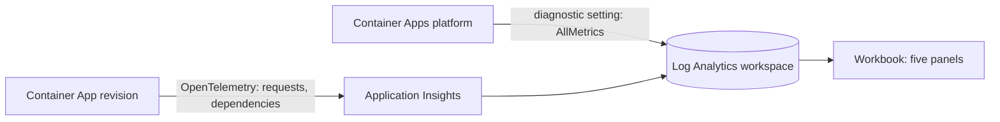

# Challenge 4: find out why it broke

**By the end of this chapter you will be able to answer five questions about your running
catalog that were physically unanswerable on the VM — and you will answer them for one
exact build, on one exact revision, in one exact window of time.**

## Why this matters

Ask the retailer's team what p95 latency was last Tuesday at 14:10 and the honest answer
is "we have no idea". The only diagnostic on the Windows VM is a text file that the
application writes when it remembers to. There is no request timing, no way to tell an
application fault from a database fault, no idea how many instances were serving, and no
link between what the code did and which build it came from.

That is not a tooling gap, it is an operational one: the team cannot investigate an
incident, so they restart the service and move on. This chapter closes that gap and sets
up Challenge 6, where an agent uses exactly this telemetry to diagnose a live incident.

## Estimated time

**Estimated time:** 90–150 minutes. Roughly 20 minutes is deploying the workbook and the
diagnostic setting; most of the rest is exercising the app so the window contains real
signal, then running and normalizing the queries. Allow up to 10 minutes after deployment
before platform metrics appear in the workspace.

## Before you start

**Where you work.** Unchanged from [Challenge 2](../ch02/README.md): still your VM from
Challenge 0, still `C:\MicroHack\source` — the evidence this chapter produces has to land
in the repository you push, so it has to be written on the machine that holds it. The
command blocks below are bash and belong in **Git Bash**, not PowerShell. If you need a
fresh terminal, start it with `"C:\Program Files\Git\bin\bash.exe" -l`, then
`cd /c/MicroHack/source`. Challenge 2 explains why the shell matters. The portal reading
in step 3 is the exception — do that in a browser, on whichever screen is bigger.

- Challenge 1 is finished: `evidence/modernization-contract.json` passes the shared
  handoff validator, and its complete `evidence/telemetry-report.json` bundle is present
  with its normalized resources, traces, metrics, and logs. See
  [Challenge 1](../ch01/README.md). If you fell behind, the facilitator's **golden
  handoff** for your stack lets you rejoin here.
- Challenges [2](../ch02/README.md) and [3](../ch03/README.md) are done. They matter here
  for a practical reason: they are what put real requests, real scale-out, and real
  revision activity into the window you are about to query.
- You can deploy to the handoff's `application.resourceGroup` and read the Log Analytics
  workspace.
- New to *trace*, *dependency*, *KQL*, *workbook*, or *diagnostic setting*? See
  [the glossary](../../docs/Glossary.md).

## The concept

Your modernized catalog emits telemetry down two independent paths, and knowing which is
which is most of this chapter.



**Application telemetry** is what your code reports: every request with its duration and
outcome, and every outbound call it made — to the database, to storage — as a
*dependency*. Each record carries the service name, the source commit as `AppVersion`,
and the Container Apps revision name, so you can attribute behaviour to one build on one
revision. That is the thing the VM's text log could never do.

**Platform metrics** are what Azure reports about the container platform itself,
exported by a diagnostic setting. This export flattens metric dimensions, so a platform
metric arrives without its revision label.

The consequence is a rule worth remembering: application telemetry can be filtered to a
revision, platform metrics generally cannot. That is why the replica panel here is
Container App total rather than revision scoped, and why Challenge 2 remains authoritative
for revision-level scale proof.

Once both land in one Log Analytics workspace, a **workbook** is simply a saved set of
KQL panels over that data — the shared, re-runnable version of the query someone would
otherwise paste into chat during an incident.

## Your goal

Deploy one Azure Workbook over the Application Insights component and Log Analytics
workspace already recorded by the completed modernization handoff, export the existing
Container App's `AllMetrics` category to that workspace, and produce a positive answer to
each of these five questions for your exact service, source commit, revision, and window:

1. revision-filtered HTTP error rate;
2. revision-filtered HTTP latency;
3. revision-filtered database dependency failures;
4. the Container App's peak one-minute total replica count;
5. revision-filtered cold starts.

Stay inside the existing telemetry stack. Do not add another telemetry stack, Data
Collection Rule, compatibility adapter, or alternate metrics pipeline. Do not change
application instrumentation, replace the target or handoff resources, or deploy another
Application Insights component or workspace.

## Steps

### 1. Bind to the handoff and treat its values as immutable

Start only after Challenge 1 produced a validator-clean
`evidence/modernization-contract.json` and its complete `evidence/telemetry-report.json`
bundle. Treat these handoff values as immutable:

- `source.commitSha`;
- `application.resourceId`, `application.resourceGroup`,
  `application.containerAppName`, and `application.revisionName`;
- `observability.applicationInsightsResourceId`;
- `observability.logAnalyticsWorkspaceResourceId`;
- `observability.serviceName`, `observability.serviceNamespace`,
  `observability.environment`, and `observability.serviceVersion`;
- `evidence.telemetryReport`.

The validated handoff proves that the Container App, Application Insights component, and
Log Analytics workspace share `application.resourceGroup`. Deploy the Challenge 4
resource-group template to that exact resource group. The template fails if any supplied
resource ID is outside the current subscription/resource group.

The telemetry report and every normalized result file it references must remain present.
Challenge 4 does not replace the earlier proof of traces, metrics, logs, service
identity, source commit, or revision identity — it builds a diagnostic surface on top of
it.

### 2. Deploy the workbook and the metrics export

`infra/observability-workbook.bicep` consumes the existing same-resource-group resources
and deploys only one workbook plus the existing Container App's
`all-metrics-to-workspace` diagnostic setting. The setting exports `AllMetrics` to the
handoff workspace's `AzureMetrics` table. Workbook `sourceId` is that exact workspace.

The two checked-in assets it deploys are frozen:

- `workshop/observability/queries.kql` is the deterministic `// query-id` rendering of
  frozen `workshop/contracts/observability-queries.json` version `1.1.0`. Do not edit or
  reinterpret a query.
- `workshop/observability/workbook.json` is a `Notebook/1.0` template containing exactly
  the five named `KqlItem/1.0` Logs panels. Each panel uses integer `queryType: 0`,
  resource type `microsoft.operationalinsights/workspaces`, and no unrelated
  cross-component resource.

### 3. Look at what you can now see — and time yourself doing it

Before you run a single query, spend five minutes in the portal. This is the part that
makes the rest of the chapter mean something.

**Start a clock first.** Write down the current wall-clock time, to the minute, *before*
you open anything. You are about to answer "why was it slow?" for a real workload, and
the wrap-up scorecard asks how long that took. On the VM the honest answer is that the
question could not be answered at all, so the only way to make the comparison fair is to
measure your side of it.

Open **Application Insights → Application map**. The catalog and its database appear as
separate nodes, with the call volume and the average dependency latency on the edge
between them:


Nothing on the VM could draw that picture, because the app and the database were the same
process on the same box. The edge is new information: it tells you how many database
calls one page view really makes.

Now open **Performance**. Note that it does not lead with an average — it offers 50th,
95th, and 99th percentiles, an operation-level breakdown, and a duration distribution
with individual sample traces you can open:


The per-operation row is the diagnostic payload: it separates a slow image route from a
fast catalog route instead of averaging them into one meaningless number.

**Stop the clock** the moment you can say out loud, without hedging, which operation was
slowest and which dependency it was waiting on — naming the dependency and its latency,
not "the database seemed slow". Write down both readings and the difference in minutes.
That difference is your **time to answer "why was it slow?"**, and it is the Challenge 4
row of the [wrap-up scorecard](../wrapup/README.md). Record it in the same place you keep
this chapter's other figures, next to `evidence/observability-report.json`.

### 4. Understand what the five frozen queries actually reveal

The workbook's panels are not a checklist. Each one answers a question the retailer could
not previously ask, and each is scoped to one service, one source commit, and — for four
of them — one revision:

| Panel | The question it answers | On the VM you would have said |
| --- | --- | --- |
| `error-rate` | Of the requests this exact build served on this exact revision in this window, what percentage failed? | "There are some errors in the log file" |
| `latency` | What was p95 latency — the experience of the slowest 1 in 20 shoppers, not the flattering average? | Nothing measurable |
| `database-dependency-failures` | Was it *us* or the *database*? This counts failed outbound calls tagged with a database system | "The site was slow" |
| `replica-count` | How much capacity was actually running, minute by minute? | Always exactly one |
| `cold-starts` | How many instances started serving for the first time in this window — did we pay a startup cost during the spike? | The concept did not exist |

Two design details are worth reading in the KQL itself. The four Application Insights
panels bind `_ResourceId`, `AppRoleName`, `AppVersion`, the exact
`azure.containerapps.revision.name` property, and explicit timestamps — `AppVersion` is
your source commit, which is how a symptom gets attributed to a build rather than to "the
app". The replica query is deliberately different: it reads `AzureMetrics`, binds the
exact handoff Container App `_ResourceId`, filters `MetricName == "Replicas"` and
`TimeGrain == "PT1M"`, then returns the peak `Total`, and it carries **no revision
filter** because the diagnostic-setting export flattened that dimension away. The
cold-start query first finds each exact commit/revision `AppRoleInstance`'s first request
through the window end, then filters those first requests into the evidence window — so
an instance that started before your window is not counted twice.

Answering these five for a window you choose is the skill. The evidence bundle below is
just how you write the answers down so someone else can check them.

### 5. Capture raw responses, then normalize them

Use `workshop/contracts/observability-evidence.example.json` only to understand the frozen
`1.1.0` structure. Its IDs, timestamps, hashes, and rows are synthetic; it is never live
evidence.

Create `evidence/observability-report.json` plus every normalized result file it
references. The bundle must bind:

- the complete Challenge 1 handoff and telemetry report;
- the exact Application Insights component, Log Analytics workspace, Container App,
  service name, namespace, environment, source commit, and revision;
- the diagnostic-setting deployment time, workbook deployment/capture time, query window,
  query capture times, and final report capture time in their actual order;
- `metricsExport.destinationTable: "AzureMetrics"`,
  `metricsExport.scope: "container-app-total"`, and
  `metricsExport.dimensionHandling: "flattened"`;
- SHA-256 hashes of the checked-in workbook template (`templateSha256`) and KQL file
  (`queriesSha256`);
- exact ARM-captured workbook `serializedData`, `serializedDataSha256`, API version, and
  `sourceId`;
- the exact rendered query and `querySha256` for each panel;
- one typed, positive row per query;
- `assertions.applicationTelemetryRevisionFilterApplied: true` for the four Application
  Insights panels, without claiming that the replica panel is revision filtered.

Each normalized query observation includes its two Azure resource IDs, source commit,
revision, service name, exact query text/hash, window, capture time, and rows. Error rate
rows contain `timestamp`, floating-point `value`, `totalRequests`, and `failedRequests`.
Latency rows contain a positive floating-point `value`. Database failure, replica, and
cold-start rows contain a positive integer `value`.

Keep raw Azure responses under `evidence/observability/raw/`, then normalize them into the
schema-declared result paths. The normalized diagnostic-setting observation records the
exact Container App/workspace IDs, setting, category, `AzureMetrics` destination, enabled
state, and observation time. Do not point a declared `resultFile` outside the repository,
through a symlink, or at an unnormalized portal export.

An empty result is not a passing result — it means your window does not contain the
signal you claimed to observe. Choose a window that does, and never turn an empty query
into a success-shaped row.

### 6. Validate

From `tests/acceptance`, run the common validator:

```bash
cd tests/acceptance
uv --no-config run catalog-validate-challenge-evidence observability \
  evidence/observability-report.json \
  --handoff evidence/modernization-contract.json \
  --contracts workshop/contracts \
  --repository-root ../..
cd ../..
```

Run the focused implementation checks:

```bash
cd tests/acceptance
uv --no-config run pytest -q tests/test_ch04_observability_challenge.py
```

## Success criteria

- [ ] Exactly two Azure resources were added: one workbook and the
      `all-metrics-to-workspace` diagnostic setting on the existing Container App — no new
      workspace, component, Data Collection Rule, or alternate pipeline.
- [ ] The workbook's `sourceId` is the handoff Log Analytics workspace, and the deployed
      `serializedData` hashes to the checked-in template.
- [ ] All five queries return a real, non-empty, correctly typed row for your chosen
      window, and you can say in one sentence what each row means.
- [ ] Your recorded timestamps are in genuine order: diagnostic setting, then workbook,
      then the query window, then each query capture, then the report.
- [ ] The four Application Insights panels are revision filtered and the replica panel is
      honestly recorded as Container App total.
- [ ] You wrote down your **time to answer "why was it slow?"** from step 3 — the two
      clock readings and the difference in minutes — and you can name the slow dependency
      it bought you.
- [ ] `catalog-validate-challenge-evidence observability` exits `0`.

## Hints

<details>
<summary>Hint 1 — a nudge</summary>

Two questions unlock this chapter. Where does each of the five signals physically come
from — your application, or the Azure platform? And what does each source know about your
revision?

Answer those and the "why is the replica panel different?" puzzle answers itself, along
with most of the evidence structure.

If a query returns nothing, the problem is almost never the query.

</details>

<details>
<summary>Hint 2 — the approach</summary>

1. Validate the handoff and confirm the app, Application Insights component, and
   workspace really do share one resource group.
2. Pick fixed UTC start and end times — never `ago()` — for a window in which the app was
   genuinely exercised, including at least one failure and at least one new instance.
   The Challenge 2 load run is an excellent window.
3. Deploy `infra/observability-workbook.bicep` to that resource group with the handoff
   values and your window as parameters.
4. Render each frozen KQL template by substituting only its declared placeholders, run all
   five against the workspace, and keep both the rendered text and its hash.
5. Save the raw ARM responses first, hash the checked-in assets exactly as they are on
   disk, then normalize.

</details>

<details>
<summary>Hint 3 — nearly the answer</summary>

The placeholders to substitute are `__START_TIME__`, `__END_TIME__`,
`__APPLICATION_INSIGHTS_RESOURCE_ID__`, `__CONTAINER_APP_RESOURCE_ID__`,
`__SERVICE_NAME__`, `__SOURCE_COMMIT__`, and `__REVISION_NAME__` — and nothing else.

Hash `serializedData` as the exact string ARM returned: no pretty-printing, no
re-serialization, no trailing newline.

The complete deployment command, capture commands, per-query row table, and the required
timestamp ordering are in [the Challenge 4 solution](../../solutions/ch04/README.md).

</details>

## If it goes wrong

| Symptom | Cause | Fix |
| --- | --- | --- |
| The replica query returns nothing | Platform metrics take a few minutes to flow after the diagnostic setting is created, or the window predates it | Wait, then choose a window that starts after the diagnostic setting existed |
| A query returns zero rows | The window contains no failures, or no instance started inside it | Exercise the app — the Challenge 2 load window is the reliable choice — and re-select the window. Never coerce an empty result into a row |
| The workbook hash does not match | `serializedData` was pretty-printed, parsed and re-serialized, trimmed, or newline-terminated before hashing | Hash the exact bytes ARM returned |
| Deployment fails on a resource ID assertion | The template was deployed to a different resource group than `application.resourceGroup` | Deploy to the handoff resource group; do not work around a cross-resource-group handoff |
| Timestamps rejected as out of order | Values were back-filled or copied from the example rather than observed | Re-record actual observation times; the ordering is the evidence that you deployed before you queried |

More patterns are in [the troubleshooting guide](../../docs/Troubleshooting.md).

## What you just proved

| Question about last Tuesday at 14:10 | On the VM | Now |
| --- | --- | --- |
| What share of requests failed? | Unknown | A percentage, for one build on one revision |
| How slow was it for the unlucky 5%? | Unknown | A p95 in milliseconds |
| Was it the app or the database? | Argument | A count of failed database dependency calls |
| How much capacity was running? | One instance, always | A per-minute peak replica count |
| Did instances start cold during the spike? | Meaningless question | A count of first-serving instances in the window |
| Where does the answer live? | One text file on a server nobody should be logged into | A queryable workspace and a shared workbook anyone on the team can re-run |
| **How long did answering take?** | **Never answered — the question has no data behind it** | **your step 3 figure, in minutes** |

The retailer has gone from one text log to five answerable questions, and — because every
Application Insights record carries the source commit — from "the app is broken" to "this
build, on this revision, failed this often." That is the difference between restarting a
service and diagnosing a system.

It is also the raw material for Challenge 6: an AI agent cannot correlate signals that
were never collected. You just collected them.

---

**Previous:** [Challenge 3: Deploy without a weekend](../ch03/README.md)
**Next:** [Challenge 5: Cloud security posture](../ch05-defender/README.md)
