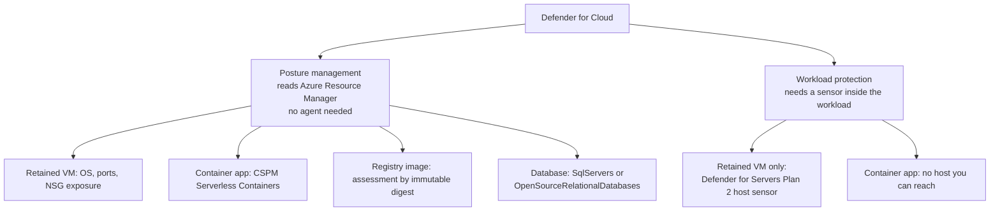

# Challenge 5: find out what the migration actually exposed

**By the end of this chapter you will have read a real cloud security posture across your
VM, container registry, container app, and managed database — and either fixed or
consciously accepted four specific findings, with the evidence to show which.**

## Why this matters

Nobody has ever security-assessed the catalog. It has run on one Windows Server VM for
years with management ports open to whoever could reach the network, an application and a
database sharing a host, and a patching schedule that lives in somebody's calendar.

Migrating to Azure does not fix that by itself. It *changes* it. Some risks disappear
(you no longer patch a host), some move (the database is now a network-reachable managed
service), and some are brand new (a registry with admin credentials enabled is a
credential you did not have before). This chapter is where you find out which is which,
before somebody else does.

The habit is the lesson. A migration is finished when you can say what its security
posture is — not when the app returns 200.

**Estimated time:** 120–180 minutes. Two of the four fixes are quick; the querying and
the honest write-up are the bulk of it. Findings surface asynchronously, so there is
built-in waiting — read the next section before you plan around it.

## Before you start

**Where you work.** Unchanged from [Challenge 2](../ch02/README.md): still your VM from
Challenge 0, still `C:\MicroHack\source` — the evidence this chapter produces has to land
in the repository you push, so it has to be written on the machine that holds it. The
command blocks below are bash and belong in **Git Bash**, not PowerShell. If you need a
fresh terminal, start it with `"C:\Program Files\Git\bin\bash.exe" -l`, then
`cd /c/MicroHack/source`. Challenge 2 explains why the shell matters. Read the portal
wherever you like; the captures still have to be written where the repository is.

- Challenge 4 is complete: [Challenge 4: observability](../ch04/README.md). Your
  `evidence/modernization-contract.json` and its target output validate.
- **Findings can take up to 24 hours to appear.** Microsoft Defender for Cloud assessments,
  Secure Score updates, and attack paths are generated asynchronously after a plan is
  enabled. That is far longer than a workshop, so the facilitator enables the paid plans
  ahead of time and seeds a **pre-warmed snapshot** you can learn from today. See
  [the facilitator guide](../../docs/Facilitator.md).
- **You will not enable a paid plan yourself, and that is deliberate.** Plan enablement is
  a subscription-wide, billable change; in a shared workshop subscription one participant
  flipping a plan changes the bill and the posture for everyone. You are given
  `Security Reader` so you can see everything and change nothing outside your own resource
  group — which, not coincidentally, is exactly the access a real security reviewer gets.
- New to this vocabulary? Start with the [glossary](../../docs/Glossary.md).

## The concept

Defender for Cloud has two different jobs, and confusing them is the most common mistake
in this chapter.

**Posture management** asks "is this resource configured badly?" It reads Azure Resource
Manager, needs no agent, and covers everything. **Workload protection** asks "is
something attacking this right now?" It needs a sensor inside the workload, so it only
exists where a sensor can live.

That distinction decides what you may claim about each subject:



In the workshop material `P2` is not a phase code — it is **Plan 2**, the paid tier of
Defender for Servers, and it is what the facilitator enabled on both VMs of the
provisioned two-VM baseline. Azure Container Apps has platform-managed hosts and receives
serverless-container posture context; it has no participant-visible host and no
host/runtime Defender sensor. Do not claim Defender host or runtime sensor coverage for
ACA, however tempting the symmetry is.

## Your goal

Interpret the posture of every resource your migration touched, decide what to do about
four named findings, and record both the decision and the evidence behind it. Use the
selected `evidence/modernization-contract.json` and the frozen Defender contract
`workshop/contracts/defender.json` version `1.1.0`. Compare the selected retained VM with
its modernized Azure Container Apps, Azure Container Registry, and selected managed
database stack, while also confirming Defender for Servers P2 coverage for the sibling
retained VM.

For each of the four controls you have three honest outcomes: remediate it, prove it was
already compliant, or document an exception with a real justification and compensating
control. All three are professional answers. Only one of them is a lie: weakening a secure
baseline so you have a nicer before/after story.

## Authoritative inputs

All declared artifact paths are repository-root-relative. Start only when these inputs
exist and their recorded SHA-256 values validate:

- `evidence/modernization-contract.json`, including its exact `sliceId`,
  `source.commitSha`, application resource ID, revision, URLs, ACR resource ID,
  repository, immutable image digest, selected database resource ID/family, and
  `deployment.targetOutput`;
- the target output named by `deployment.targetOutput`, including
  `network.migrationSourceVmResourceId` and the workload managed identity;
- `workshop/defender/lab-profile.json`;
- facilitator-provided live foundation captures for pricings, budget, Serverless
  Containers portal preflight, both retained VM identities, and cleanup inventory;
- the distinct pre-warmed Defender seed snapshot; and
- the facilitator-authorized cleanup manifest.

The selected source VM is exactly `network.migrationSourceVmResourceId`. The coverage
artifact must contain exactly the `dotnet` and `java` retained VMs under Defender for
Servers P2, including the selected VM and its sibling. Never substitute a VM discovered
by name or portal search — in a shared subscription the VM you find by name may belong to
the team at the next table.

The checked-in files under `workshop/contracts/fixtures/defender/` and
`workshop/contracts/defender-evidence-capture.example.json` are sanitized examples.
They describe structure only. Their zero IDs, example URLs, timestamps, hashes, and
findings are never live participant evidence.

## Steps

### 1. Read the posture, subject by subject

Work down this table and, for each row, be able to say what Defender can and cannot tell
you about that resource. This is the interpretation the rest of the chapter rests on.

| Subject | Required interpretation |
| --- | --- |
| Selected retained VM | Defender for Servers P2; customer-managed OS, host, management ports, NSG exposure, and optional JIT policy |
| Sibling retained VM | Its exact identity and successful P2 coverage must remain in the two-VM coverage artifact |
| Azure Container App | Defender CSPM Serverless Containers posture only; platform-managed host, no host/runtime Defender sensor |
| Azure Container Registry image | Query the frozen subassessment path for the exact handoff repository and immutable digest |
| Azure SQL | Selected `azure-sql` database is protected by `SqlServers`; assess the parent SQL server network posture |
| PostgreSQL | Selected `postgresql-flexible` database is protected by `OpenSourceRelationalDatabases`; assess the parent flexible server |
| Security context | Query recommendations, Secure Score, MCSB controls, and Resource Graph attack paths at the handoff subscription |

Current image findings, recommendations, Secure Score updates, and attack paths are
asynchronous. A current live query can legitimately return zero records. The graded
signal is the exact query attempt and provenance, not a newly generated finding or
alert. Use the distinct pre-warmed seed snapshot for deterministic learning evidence;
never relabel the snapshot as current state and never wait for or manufacture a new
recommendation or alert during class.

This is worth sitting with for a moment: an empty result is a real answer. Treating
"no findings yet" as "no findings" is how posture reviews go wrong in production too.

### 2. Stay inside the permission boundary

Participants operate only in the assigned resource group with `Security Reader` plus
the existing resource-group permissions required by the selected modernization path.
Participants must not:

- enable or disable paid Defender plans;
- change Defender policy, auto-provisioning, subscription settings, agents, VM
  extensions, or Data Collection Rule associations;
- delete policies, agents, extensions, or shared resources;
- query or alter another participant resource group or subscription; or
- perform post-workshop cleanup.

Owner or Security Admin at the dedicated workshop subscription is facilitator-only.
The Serverless Containers portal preflight requires Owner. Cleanup is
facilitator-authorized only.

### 3. Decide the four bounded controls

Remediate or record the contract-approved disposition for exactly these controls. Each one
is a finding a real migration produces, so decide it the way you would at work.

1. `acr-admin-authentication`: disable ACR admin authentication. Preserve the exact
   handoff workload managed identity, its ACR-scoped `AcrPull` role
   `7f951dda-4ed3-4680-a7ca-43fe172d538d`, and the exact digest-qualified image.
   *Why it matters:* the admin account is a shared static credential with push rights.
   Managed identity already covers the pull, so the account buys you nothing and costs you
   a secret that cannot be attributed to a person.
2. `container-app-ingress`: `allowInsecure` must be `false`. Internal ingress may be
   remediated/already compliant; intentional public HTTPS ingress must be `justified`
   with compensating controls.
   *Why it matters:* the legacy site answered plain HTTP on a VM. Carrying that habit
   forward is the easiest downgrade attack in the estate.
3. `database-public-network`: evaluate the selected family only. Disable public network
   access, retain an already-compliant state, or use `documented-exception` with a
   specific justification and compensating controls.
   *Why it matters:* on the VM the database was unreachable from the internet by accident
   of topology. As a managed service it is reachable by default, and that is the single
   biggest posture change your migration made.
4. `legacy-vm-management-ingress`: bind every NIC and effective NSG response to the
   exact selected source VM. Remove public SSH/RDP exposure, prove an exact bound
   Defender JIT policy covers the public management port, retain an already-segmented
   state, or use `documented-exception`.
   *Why it matters:* the VM is still running. Migrations leave the old thing behind far
   longer than anyone plans, and exposed management ports are how that becomes an
   incident.

Do not weaken a secure baseline just to create a before/after transition. An
`already-compliant` disposition is valid when the captured state proves it.

### 4. Capture the live evidence

Create `evidence/defender/capture.json` version `1.1.0`. It must digest-bind:

- the selected handoff, its exact target output, lab profile, and cleanup manifest;
- facilitator foundation artifacts, including both retained VM identities and the
  distinct pre-warmed seed snapshot;
- before/after raw state for the exact ACR, ACA, selected database server, and selected
  source VM;
- the exact ACR-scoped managed-identity `AcrPull` assignment;
- the three explicit decision records;
- current image assessment, recommendations, Secure Score, MCSB, and attack-path query
  envelopes;
- exact handoff revision health/readiness URLs with HTTP `200`; and
- the final capture time after every referenced observation.

The frozen current-query provenance is:

| Signal | Method, path, API version |
| --- | --- |
| Image assessment | `GET providers/Microsoft.Security/assessments/c0b7cfc6-3172-465a-b378-53c7ff2cc0d5/subAssessments`, `2019-01-01-preview`, exact handoff ACR scope |
| Recommendations | `GET providers/Microsoft.Security/assessments`, `2020-01-01`, handoff subscription |
| Secure Score | `GET providers/Microsoft.Security/secureScores`, `2020-01-01`, handoff subscription |
| MCSB | `GET providers/Microsoft.Security/regulatoryComplianceStandards/Microsoft-cloud-security-benchmark/regulatoryComplianceControls`, `2019-01-01-preview`, handoff subscription |
| Attack paths | `POST providers/Microsoft.ResourceGraph/resources`, `2022-10-01`, exact `securityresources` query and one subscription |

Attack paths are available only through that complete Azure Resource Graph POST
envelope. An unsupported direct `GET` to a `Microsoft.Security/attackPaths` collection
is not evidence. The response must be untruncated and complete, but `data: []` is valid.

The capture manifest binds each raw file by digest, so the structure the schema expects is
in `workshop/contracts/defender-evidence-capture.schema.json`. Never insert free text
where a structured result belongs.

### 5. Render and validate

Do not manually create or edit `evidence/defender-report.json` or any normalized
Defender result. From `tests/acceptance`, run the exact frozen registry commands:

```bash
cd tests/acceptance
uv --no-config run catalog-render-defender-evidence --capture evidence/defender/capture.json --handoff evidence/modernization-contract.json --output evidence/defender-report.json --repository-root ../..
uv --no-config run catalog-validate-defender-evidence --capture evidence/defender/capture.json --handoff evidence/modernization-contract.json --report evidence/defender-report.json --contracts workshop/contracts --repository-root ../..
```

The validator replays every digest-bound raw input. Empty asynchronous current results
do not fail by themselves. Wrong scopes, paths, API versions, identities, database
family, VM/NIC/NSG binding, mutable images, missing `AcrPull`, altered raw files,
aliasing seed and current files, incomplete Resource Graph responses, fabricated
findings, or manually normalized JSON fail closed.

## Success criteria

You are done when:

- You can say, in one sentence per subject, what Defender does and does not see for your
  VM, container app, registry image, and database — and you do not claim a host sensor for
  the container app.
- Each of the four controls has a decision you would defend in a review: remediated,
  already compliant, or a documented exception with a named compensating control.
- The ACR admin account is off and the app still pulls the exact digest-qualified image
  using its managed identity — the app's `/healthz` and `/readyz` still return HTTP `200`
  after your changes.
- Your before and after raw state for the ACR, container app, database server, and source
  VM come from live ARM responses, not from the portal or a fixture.
- Seed-snapshot evidence and current-query evidence are clearly separate files, and you
  never labelled one as the other.
- `catalog-validate-defender-evidence` exits successfully.

## Hints

<details>
<summary>Hint 1 — a nudge</summary>

Two ideas unlock most of this chapter.

First, work out for each resource whether a Defender *sensor* could physically live
inside it. Where it cannot, only posture applies — and posture is read from Azure
Resource Manager, which is why it works with no agent at all.

Second, an empty response is evidence that you asked. Findings arrive on Azure's
schedule, not yours, which is exactly why a seeded snapshot exists alongside your live
queries.

</details>

<details>
<summary>Hint 2 — the approach</summary>

Sequence it like this:

1. Validate the handoff first, then read every resource ID out of it and its target
   output. Never look a resource up by name.
2. Capture the complete before-state ARM document for the registry, container app,
   database server, and source VM — before you change anything, because you cannot go back
   and take a "before" later.
3. Make only the four decisions. For each, either apply the change or write down why the
   current state is already acceptable.
4. Re-capture the same four resources as after-state, then prove the app still serves the
   exact digest-qualified image and still answers `/healthz` and `/readyz`.
5. Run the five current-signal queries with the exact methods, paths, and API versions in
   the provenance table. Attack paths are a Resource Graph POST, not a GET.
6. Assemble the capture manifest with digests, then render and validate.

</details>

<details>
<summary>Hint 3 — nearly the answer</summary>

The registry change is `az acr update --admin-enabled false`; the ingress change is
`--allow-insecure false`; the database change sets `"publicNetworkAccess":"Disabled"` on
the parent server, not the database; the VM control binds `VM_MANAGEMENT_RULE_ID` from
the effective NSG response for that VM's NICs.

The pull must keep working afterwards, which it does only if the workload identity keeps
its ACR-scoped `AcrPull` assignment and the app still references
`@<handoff sha256 digest>` rather than a tag.

Full commands, the family-specific database handling, the exact query envelopes, and the
capture assembly are in
[the Challenge 5 solution](../../solutions/ch05-defender/README.md).

</details>

## If it goes wrong

| Symptom | Cause | Fix |
| --- | --- | --- |
| The container app stops pulling its image after you disable ACR admin | The workload identity lost, or never had, the ACR-scoped `AcrPull` assignment | Re-check the role assignment at the registry scope for the exact workload principal. Disabling admin only works because managed identity was already carrying the pull. |
| Your image assessment, recommendations, or attack-path query returns nothing | Findings are asynchronous and can take up to 24 hours | Nothing to fix. Record the complete empty response as the query evidence it is, and use the seeded snapshot for the learning discussion. |
| The validator rejects your VM evidence | You captured a VM found by name rather than the one named by `network.migrationSourceVmResourceId` | Re-capture from the handoff-declared resource ID, including every NIC and its effective NSG response. |
| An action is refused | `Security Reader` is read-only outside your resource group, by design | Do not escalate and do not ask for Owner. If the action is genuinely needed, it belongs to the facilitator. |

More diagnostics in [the troubleshooting guide](../../docs/Troubleshooting.md).

## Cleanup provenance (facilitator-owned)

Participants inspect the digest-bound cleanup manifest but do not execute cleanup. The
refrozen cleanup inventory is a facilitator-owned composite captured before paid
plan enablement and, if cleanup is completed, again after restoration:

- one complete Resource Graph `POST providers/Microsoft.ResourceGraph/resources`
  response at `2022-10-01`, using exactly
  `union Resources, InsightResources, SecurityResources, PolicyResources`;
- `Resources` produces VM and Arc machine extensions;
- `InsightResources` produces Data Collection Rule associations;
- `SecurityResources` produces Defender pricings;
- `PolicyResources` produces policy assignments;
- exact ARM list `GET providers/Microsoft.Security/autoProvisioningSettings` at
  `2017-08-01-preview`, operation
  `subscription-defender-auto-provisioning-settings`; and
- exact ARM list `GET providers/Microsoft.Security/settings` at `2021-06-01`.
  Its operation is `subscription-defender-settings`.

Auto-provisioning settings and settings must not be invented as Resource Graph rows.
Facilitators restore the prior pricing/enforce/extension state and prior inventory
exactly, then run the cost query; billing data may lag.

## What you just proved

The catalog has a security posture now, and you can describe it. Not "we moved it to
Azure and assume it is safer" — an enumerated set of findings across four resource types,
with a decision attached to each and raw before/after state behind every decision.

| | The catalog on the VM | The catalog today |
| --- | --- | --- |
| Who assesses it | Nobody | Defender for Cloud, continuously |
| Registry credentials | n/a — files copied by hand | Admin account off; pulls authenticated by managed identity |
| Database reachability | Unreachable by accident of topology | An explicit, recorded decision |
| Management ports | Open because nobody looked | Segmented, JIT-protected, or a documented exception with an owner |
| Known findings | Unknown — never measured | Enumerated, each with a disposition |

Three of your four decisions may have been "already compliant" or "documented exception".
That is a fine result. The value is not the count of things you fixed; it is that a
question nobody could previously answer now has a written, evidenced answer — and the same
five queries will answer it again next month without you.

Carry the last row to the [wrap-up scorecard](../wrapup/README.md) in exactly that form.
The scorecard asks this chapter for a posture statement, not a finding count, for the
reason above: a count rewards whoever started from the worst baseline, and this chapter
grades the decision and its evidence instead. The countable part — four bounded controls,
each with a disposition — is in `evidence/defender-report.json` under `.controls`, at
`containerRegistry`, `containerApp`, `database`, and `legacyVm`.

---

**Previous:** [Challenge 4: observability](../ch04/README.md) ·
**Next:** [Challenge 6: SRE Agent](../ch06-sre-agent/README.md) ·
**Solution:** [Challenge 5 solution](../../solutions/ch05-defender/README.md) ·
**Back to** [workshop overview](../../README.md)
