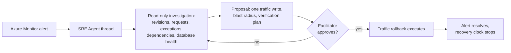

# Challenge 6: let an agent diagnose the incident — and keep the last word

**By the end of this chapter you will have watched an AI agent diagnose a live catalog
failure from telemetry alone, rejected one of its plausible explanations with evidence,
approved the single change it was allowed to make, and written down how many minutes the
incident lasted.**

## Why this matters

On the Windows Server VM, an incident begins when a customer complains. Someone remotes
in, opens a text file, guesses, and restarts the service. Nobody can say how long it
lasted, because nobody was holding a stopwatch — and nobody was watching before the
complaint arrived.

Everything you built over the last two days exists to change that. Immutable revisions
from Challenge 3 give you something to roll back *to*. Traces and metrics from
Challenge 4 give an investigator something to read. Right now a deliberately broken
revision is taking catalog traffic, and [Azure SRE Agent](../../docs/Glossary.md) is
about to correlate revision history, failed requests, exceptions, database dependencies,
and database health into a single proposal — and then stop, and wait for a human.

That last part is the point. The agent is fast; you are accountable. This chapter is
where those two facts have to coexist.

**Estimated time:** 90–150 minutes. Roughly a third of that is the agent thinking and
Azure Monitor settling — the alert can take several minutes to resolve after the
rollback. Use the waiting to draft your assessment and to fill in the recovery clock in
Task 7.

## Before you start

**Where you work.** Unchanged from [Challenge 2](../ch02/README.md): still your VM from
Challenge 0, still `C:\MicroHack\source` — the evidence this chapter produces has to land
in the repository you push, so it has to be written on the machine that holds it. The
command blocks below are bash and belong in **Git Bash**, not PowerShell. If you need a
fresh terminal, start it with `"C:\Program Files\Git\bin\bash.exe" -l`, then
`cd /c/MicroHack/source`. Challenge 2 explains why the shell matters. The agent chat is a
portal session — keep it open in a browser beside that terminal, because this chapter
moves between the two.

- Challenge 5 is complete: [Challenge 5: cloud security posture](../ch05-defender/README.md).
- The selected Challenge 1 modernization handoff and your Challenge 3 CI/CD and
  Challenge 4 observability reports validate. If your handoff is a facilitator golden
  handoff, that is fine — this chapter reads the validated document, not your history.
- **The SRE Agent foundation is facilitator-built.** It is not a participant task, and it
  takes roughly 45–60 minutes per team to construct: a dedicated agent resource, two
  managed identities, bounded roles, telemetry connectors, an Azure Monitor response plan
  in Review mode, a rejected preflight test, and the drill revision itself. See
  [the facilitator guide](../../docs/Facilitator.md). Do not start until the facilitator
  confirms the starting state below.
- You hold **SRE Agent Standard User** only. The facilitator holds SRE Agent
  Administrator and is the only person who can approve a write.

<details>
<summary>The starting state your facilitator confirms</summary>

- the selected Challenge 1 handoff and its Challenge 3 CI/CD and Challenge 4
  observability reports validate;
- one dedicated `Microsoft.App/agents@2026-01-01` resource exists for your team;
- its action and knowledge identity is user-assigned and its two telemetry connectors use
  the system identity;
- the exact participant resource group has Reader, Log Analytics Reader, and Monitoring
  Reader for both identities;
- only the user-assigned identity has the Azure-documented subscription Monitoring
  Contributor exception for Azure Monitor alert ingestion and the exact-Container-App
  custom traffic role;
- you have SRE Agent Standard User only, while the facilitator has SRE Agent
  Administrator;
- the Azure Monitor response plan is in **Review** mode with Low action access;
- a rejected preflight test proved the alert reaches the plan and performs no write;
- the retained healthy revision uses the handoff image digest and remains available; and
- the drill revision was created at zero traffic before the recorded incident window; and
- `workshop/sre-agent/runbook.md` is available to the agent as the bounded runbook.

</details>

## The concept

An SRE Agent is not a chatbot bolted onto a portal. It is an Azure resource with its own
identity, its own scoped permissions, its own telemetry connectors, and a **response
plan** that decides how much it may do on its own. In **Review** mode it may read
everything inside its scope and may propose exactly one bounded action — but the write
does not happen until a human with the Administrator role presses Approve.

The failure you are investigating is a **drill revision**: a copy of your working
revision, created at zero traffic before the incident window, that reuses the same
immutable image and every secret reference. Its only intentional changes are
`CATALOG_DATABASE_HOST=<name>.sre-drill.invalid` and a readiness probe routed to
`/healthz` instead of `/readyz`. That combination is deliberately nasty: the platform
believes the revision is healthy, so it keeps sending it traffic, while every catalog
request fails against a hostname that cannot resolve. No secret is exposed and no real
database is touched.



The agent's read scope is wide. Its write scope is one ARM action on one Container App.
Everything in this chapter enforces the gap between those two.

## Your goal

Drive the agent through a complete, evidence-backed investigation of the bad revision;
force it to rule out two plausible alternative causes rather than accept its first
answer; review the proposed command until you are certain it changes nothing but ingress
traffic weights; have the facilitator approve it; prove the catalog recovered; and record
how long the whole incident lasted.

You are the reviewer, not the operator. If the agent gives you an answer you cannot
trace back to a query result, reject it and ask again.

## Safety boundary

The only permitted in-window agent write is a traffic update on the exact handoff
Container App:

| Revision | Final weight |
| --- | ---: |
| Retained healthy revision | 100 |
| Drill revision | 0 |

Do not approve or request any image, secret, environment, scale, ingress-mode, revision
activation, role, policy, or resource deletion change. Autonomous mode, participant
approval, on-behalf-of elevation, broad Contributor/Owner roles, and subscription-wide
resource changes are prohibited. The alert-ingestion role is not permission to target
resources outside the participant scope.

Azure authorizes the rollback through exact-resource `Microsoft.App/containerApps/write`;
that ARM action is not JSON-field-scoped. Treat the reviewed command and before/after state
comparison as mandatory controls: approval is prohibited unless only ingress traffic
weights change.

## Steps

### Task 1: scope the incident

Before anything can be diagnosed it has to be bounded. Ask the agent to identify:

1. the exact handoff Container App and service;
2. the bad and retained healthy revisions;
3. the incident start and investigation end;
4. which revision has traffic; and
5. the failed-request window.

Reject an answer based only on a remembered runbook or the known rollback. Require the
live native ARM revision-list responses, nested `properties.trafficWeight`, deployment
chronology, and revision-filtered request evidence. Reject a flattened revision object or
one created at or after the incident start.

### Task 2: require the complete investigation

A single failing signal is a coincidence. Six correlated signals are a diagnosis. The
agent must correlate all six before proposing an action:

1. complete, non-paginated Container App revision/deployment history;
2. current revision traffic;
3. request failures filtered by handoff `service.name`, 40-hex source commit, bad
   revision, and incident window;
4. exceptions under the same filters;
5. failed SqlClient dependencies with `db.system.name=microsoft.sql_server` or failed
   JDBC dependencies with `db.system.name=postgresql`; and
6. the selected database's live availability: Azure SQL database `Online` or PostgreSQL
   flexible-server parent `Ready`.

The investigation evidence must be captured strictly after the alert-bound
`IncidentActivitySnapshot` and before `AgentResponse`. Evidence gathered before the alert
existed is not investigation; it is foreknowledge.

### Task 3: challenge the hypothesis

This is the exercise that matters most, and the one worth arguing about at your table.

Require the agent to support the hypothesis
`bad-revision-selected-database-endpoint` from the captured invalid dependency target.
Ask it to reject both alternatives with evidence:

- `selected-database-platform-outage`; and
- `application-image-regression`.

Both alternatives are entirely plausible from the symptoms alone — a wave of failed
database dependencies looks exactly like a database outage, and a new revision failing
looks exactly like a bad build. Each is refuted by one specific observation, not by
argument: an available selected database rejects the first, and the same immutable image
digest on the healthy and bad revisions rejects the second. A narrative guess or a missing
alternative does not pass.

Notice what you just did. You did not check whether the agent's answer sounded right —
you checked which observation would have changed it. That is the habit worth taking home.

### Task 4: review the proposal

Before approval, inspect the exact proposal. It must state:

- affected revision and time window;
- counts and types from all diagnostic captures;
- exact bad dependency target and selected-database status;
- the supported hypothesis and both rejected alternatives;
- blast radius `exact-bad-revision-traffic`;
- retained healthy revision `100`, bad revision `0`; and
- verification steps `healthy-revision-100`, `bad-revision-0`, `health-200`,
  `readiness-200`, and `alert-resolved`.

The Review-mode tool event must prove `writeExecuted=false`. If it does not, the agent
acted before you reviewed it, and that is a stop-the-drill condition.

### Task 5: facilitator approval

Show the proposal to the facilitator. Only the facilitator may select **Approve**. Record
the facilitator principal, approval timestamp, thread, trace, and correlation IDs. Do not
continue if the proposed command touches anything except traffic weights on the exact
handoff Container App.

### Task 6: verify recovery

An executed action is not a recovery. Prove it. After the agent executes the approved
write:

- exactly one correlation-bound user-assigned-identity Container App write follows the
  earlier facilitator seed write;
- before/after Container App documents differ only in ingress traffic;
- the retained healthy revision is active at `100` and the drill revision at `0`;
- the exact handoff `/healthz` and `/readyz` URLs return HTTP `200`;
- the Azure Monitor alert is `Resolved`;
- agent audit contains `IncidentActivitySnapshot`, `AgentResponse`,
  `AgentToolExecution`, `ApprovalDecision`, `AgentAzCliExecution`, and
  `AgentExecution` in order; and
- the execution event reports success.

Two of those checks carry the only timestamps Task 7 needs, and nothing later in this
chapter derives them for you. Read both while the responses are still in front of you and
write them down, in UTC and to whole seconds:

| Clock | Where you read it |
| --- | --- |
| Detection | the `timestamp` of the agent audit row whose event name is `IncidentActivitySnapshot` |
| Recovery | `properties.essentials.resolvedDateTime` on the resolved alert response |

### Task 7: record the recovery clock

This is the number the rest of your organization will understand, so take it seriously.

**Detection** is the timestamp of the alert-bound `IncidentActivitySnapshot` — the moment
the alert reached the agent thread, with no human involved. **Recovery** is the timestamp
at which the Azure Monitor alert became `Resolved` in Task 6. Both are already in the
evidence you captured; you are not measuring anything new, only reading a clock that was
already running.

Neither reaches this block on its own, so fill in the two values you wrote down in Task 6.
`fromdateiso8601` reads whole seconds only: drop any fractional part the query returned
and keep the trailing `Z`. Left blank or in the wrong order, the block stops and writes
nothing rather than producing a number you cannot defend.

```bash
DETECTED_AT=      # IncidentActivitySnapshot timestamp, from Task 6
RECOVERED_AT=     # alert resolvedDateTime, from Task 6

: "${DETECTED_AT:?Set the IncidentActivitySnapshot timestamp as YYYY-MM-DDTHH:MM:SSZ}" &&
: "${RECOVERED_AT:?Set the alert resolvedDateTime as YYYY-MM-DDTHH:MM:SSZ}" &&
jq -en \
  --arg detected "$DETECTED_AT" \
  --arg recovered "$RECOVERED_AT" \
  '($recovered | fromdateiso8601) >= ($detected | fromdateiso8601)
   or error("recovery is earlier than detection: recheck both Task 6 timestamps")' >/dev/null &&
mkdir -p evidence &&
jq -n \
  --arg detected "$DETECTED_AT" \
  --arg recovered "$RECOVERED_AT" \
  '{
    detectedAt: $detected,
    recoveredAt: $recovered,
    minutesToRecovery: ((($recovered | fromdateiso8601)
      - ($detected | fromdateiso8601)) / 60 | floor)
  }' > evidence/ch06-mttr.json &&
cat evidence/ch06-mttr.json
```

`evidence/ch06-mttr.json` is where this figure lives. Every other headline number in this
workshop lands in a file — the load report, the CI/CD report, the handoff — and this one
now does too, so closing the terminal does not lose it and your facilitator can put it
next to everyone else's. The solution derives the same file straight from the captured
audit and alert responses, with no hand-typed timestamps:
[Challenge 6 solution, step 7](../../solutions/ch06-sre-agent/README.md).

Repeat the result in your assessment and carry it to the
[wrap-up scorecard](../wrapup/README.md) as your **mean time to recovery**. Then split it
honestly into detection, investigation, approval, and execution — and ask which of those
four your current on-call rotation could match.

### Task 8: submit the incident evidence

Write a concise assessment containing the evidence-supported root cause, both rejected
alternatives, the traffic rollback, and one prevention action: validate selected-database
endpoint configuration and `/readyz` behavior before assigning traffic.

Create `evidence/sre-agent/capture.json` with exactly the seven digest-bound artifact kinds
defined by the contract. Render and validate the report from `tests/acceptance`:

```bash
cd tests/acceptance
uv --no-config run catalog-render-sre-agent-evidence \
  --capture evidence/sre-agent/capture.json \
  --handoff evidence/modernization-contract.json \
  --output evidence/sre-agent-report.json \
  --repository-root ../..

uv --no-config run catalog-validate-sre-agent-evidence \
  --capture evidence/sre-agent/capture.json \
  --handoff evidence/modernization-contract.json \
  --report evidence/sre-agent-report.json \
  --contracts workshop/contracts \
  --repository-root ../..
```

Do not manually create or edit the normalized report.

The frozen contract is `workshop/contracts/sre-agent.json` version `1.2.0`. Checked-in
files under `workshop/contracts/fixtures/sre-agent/` are sanitized shape examples. Their
zero IDs, example timestamps, query rows, and outcomes are never live evidence.

## Success criteria

You are done when all of the following are true:

- The agent's proposal cites live query results — counts, exception types, and the
  `.sre-drill.invalid` dependency target — and not the runbook.
- Both alternative hypotheses are rejected by a named observation, not by prose.
- The Review-mode tool event shows `writeExecuted=false` before the approval.
- The facilitator, not you, is the principal on the `ApprovalDecision`.
- The catalog URL from your handoff serves the catalog again, and `/healthz` and
  `/readyz` both return HTTP `200`.
- The retained healthy revision carries `100` and the drill revision carries `0`.
- The Azure Monitor alert reads `Resolved`.
- You can state your mean time to recovery in minutes, from detection to resolved alert,
  and `evidence/ch06-mttr.json` holds `detectedAt`, `recoveredAt`, and
  `minutesToRecovery`.
- `catalog-validate-sre-agent-evidence` exits successfully.

## Hints

<details>
<summary>Hint 1 — a nudge</summary>

The agent will answer confidently whether or not it has evidence. The difference between
a good and a bad answer in this chapter is never the wording — it is whether every claim
can be traced to a query result you could re-run yourself.

Start by asking what would have to be true for each alternative explanation to be the
real cause. Then look for the observation that makes it impossible.

</details>

<details>
<summary>Hint 2 — the approach</summary>

Work the thread in four moves, and do not let the agent skip one:

1. Ask it to scope the incident to a revision and a time window, citing current traffic
   and the complete deployment history rather than a single revision lookup.
2. Ask it to correlate request failures, exceptions, database dependencies, and live
   database availability for the exact service, source commit, and bad revision.
3. Ask it to state one supported hypothesis and explain why a database platform outage
   and an image regression are weaker — each needs its own refuting observation.
4. Ask it to propose only the runbook traffic rollback, with blast radius and the
   verification plan, and to execute nothing.

For the recovery clock, both timestamps are already inside the audit and alert evidence
you captured in Task 6 — you do not need a new query.

</details>

<details>
<summary>Hint 3 — nearly the answer</summary>

The supported hypothesis is `bad-revision-selected-database-endpoint`: the drill
revision points the catalog at a hostname that cannot resolve. The available selected
database rejects `selected-database-platform-outage`. The identical image digest on both
revisions rejects `application-image-regression`.

The approved command sets the retained healthy revision to `100` and the drill revision
to `0`, and changes nothing else — compare the before and after Container App documents
and confirm they differ only in
`response.properties.configuration.ingress.traffic`.

Exact prompts, the raw capture commands, and the full evidence assembly are in
[the Challenge 6 solution](../../solutions/ch06-sre-agent/README.md).

</details>

## If it goes wrong

| Symptom | Cause | Fix |
| --- | --- | --- |
| The agent names the rollback immediately, with no counts or dependency targets | It answered from the bounded runbook instead of investigating | Reject the answer and re-ask with the explicit six-signal correlation demand from Task 2. A proposal that cannot cite evidence is not a diagnosis. |
| The validator reports early evidence | You began querying before the alert-bound `IncidentActivitySnapshot` | Recapture the investigation artifacts after the snapshot timestamp and before `AgentResponse`. Ordering is part of the proof. |
| More than two Container App writes appear in the Activity Log | Someone changed the app during the incident window — a portal click counts | Stop and tell the facilitator; the window has to be re-seeded rather than explained away. |
| The alert stays `Fired` after a successful rollback | Azure Monitor has not re-evaluated yet | Wait and re-query. Do not force a resolution, and do not stop your recovery clock until the alert actually reads `Resolved`. |

More diagnostics in [the troubleshooting guide](../../docs/Troubleshooting.md).

## Cleanup and cost (facilitator-owned)

Participants stop after validation. Teardown of the agent, its dedicated resource group,
and the drill revision is the facilitator's task, and it is a real one: the agent carries
a fixed four-agent-unit hourly charge for as long as the resource exists.
Stopping the agent does not end that charge — only facilitator-authorized deletion does.
The full sequence lives in [the facilitator guide](../../docs/Facilitator.md) and
[the Challenge 6 solution](../../solutions/ch06-sre-agent/README.md).

## What you just proved

An incident opened, was diagnosed from telemetry, was explained against two competing
theories, was fixed by a bounded action a human approved, and closed — and you have a
timestamped audit trail for every one of those transitions.

| | The catalog on the VM | The catalog today |
| --- | --- | --- |
| Detection | A customer complains | An alert opens an agent thread automatically |
| Diagnosis | Guess, restart, hope | Six correlated signals, one supported cause, two rejected |
| Repair | Restore, out of hours | One reviewed traffic write, approved by a named human |
| Audit trail | Somebody's memory | Ordered agent events plus the Activity Log |
| **Time from detection to recovery** | **Unmeasured — the incident lasts until somebody notices** | **`minutesToRecovery` in `evidence/ch06-mttr.json`** |

Take that figure to the [wrap-up](../wrapup/README.md). It is the most persuasive single
number this workshop produces, and it is yours, measured, not quoted from a datasheet —
which is exactly why it is written to a file rather than left on a terminal you are about
to close.

And note what the agent did *not* do. It did not deploy, it did not touch a secret, it
did not widen its own permissions, and it did not act until a human agreed. That boundary
is what makes the speed usable in production rather than alarming.

---

**Previous:** [Challenge 5: cloud security posture](../ch05-defender/README.md) ·
**Next:** [Wrap-up: what you proved](../wrapup/README.md) ·
**Optional:** [Challenge 7 — Enterprise hardening](../ch07-enterprise/README.md) or
[AI catalog experience](../ch07-innovation/README.md) ·
**Back to** [workshop overview](../../README.md)
