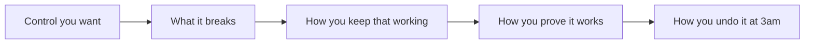

# Challenge 7 (optional): make it survive an enterprise review

**By the end of this chapter you will have designed — and, if time allows, deployed — one
enterprise control your organization would demand before this application carried real
customer data.**

## Why this matters

The catalog now runs on Azure Container Apps with a managed database, a pipeline, traces,
and a posture baseline. In a small company that might be enough. In a regulated one it is
the beginning of the conversation, and the questions come in a predictable order: can it be
reached from the internet, who holds the keys, what stops a bad request, and who enforces
all of that when nobody is looking.

This track is where you answer one of those questions properly rather than all of them
vaguely. It is also the honest edge of the workshop: the required chapters deliberately
left these open so the two days could stay about modernization.

**Estimated time:** open-ended. Budget 60–90 minutes for a defensible design of one item
from the menu, or 2–4 hours if you also deploy it. Nobody finishes all five, and trying to
is the most common way to end up with five shallow answers.

## Before you start

- All required chapters are complete, through
  [Challenge 6: SRE Agent](../ch06-sre-agent/README.md).
- Start from a valid `evidence/modernization-contract.json`.
- **This track has no canonical solution and no validator.** There is no reference
  implementation to check yourself against and no exit code that tells you when you are
  done. Your output is a design your peers can pull apart — the review is the grade.
- **Nothing here may change the frozen handoff or the evidence produced by required
  chapters.** Work in a disposable extension environment, not the evidence-producing
  required deployment. Anything you build must leave the validated handoff,
  `evidence/`, and every required chapter's report byte-identical.
- Subscription policy, DNS, networking, key lifecycle, or encryption changes require
  facilitator and subscription-owner approval before deployment.
- Cloud finding investigation remains required Challenge 5 and is out of scope here.

Choose either validated stack:

- `.NET/SQL Server` with Azure SQL Database; or
- `Java/PostgreSQL` with Azure Database for PostgreSQL Flexible Server.

## The concept

Every control on the menu below trades away something you currently have for free.
Private networking costs you the ability to reach things from your laptop. A web
application firewall costs you a class of legitimate request. Customer-managed keys cost
you an availability dependency on a key vault. Policy costs you deployment velocity.

An enterprise design is not a list of controls switched on. It is a set of trades you can
justify, each with a named owner, a failure mode, and a way back.

If you cannot fill all five boxes, the control is not designed yet.

## Your goal

Pick **one** item from the menu, design it end to end for your selected stack, and be able
to defend it against the four questions in the diagram. If you finish, take a second item —
but a complete answer to one beats sketches of three.

Produce your artifacts outside the required evidence directory, then prove that the
unchanged application still passes the original runtime, migration, acceptance, telemetry,
and handoff validators.

## The menu

Pick one. The time estimates assume you design carefully and deploy only if the design
holds up.

| # | Control | Design | Deploy | Best for |
| --- | --- | ---: | ---: | --- |
| 1 | Private networking | 60–90 min | +90–120 min | Teams whose next blocker is "it must not be on the public internet" |
| 2 | Identity and secrets | 45–60 min | +45–60 min | Teams who still have one password somewhere and want it gone |
| 3 | Edge protection with a WAF | 45–60 min | +60–90 min | Teams facing a public-facing compliance requirement |
| 4 | Customer-managed keys | 60–90 min | +60–90 min | Regulated teams who must hold their own key material |
| 5 | Policy and governance | 45–75 min | +30–45 min | Platform teams who own more than one application |

### 1. Private networking

Design private ingress and egress boundaries for:

- the Container App environment;
- Azure Container Registry;
- Azure SQL Database or PostgreSQL Flexible Server;
- the selected image storage provider;
- Key Vault;
- Application Insights and Log Analytics; and
- operator access.

Include private endpoints or delegated subnets where supported, private DNS zones and
links, approved egress, build/deployment connectivity, and a break-glass diagnostic
path. Explain how probes, CI/CD, telemetry, and managed identity continue to work.

The hard part is not the private endpoint. It is that your GitHub Actions runner, your
health probe, and your own browser all lose their route at the same moment — and each
needs a different answer.

### 2. Identity and secrets

Replace every remaining human-managed runtime secret with Microsoft Entra workload
identity or a Key Vault reference where the target service supports it. Produce an
exact identity-to-resource matrix with role name, role definition ID, scope, and
justification.

Keep the database-specific authentication boundary explicit:

- Azure SQL Database uses the selected user-assigned managed identity and contained
  database permissions.
- PostgreSQL Flexible Server uses Microsoft Entra authentication and the pinned JDBC
  authentication plugin.

No secret may appear in source, image layers, workflow variables, logs, evidence, or
Terraform state newly introduced by this challenge.

### 3. Edge protection

Place an approved Azure edge service with Web Application Firewall in front of the
application. Define:

- TLS and custom-domain ownership;
- origin authentication and direct-origin blocking;
- managed and custom WAF rules;
- rate limits compatible with the bounded load challenge;
- health-probe routing; and
- false-positive review and rollback.

Do not claim protection from a service that remains bypassable through the Container
App ingress. Test the bypass yourself before you claim it is closed — an unblocked origin
is the most common false sense of security in this design.

### 4. Customer-managed keys

Assess customer-managed key support separately for the database, registry, storage,
and observability services. For every selected integration, document:

- Key Vault or managed HSM boundary;
- key type, rotation, versioning, and recovery settings;
- the service identity and exact key permissions;
- deployment ordering and failure behavior; and
- the restore or rollback procedure.

Do not assert that one key or one API applies uniformly across both database families.
Support and semantics differ per service, and the differences are the interesting part.

### 5. Policy and governance

Propose an Azure Policy initiative that audits before it denies. Cover allowed regions,
required tags, public network access, private connectivity, diagnostic settings,
managed identity, TLS, and approved SKUs. Identify exemptions required by the workshop
and give every exemption an owner and expiry.

Add a management-group/subscription/resource-group placement diagram, resource locks,
budget/alert ownership, and evidence-retention classification. Do not deploy
subscription-wide policy from a participant identity.

## Deliverables

Create architecture artifacts outside the required evidence directory. For the item you
chose, produce the subset that applies:

1. A current-state and proposed-state diagram.
2. A data-flow and trust-boundary diagram.
3. An identity/RBAC matrix.
4. A private DNS and endpoint matrix.
5. A customer-managed-key support and lifecycle matrix.
6. A WAF/routing policy with an origin-bypass test.
7. An audit-first Azure Policy plan with exemptions.
8. An implementation sequence, cost estimate, rollback, and cleanup plan.
9. A stack-specific validation plan that reruns the handoff and shared acceptance
   contracts without altering their expected output.

## Success criteria

- The proposal supports both shared architecture and the selected database-specific
  authentication/network requirements.
- Every control names its owner, Azure scope, dependency, failure mode, verification,
  and cleanup.
- Workload and operator permissions remain least privilege.
- Private networking does not silently break deployment, telemetry, probes, or image
  access.
- WAF origin bypass, key unavailability, DNS failure, and policy-denial scenarios have
  executable tests.
- The unchanged application passes the original runtime, migration, acceptance,
  telemetry, and handoff validators after the extension.

## Hints

Hint 1 — a nudge

Start from what would break, not from what you would build. For whichever control you
picked, list every caller that currently reaches the resource: the pipeline, the probe,
the telemetry exporter, the image pull, and you. Each one of those is a design problem
the control creates.

Hint 2 — the approach

Write the design as a table before you write any infrastructure code: control, what it
breaks, the compensating path, the test that proves the compensating path works, and the
rollback. Fill the table completely for one control, then decide whether to deploy.

If you do deploy, deploy into a separate resource group with its own name and its own
teardown command, so that "undo" is one action rather than an archaeology exercise.

Hint 3 — nearly the answer

There is no reference implementation for this track — the closest thing to an answer is
[the shared Azure target](../../infra/README.md), which shows how the required
architecture is wired today and therefore exactly which wires your control cuts.

Read it alongside [the design document](../../docs/Design.md), which names the ownership
boundaries you must not move.

## If it goes wrong

| Symptom | Cause | Fix |
| --- | --- | --- |
| A required chapter's validator starts failing | You extended the evidence-producing deployment instead of a disposable copy | Revert the extension environment. The required handoff and evidence must stay byte-identical; that is the one hard rule of this track. |
| The pipeline can no longer deploy after you go private | The runner has no route to the private endpoint | This is the design problem, not a bug. Choose deliberately between a private runner, an approved egress path, or a build-time exception with an owner. |
| The application stops starting after a key or identity change | Deployment ordering — the identity was granted access after the resource needed it | Model the ordering explicitly. Key and identity dependencies fail at startup, not at deploy time, which is what makes them nasty. |

More diagnostics in [the troubleshooting guide](../../docs/Troubleshooting.md).

## What you just proved

You took an application that works and asked what it would take to run it somewhere that
does not trust you by default. Whatever you chose, you now have a written trade — control,
cost, failure mode, rollback — rather than an intention.

That artifact is the one most likely to survive contact with your own organization. The
required chapters proved the migration works; this one proves you know what it still
needs.

---

**Previous:** [Challenge 6: SRE Agent](../ch06-sre-agent/README.md) ·
**Also optional:** [Challenge 7 — AI catalog experience](../ch07-innovation/README.md) ·
**Finish at** [the wrap-up](../wrapup/README.md) ·
**Back to** [workshop overview](../../README.md)
