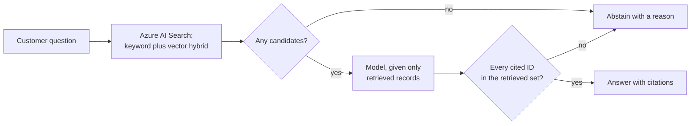

# Challenge 7 (optional): let a customer ask the catalog a question

**By the end of this chapter you will have a catalog that answers natural-language
questions about 198 collectible figures using only products that actually exist — and
refuses to answer when it cannot back the claim up.**

## Why this matters

The catalog has exact search. A customer who knows the product name finds it. A customer
who half-remembers "the one with the dragon, in the space category, under twenty euros"
does not, and leaves.

That is a revenue problem you could not have solved on the old VM — not because the model
was unavailable, but because there was no place to put a retrieval service, no identity to
authenticate it with, no way to observe it, and no way to ship it without a weekend. You
built all of that in the required chapters. This track spends it.

The interesting engineering here is not getting an answer. It is refusing to give one.
Anything that invents a product ID is worse than the search box you already had.

**Estimated time:** open-ended. Budget 90–120 minutes for a contract and a working
retrieval path, or a half day for a complete grounded experience with an evaluation set.

## Before you start

- All required chapters are complete, through
  [Challenge 6: SRE Agent](../ch06-sre-agent/README.md).
- **This track has no canonical solution and no validator.** There is no reference
  implementation and no exit code to aim at. What you are judged on is whether every
  answer is traceable to a real product.
- **Nothing here may change the frozen handoff or the evidence produced by required
  chapters.** The validated `evidence/modernization-contract.json` and every required
  chapter's report must stay byte-identical, and disabling your extension must restore
  the exact required application.
- This is an optional paid-service extension. Obtain facilitator approval for Azure AI
  Search, model deployment, content-safety, and evaluation capacity before creating
  resources.

Supported starting points:

- `.NET/SQL Server` with Azure SQL Database; and
- `Java/PostgreSQL` with Azure Database for PostgreSQL Flexible Server.

## The concept

Grounding means the model is only allowed to talk about text you retrieved and handed to
it. The model does not know your catalog and must not appear to. Retrieval finds candidate
products; generation phrases an answer about those candidates; a validator checks every
product ID in the answer against what retrieval actually returned, and drops the answer if
it does not match.

The two arrows into "abstain" are the feature. A system that always answers is not
grounded; it is confident.

## Your goal

Add a grounded catalog discovery experience to either validated stack without changing
the required catalog contract. The experience may recommend figures, answer catalog
questions, or combine natural-language discovery with the existing exact search.

Pick a scope from the menu, build it end to end, and be able to demonstrate one question
it answers well, one it declines, and one it should decline and does.

## The menu

Pick one and finish it. These build on each other, so if you have time, take them in
order.

| # | Scope | Rough time | You end up with |
| --- | --- | ---: | --- |
| 1 | Grounded contract and index | 60–90 min | A versioned index over the canonical corpus and a written API contract, with no model calls yet |
| 2 | Retrieval, generation, and citation validation | 90–150 min | A working answer path that abstains rather than invents |
| 3 | Responsible-AI controls | 45–75 min | A threat model and a content-safety boundary on the server |
| 4 | Evaluation | 60–90 min | Numbers: relevance, citation precision, grounded-answer rate, abstention correctness |
| 5 | A chat frontend | 60–120 min | A React `assistant-ui` surface calling only your server API |

## Architecture constraints

- The canonical 198-figure corpus remains the only source of product truth.
- Existing routes, identity rules, import transaction, health, performance, and
  telemetry behavior remain unchanged.
- Generated answers must cite canonical product IDs and links that exist in the
  validated catalog.
- Azure AI Search is the shared retrieval boundary; use keyword plus vector hybrid
  retrieval and keep the index key equal to canonical `productId`.
- Model and search access use managed identity and least-privilege data-plane roles.
  Do not place keys in source, browser code, prompts, logs, or evidence.
- Grounding, model response, and UI failure must not make `/readyz` fail for the
  existing catalog.
- Treat prompt text, retrieved descriptions, and model output as untrusted content.

## Stack adapters

Keep one application-facing use case and implement only the selected adapter:

| Stack | Backend integration |
| --- | --- |
| `.NET/SQL Server` | Add a bounded .NET service that reads canonical catalog DTOs, queries Azure AI Search, invokes the approved model, and emits existing OpenTelemetry resource identity |
| `Java/PostgreSQL` | Add the equivalent Spring service with the same request/response and grounding rules; database-specific repositories remain behind the existing catalog boundary |

The AI index is derived, not authoritative. Rebuild it from the validated catalog rather
than writing model output or embeddings back into the primary database.

If you add a separate chat frontend, use React with `assistant-ui` and call only a
server-side API. The browser must never receive Azure credentials or direct model/search
access. Reusing the existing server-rendered UI is also valid.

## Steps

### 1. Define the grounded contract

Specify:

- user question and optional filters;
- maximum input/output size and timeout;
- retrieval query and maximum documents;
- response text, canonical citations, and abstention reason;
- stable error responses for unavailable retrieval/model services; and
- prompt-injection and unsupported-request handling.

Require at least one citation for every catalog claim. When evidence is insufficient,
return a clear abstention rather than model knowledge.

### 2. Build the index

Map only canonical fields required for discovery: product ID, name, description,
category name/slug, and image route. Record source commit, corpus digest, embedding
deployment identity, index schema/version, document count, and index time.

Use deterministic chunking for this small catalog. Do not index secrets, operational
logs, participant prompts, or derived model answers.

### 3. Implement retrieval and generation

Combine text and vector retrieval, apply filters server-side, and pass only returned
canonical records into the generation prompt. Validate every model citation against the
retrieved set before returning it.

Use bounded retries only for transient service responses. Propagate explicit dependency
failure; do not return a success-shaped fallback that lacks verified grounding.

### 4. Add responsible-AI controls

Document threat cases for prompt injection, malicious catalog text, unsafe user input,
unsafe output, hallucinated products, sensitive-data disclosure, denial of service, and
cross-user leakage. Apply the approved content-safety policy at the server boundary and
retain privacy-appropriate audit metadata without raw secrets or unnecessary prompt
content.

### 5. Evaluate

Create a sanitized evaluation set covering:

- answerable exact-product and category questions;
- ambiguous questions;
- questions outside the catalog;
- prompt-injection attempts;
- requests for nonexistent figures;
- unsafe input; and
- retrieval or model unavailability.

Measure retrieval relevance, citation precision, grounded-answer rate, abstention
correctness, safety behavior, latency, and cost. Pin the model/deployment and evaluation
dataset versions so results are comparable.

### 6. Observe and isolate

Emit dependency spans and bounded metrics for retrieval, model calls, citation
validation, abstention, token use, latency, and safety outcomes while preserving the
existing service namespace/environment/version/revision attributes. Never log secrets,
full credentials, or unreviewed sensitive prompt content.

Use a feature flag or separate route so the original catalog remains available when the
AI extension is disabled.

## Deliverables

1. Architecture and trust-boundary diagram.
2. Stack-neutral API contract and selected .NET or Java adapter.
3. Versioned AI Search index definition and deterministic indexing process.
4. Managed-identity/RBAC matrix.
5. Grounding prompt, citation validator, and abstention behavior.
6. Threat model and content-safety configuration.
7. Sanitized evaluation dataset, thresholds, and actual results.
8. Telemetry queries, cost estimate, disable path, and cleanup inventory.
9. Evidence that the unchanged required catalog acceptance and handoff validators still
   pass.

## Success criteria

- Every catalog claim is supported by a canonical citation returned by retrieval.
- Hallucinated or unretrieved product IDs are rejected before the response reaches the
  user.
- Both the common API design and selected stack adapter are documented.
- Managed identity is used end to end; no browser or repository secret is introduced.
- The evaluation meets facilitator-approved relevance, grounding, safety, latency, and
  cost thresholds.
- Disabling the extension restores the exact required workshop application without data
  migration or evidence changes.

## Hints

Hint 1 — a nudge

Write the failure cases before the happy path. What should the system say when the
customer asks for a figure that does not exist, when retrieval returns nothing, when the
model is unavailable, and when a product description itself contains an instruction?

If you can answer those four, the happy path is small.

Hint 2 — the approach

Build it in this order and test after each step:

1. Index the canonical corpus and query it directly — no model at all. Confirm you can
   retrieve the right figures for three real questions.
2. Add generation, passing only the retrieved records into the prompt.
3. Add the citation validator between the model and the response, and make it drop the
   answer rather than repair it.
4. Only then add the frontend.

Steps 1 and 3 are where the value is. Step 2 is the easy part, which is exactly why it
should not be first.

Hint 3 — nearly the answer

There is no reference implementation for this track. The canonical corpus and its
manifest are [`data/manifest.json`](../../data/manifest.json), and the modernized target
for both stacks is [the reference implementation](../../solutions/reference/README.md) —
read how the existing catalog service is wired before you add a second service next to
it, because your new one has to emit the same telemetry identity.

Keep the index key equal to canonical `productId`; it makes citation validation a set
membership test rather than a parsing problem.

## If it goes wrong

| Symptom | Cause | Fix |
| --- | --- | --- |
| The assistant confidently describes a figure that does not exist | Generation ran without citation validation, or validation repaired the answer instead of dropping it | Validate every cited ID against the retrieved set and abstain on mismatch. An abstention is a correct answer here. |
| `/readyz` starts failing for the catalog | The AI dependency was wired into the existing readiness path | Isolate it. The required application must stay available when your extension is unavailable — that is a success criterion, not a nicety. |
| A required chapter's validator starts failing | The extension changed catalog routes, identity, corpus, or telemetry attributes | Put the extension behind a feature flag or separate route and restore the required behavior exactly. |

More diagnostics in [the troubleshooting guide](../../docs/Troubleshooting.md).

## What you just proved

The same platform that made the catalog deployable, observable, and recoverable also made
it extensible. You added a retrieval service, a model call, an identity, telemetry, and a
safety boundary — without touching the application contract the required chapters froze,
and with a switch that turns it all off.

And you built something with a spine: it says "I do not know" when it does not know. That
is a harder engineering result than a fluent answer, and it is the one that survives a
customer using it.

---

**Previous:** [Challenge 6: SRE Agent](../ch06-sre-agent/README.md) ·
**Also optional:** [Challenge 7 — Enterprise hardening](../ch07-enterprise/README.md) ·
**Finish at** [the wrap-up](../wrapup/README.md) ·
**Back to** [workshop overview](../../README.md)
