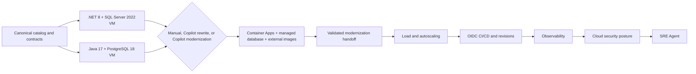

# Application Innovation workshop design

## Design goal

The workshop teaches modernization decisions without allowing stack differences or
evidence formatting to change the definition of success. Two legacy baselines and three
implementation paths converge on one Azure architecture and one machine-validated
handoff. Shared operational chapters then consume that handoff.



## Canonical inputs and identities

`data/catalog.json` and `data/images/` are the only canonical corpus. The contract
requires 198 figures, 20 categories, and 198 lowercase UUID PNG files. Product IDs are
canonical lowercase RFC 4122 UUIDs, and each image filename equals
`<productId>.png`.

`workshop/contracts/` owns:

- normalization and text-validation vectors;
- catalog, database, API, migration, runtime, telemetry, and handoff schemas;
- stack/path registry and shared challenge registry;
- sanitized representative fixtures and expected evidence;
- Azure target, load, CI/CD, observability, cloud security, and SRE Agent protocols; and
- the pinned cross-platform toolchain.

Both runtimes consume these assets. A stack-specific interpretation is a defect, not an
extension point.

## Legacy baseline

Each participant resource group contains two independent Windows Server 2025 VMs, each
with its own public IP:

| Stack | Source runtime | Native database | Local application |
| --- | --- | --- | --- |
| `dotnet-sqlserver` | .NET 8 | SQL Server 2022 Express | Catalog on port 5000 |
| `java-postgresql` | Microsoft OpenJDK 17 | PostgreSQL 18 | Catalog on port 8080 |

Both machines receive pinned tooling and an immutable repository archive. Provisioning
verifies installer hashes/publishers, starts the native database and application, and
writes a sanitized smoke marker only after liveness, readiness, a canonical image, and
native `198/20/198` counts pass.

The public IP exists for RDP only; the catalog is served on the loopback interface and is
browsed inside the VM, which is faithful to the single-machine baseline the workshop is
arguing against. The VMs share only participant-scoped network resources and can be
powered independently. Challenge 0 selects one stack and deallocates the other; it does
not delete either baseline.

## Three modernization paths

The selected stack follows exactly one path:

1. **Manual rebuild** uses ordinary source, runtime, container, database, and Azure
   tooling.
2. **Copilot-assisted rewrite** uses GitHub Copilot for bounded characterization,
   planning, implementation, and review while preserving the same contract.
3. **Copilot modernization** uses the pinned modernization/upgrade tooling and records
   assessment, tasks, and results.

All paths start from the legacy baselines under `dotnet/` or `java/` and converge on the
modernized reference implementation under `solutions/reference/`. They differ in method
and path evidence, not in target architecture or acceptance thresholds.

## Shared Azure target

`infra/main.bicep` is the authoritative target template. It creates the bounded
resource-group deployment used by both stacks:

- Azure Container Registry;
- one Azure Container App and environment;
- Azure SQL Database for .NET or Azure Database for PostgreSQL Flexible Server for Java;
- an external image provider selected by the frozen path contract;
- user-assigned managed identity and exact resource-scoped roles;
- Log Analytics and Application Insights;
- secrets and configuration required by the selected runtime; and
- revision, ingress, health probe, and autoscaling settings consumed downstream.

The application container is Linux/AMD64, immutable by digest, non-root, and listens on
port 8080. Azure SQL and Blob access use the workload managed identity. Java PostgreSQL
supports the frozen `managed-identity` mode or the bounded `password-secret`
compatibility mode, while Azure Files uses the Container Apps
`aca-volume-secret` boundary. Secrets are not image layers, source values, or evidence
fields.

The .NET target is .NET 10 with Azure SQL Database. The Java target is Microsoft OpenJDK
21 with PostgreSQL Flexible Server. Both preserve the same routes, import transaction,
bounded performance endpoint, health semantics, and OpenTelemetry resource identity.

## Migration and reset boundary

Workshop data is canonical and disposable. The rewrite intentionally excludes:

- in-place schema adoption;
- dual write or synchronization;
- zero-downtime cutover;
- backward-compatible legacy identity adapters; and
- generalized rollback infrastructure.

Each stack produces a native backup/export, deploys an empty managed database, applies
its versioned migration, imports the canonical corpus transactionally, and verifies
counts and representative rows. Any failed import leaves no partial publication.
Rollback restores the recorded baseline/export under facilitator control; it is not an
automatic production failover protocol.

## Handoff and rejoin protocol

Every stack/path cell renders `evidence/modernization-contract.json` from actual
artifacts. The handoff binds:

- stack, path, source commit, and immutable image digest;
- Container App, revision, ACR, database, image provider, identity, and telemetry IDs;
- migration, runtime test, shared acceptance, telemetry, and rollback evidence; and
- hashes and timestamps required by the frozen schema.

The common validator checks file digests, producer identities, stack/path legality,
resource relationships, live-vs-fixture boundaries, and expected corpus. Challenges 2
through 6 read only a valid handoff. A prevalidated stack-matched golden handoff is the
only supported workshop rejoin mechanism.

## Shared operational chapters

- **Load and autoscaling** uses one bounded 40-user, 300-second Azure Load Testing plan
  and correlates actual run, replica, database, and recovery windows.
- **CI/CD and revisions** uses GitHub OIDC, exact-resource roles, an immutable
  zero-traffic candidate, a protected production environment, promotion, and rollback.
- **Observability** adds one workbook and one Container App metric diagnostic setting;
  four panels query revision-bound Application Insights data and one panel queries
  flattened app-total replicas.
- **Cloud security posture** consumes facilitator-prepared paid-plan and seed snapshots.
  Participants perform read-only investigation and produce provenance-bound evidence.
- **SRE Agent** uses a dedicated resource group, fixed capacity, bounded identities and
  connectors, an approved traffic-only response plan, native incident evidence, and
  explicit cleanup/billing verification.

Optional Challenge 7 work is isolated from these required protocols and may not rewrite
their evidence.

## Evidence architecture

Evidence follows one direction:

```text
native producer response
  -> immutable raw capture
  -> digest-bound capture manifest
  -> deterministic renderer
  -> normalized report
  -> common validator
```

Examples and sanitized fixtures prove parser behavior only. They are never accepted as
live proof. Renderers preserve source paths, request parameters, resource IDs, windows,
pagination state, and content digests needed to detect manual editing or producer/
consumer mismatch.

## Ownership and authorization

- The **contract coordinator** owns shared schemas, registries, validators, and
  cross-runtime vectors.
- The **facilitator** owns subscription preflight, base infrastructure, golden handoffs,
  paid-plan changes, seed incidents, protected resources, and final cleanup.
- The **participant** owns one resource group and one selected implementation path, then
  only the bounded operations granted by each shared challenge.
- The **subscription owner** explicitly authorizes paid services, broad roles,
  traffic-changing incident response, and destructive cleanup.

Participant resource-group Owner is not permission to mutate subscription-wide state.
The single SRE Agent user-assigned identity Monitoring Contributor assignment is a
frozen, approved exception for alert ingestion; all other SRE actions remain
exact-resource scoped.

## Deployment ownership

| Artifact | Scope | Owner |
| --- | --- | --- |
| `baseInfra/terraform` | Subscription and participant resource groups | Facilitator |
| `infra/main.bicep` | Selected participant resource group | Participant with facilitator handoff |
| `infra/github-cicd.bicep` | Exact ACR and Container App resource group | Facilitator/CI administrator |
| `infra/observability-workbook.bicep` | Handoff resource group | Participant |
| `infra/sre-agent.bicep` | Subscription plus dedicated SRE resource group | Facilitator |

Duplicate challenge-local infrastructure templates are intentionally absent. Guides
reference the authoritative artifact directly so package, API, and role changes cannot
drift between copies.

## Protected resources and cleanup

Provider registrations, canonical input, contract fixtures, raw and normalized
evidence, shared telemetry, and the encrypted Terraform backend are protected.
Participant cleanup removes only authorized participant resources after paid-plan and
SRE cleanup validators pass. Provider registration state is detached from Terraform
before participant destroy and is never unregistered by this repository.

See [Troubleshooting](Troubleshooting.md) for the diagnostic path and
[Common errors](CommonErrors.md) for resolved implementation pitfalls.
